# Ollama私有化大模型部署与Apifox和Chatbox调用
> 本篇知识点：① 私有化大模型方案　② Ollama 安装与部署　③ Ollama 客户端命令　④ Apifox 调用 Ollama API　⑤ ChatBox 搭建聊天机器人　⑥ HTTP 基础补充

---

## 今日大纲

1. 了解私有化大模型
2. 掌握 Ollama 安装与部署
3. 熟悉 Ollama 客户端命令
4. 掌握基于 Ollama 平台的 ChatBox 聊天机器人

---

# 一、私有大模型方案

## 学习目标

了解私有化大模型解决方案，能够选择企业常用的方案实现私有大模型部署。

## 为什么要有私有大模型

随着 AI 技术普及，AI 在提升效率的同时也暴露出严重的安全问题。最典型的是**三星员工使用 ChatGPT 泄露公司机密**的案例。


核心问题就是**企业数据隐私与安全**：在金融、医疗、政府等行业，数据隐私至关重要。使用公共大模型可能涉及敏感数据泄露风险，因为公共模型训练过程可能接触到来自不同来源的敏感数据。因此产生私有大模型的市场需求——私有大模型允许企业或机构在自己的数据上训练模型，训练结果只供内部或合作伙伴使用，确保数据隐私和安全。

除了数据隐私，还有便于内部员工提效、大模型开发的投入等原因，共同推动私有大模型成为未来 AI 发展的新方向之一。

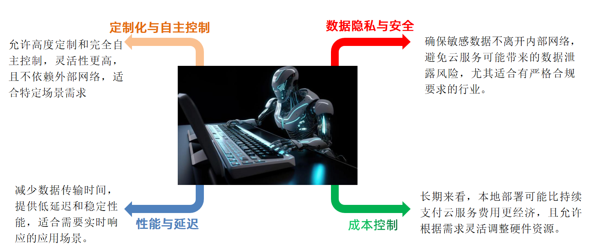

## 私有大模型解决方案

目前社区出现两个代表性产品：**Ollama** 和 **LM Studio**。

| 维度 | Ollama | LM Studio |
| --- | --- | --- |
| **产品定位** | 开源的本地 LLM 运行框架 | 闭源的本地 LLM 工作站（训练/部署/调试一体） |
| **技术特点** | 智能化、便捷、安全，数据传输和存储严格保护 | 高性能、可定制模型结构与训练策略、友好界面 |
| **功能** | 预训练模型访问与微调、多种模型架构、用户友好界面 | 丰富训练数据与算法库、可视化监控、强大调试工具 |
| **应用场景** | 学术研究、开发者原型设计、创意写作 | 智能客服、NLP 任务、学术研究 |
| **用户友好性** | 界面化操作，适合不同水平用户 | 适合初学者和非技术人员 |
| **定制性** | 一定程度的定制选项 | 高度可定制 |
| **资源要求** | 需一定内存/显存；跨平台（macOS/Linux/Windows 预览版） | 复杂模型需大量计算资源 |
| **成本** | 开源，直接成本较低 | 闭源，含软件许可/云服务费用 |
| **社区生态** | 活跃，开发者主流本地运行时，快速适配新模型 | 未提及 |

## 选择私有化大模型部署方案

Ollama 作为开源轻量级工具，适合熟悉命令行的开发人员和高级用户进行模型实验和微调。提供广泛的预训练模型和灵活定制选项，保持高度便捷性和安全性。**最重要的是开源且提供 API，对开发有先天优势**，因此在企业中备受欢迎，本课程也以 Ollama 为主要学习对象。

## 小结

- 了解私有化大模型解决方案
  - **Ollama**：开源的大型语言模型本地运行框架
  - **LM Studio**：闭源的本地大型语言模型工作站

---

# 二、Ollama 介绍与下载

## 学习目标

通过安装 Ollama 工具，实现基于 Ollama 运行通义 Qwen 大模型。

## 什么是 Ollama

> **Ollama**：一款旨在简化大型语言模型本地部署和运行过程的开源软件。
> 中文名：羊驼　网址：https://ollama.com/

Ollama 提供轻量级、易于扩展的框架，让开发者能在本地机器上轻松构建和管理 LLM。可以访问和运行一系列预构建模型，或导入和定制自己的模型，无需关注复杂的底层实现。

主要功能包括快速部署和运行各种大语言模型（Llama 2、Code Llama 等），支持从 GGUF、PyTorch、Safetensors 格式导入自定义模型，并提供丰富的 API 和 CLI 命令行工具。

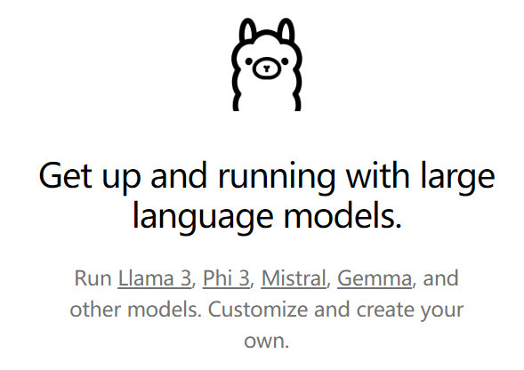

## Ollama 特点

- **一站式管理**：将模型权重、配置和数据捆绑到 Modelfile 包中，优化设置与配置细节，无需关注底层实现。
- **热加载模型文件**：无需重启即可切换不同模型，提高灵活性，增强用户体验。
- **丰富的模型库**：提供 Llama 2、Llama 3、通义千问等预构建模型。
- **多平台支持**：支持 macOS、Windows、Linux。
- **无复杂依赖**：优化推理代码，可在各种硬件上高效运行，包括纯 CPU 推理和 Apple Silicon。
- **资源占用少**：代码简洁，运行时占用资源少，本地高效运行。

## Ollama 下载

> Ollama 支持三种平台：
> - Windows：https://ollama.com/download/OllamaSetup.exe
> - Mac：https://ollama.com/download/Ollama-darwin.zip
> - Linux：https://ollama.com/download/ollama-linux-amd64

## Ollama 模型库

> Ollama 支持多种开源模型，涵盖文本生成、代码生成、多模态推理等场景。
> 官方模型库：https://ollama.com/library

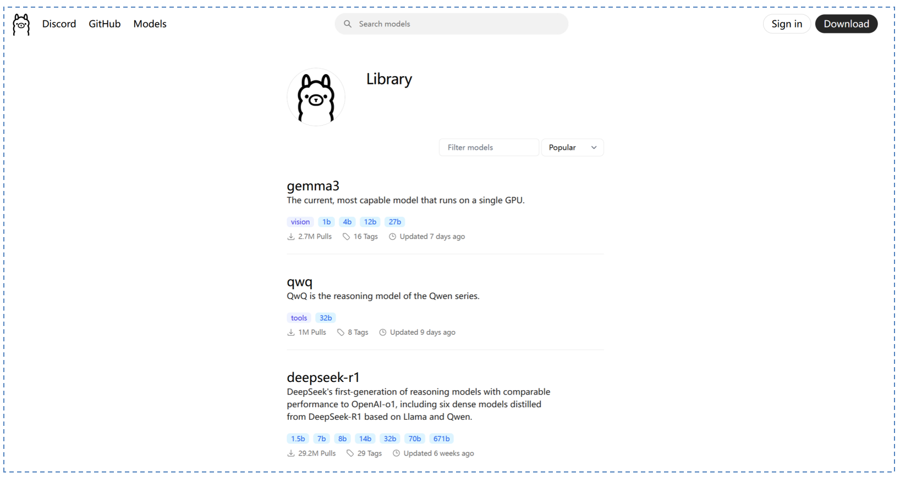

---

# 三、基于各平台部署私有大模型

## Windows 部署

### 安装 Ollama

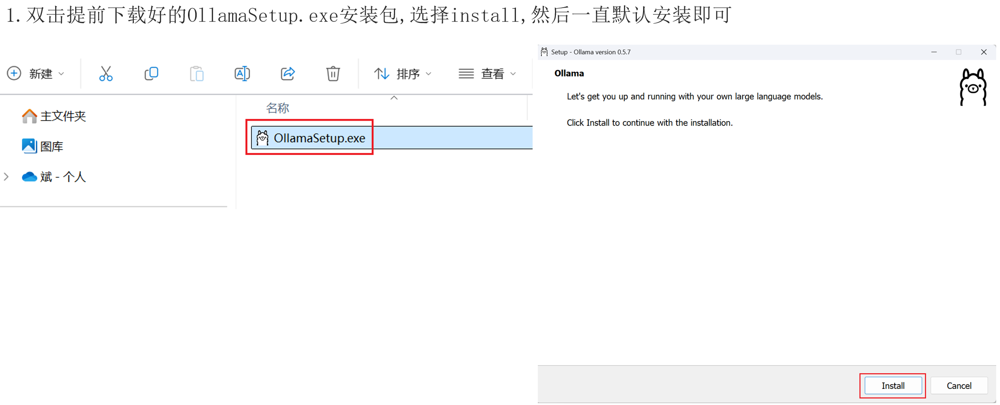

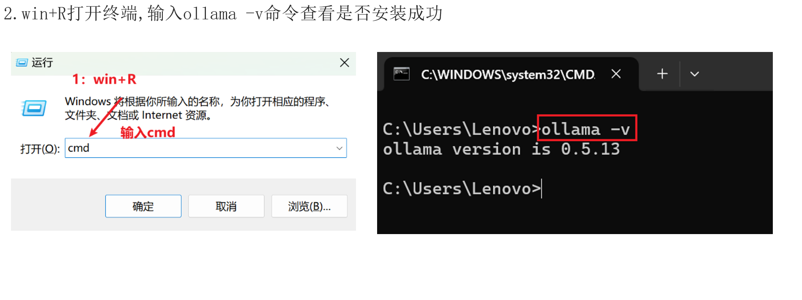

### 部署大模型

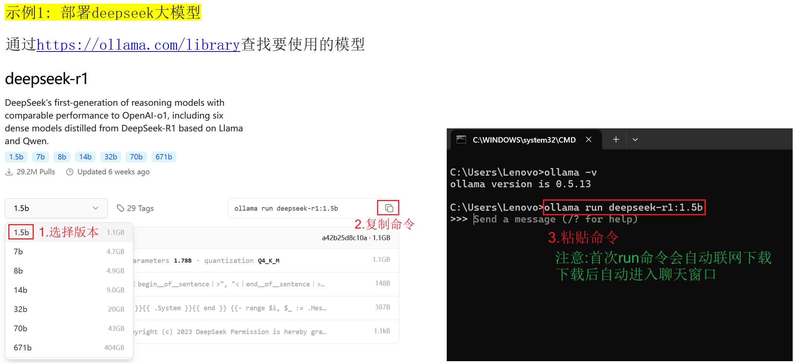

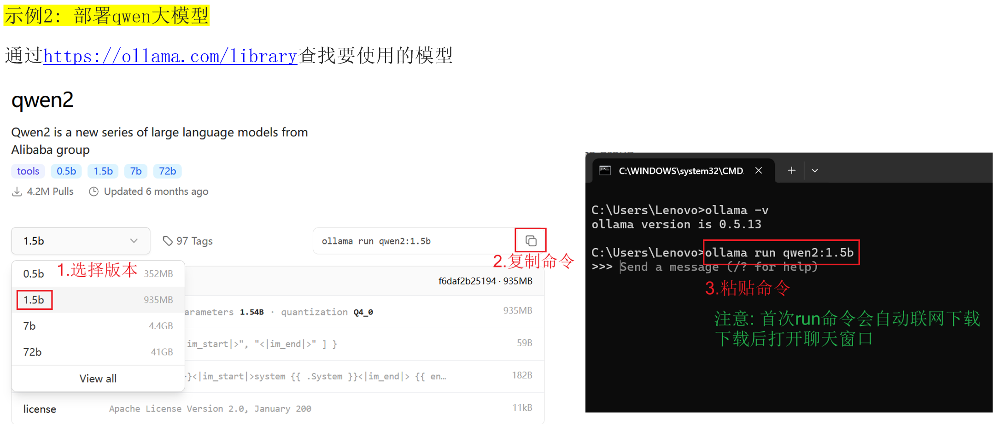

### 安装位置

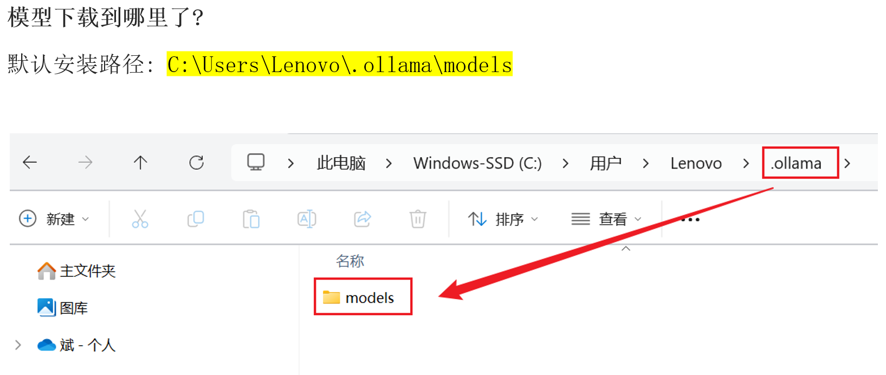

## Mac 部署

### 安装 Ollama

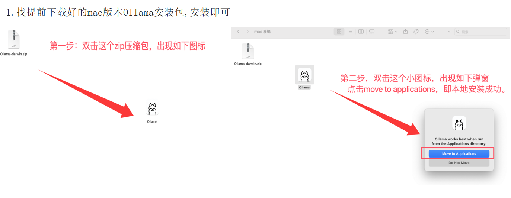

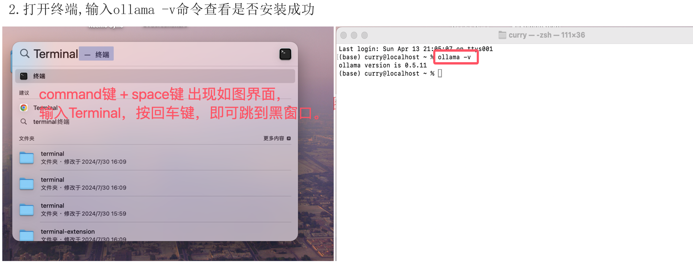

### 部署大模型

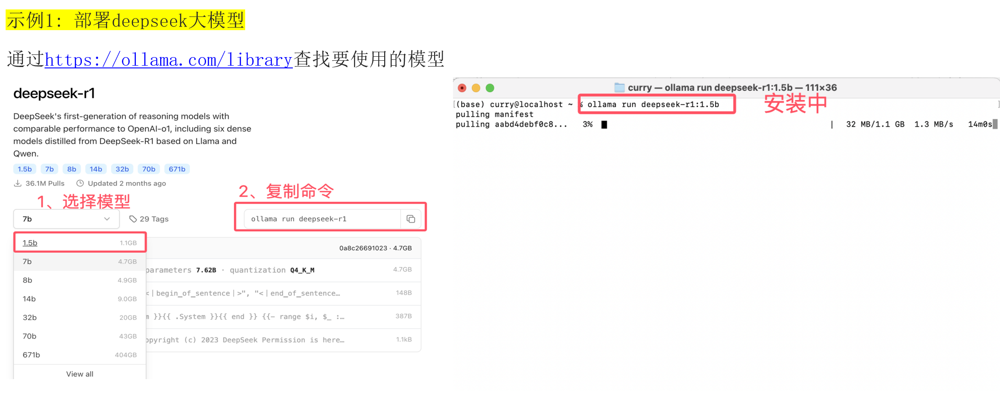

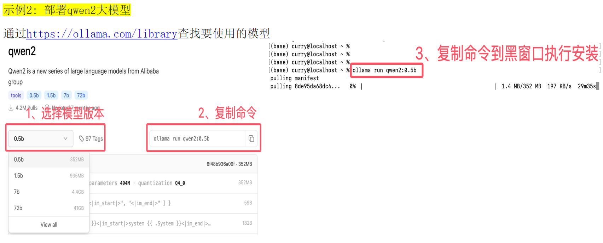

### 安装位置

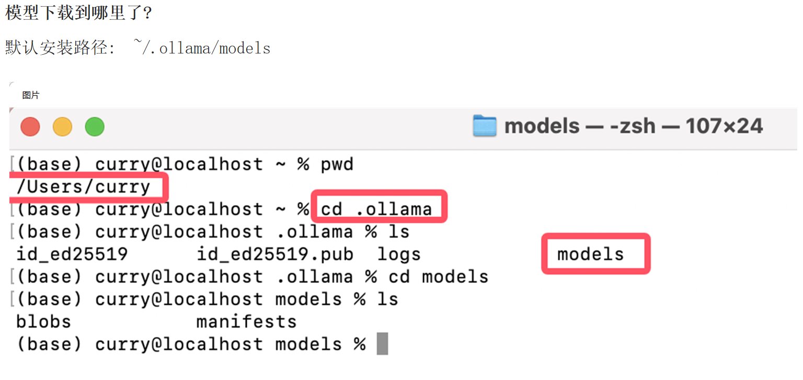

## Linux 部署

### 安装 Ollama

1. 提前安装并连接虚拟机，在 `/root` 目录创建 `resource` 目录：

```shell
mkdir /root/resource
```

2. `cd` 进入 `ollama-linux-amd64.tgz` 包所在目录，用 tar 解压到 `/usr` 目录：

```shell
[root@ ~ ]# cd /root/resource
[root@resource]# tar -zxvf ollama-linux-amd64.tgz -C /usr
```

3. 解压后通过查看版本指令验证安装（此时有警告是正常的）：

```shell
[root@resource]# ollama -v
Warning: could not connect to a running Ollama instance
Warning: client version is 0.3.9
```

4. 执行 `vim /etc/systemd/system/ollama.service`，粘贴以下内容：

```shell
[root@ ~ ]# vim /etc/systemd/system/ollama.service
```

```ini
[Unit]
Description=Ollama Service
After=network-online.target

[Service]
ExecStart=/usr/bin/ollama serve
User=root
Group=root
Restart=always
RestartSec=3

[Install]
WantedBy=default.target
```

5. 让服务生效并设置开机自启：

```shell
# 修改后重新加载
[root@ ~ ]# systemctl daemon-reload

# 设置开机自启
[root@ ~ ]# systemctl enable ollama
```

6. 启动 Ollama 服务：

```shell
[root@ ~ ]# systemctl start ollama
```

7. 再次查看版本，正常展示：

```shell
[root@ ~ ]# ollama -v
ollama version is 0.3.9
```

### 部署大模型

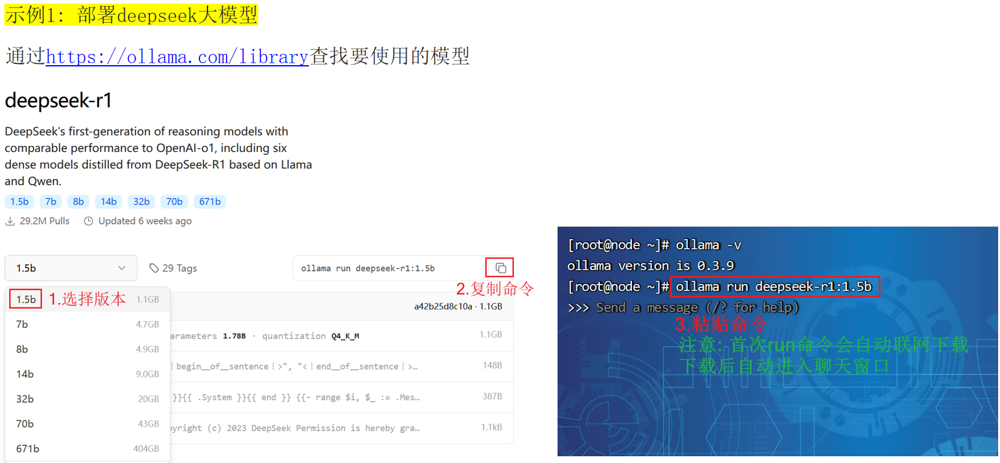

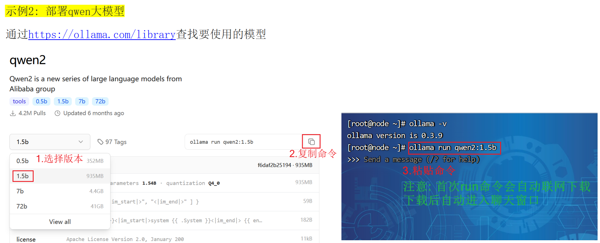

### 安装位置

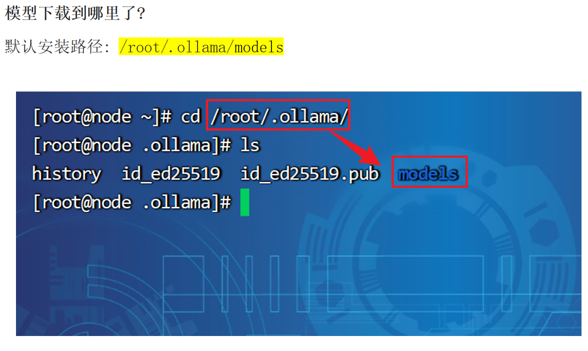

### 开通远程访问【重点】

为在本机（Windows 或 Mac）远程访问虚拟机中的 Ollama，需要开通远程访问权限：

**Step 1：增加环境变量**

```shell
[root@node ~]# vim /etc/profile
```

在 profile 文件末尾添加（小技巧：`Go` 快速跳转到最后一行）：

```shell
export OLLAMA_HOST=0.0.0.0:11434
export OLLAMA_ORIGINS=*
```

生效环境变量：

```shell
[root@node ~]# source /etc/profile
```

**Step 2：增加服务变量**

```shell
[root@node ~]# vim /etc/systemd/system/ollama.service
```

粘贴以下内容到指定位置：

```ini
Environment="OLLAMA_HOST=0.0.0.0:11434"
Environment="OLLAMA_ORIGINS=*"
```

```ini
[Unit]
Description=Ollama Service
After=network-online.target

[Service]
ExecStart=/usr/bin/ollama serve
User=root
Group=root
Restart=always
RestartSec=3

Environment="OLLAMA_HOST=0.0.0.0:11434"
Environment="OLLAMA_ORIGINS=*"

[Install]
WantedBy=default.target
```

生效修改的配置：

```shell
# 重新加载
[root@node ~]# systemctl daemon-reload

# 重启 ollama
[root@node ~]# systemctl restart ollama
```

**Step 3：关闭防火墙**

```shell
# systemctl status firewalld 查看状态，开启则执行以下命令关闭
[root@node ~]# systemctl stop firewalld
```

**Step 4：验证远程连接**

验证 Windows 是否能远程连接 Ollama，出现 `is running` 即连接成功。

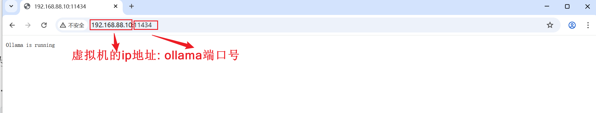

## 【补充】修改模型存储路径

Ollama 默认存储路径（各系统一致）：`~/.ollama/models`

### Windows 修改路径

1. 在其他位置创建用于存储模型的目录
2. 页面配置环境变量 `OLLAMA_MODELS`，指定存储路径
3. **一定要重启 Ollama**（任务栏右下角退出 → 开始栏重新启动）
4. 原下载好的文件剪切到新目录直接使用，或重新下载

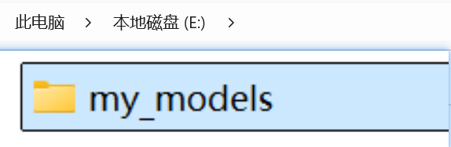

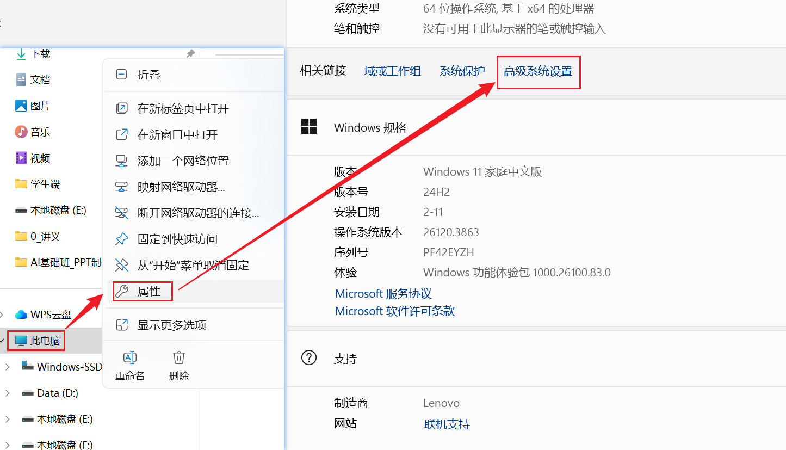

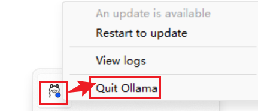

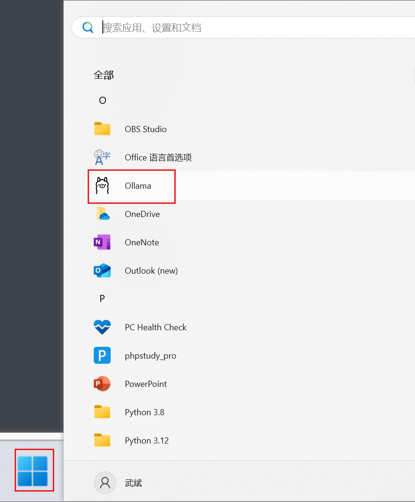

### Linux 修改路径

1. 创建新路径：

```shell
mkdir /root/ollama
```

2. 在 `/etc/profile` 末尾添加环境变量（`OLLAMA_MODELS` 值为新路径）：

```shell
vim /etc/profile
```

```shell
export OLLAMA_MODELS=/root/ollama
```

3. 生效并验证：

```shell
# 让配置生效
[root@bogon ollama]# source /etc/profile

# 验证环境变量是否成功
[root@bogon ollama]# echo $OLLAMA_MODELS
/root/ollama
```

4. 停止服务后后台启动，重新使用模型（修改路径后会重新下载到新路径，偶尔出现 404 错误是正常现象，之后会自动下载）：

```shell
[root@bogon ollama]# systemctl stop ollama
[root@bogon ollama]# ollama serve &
[root@bogon ~]# ollama run qwen2:0.5b
```

5. **让重启也支持模型路径**：修改服务文件 `/etc/systemd/system/ollama.service`，添加：

```ini
Environment="OLLAMA_MODELS=/root/ollama"
```

```ini
[Unit]
Description=Ollama Service
After=network-online.target

[Service]
ExecStart=/usr/bin/ollama serve
User=root
Group=root
Restart=always
RestartSec=3

Environment="OLLAMA_HOST=0.0.0.0:11434"
Environment="OLLAMA_ORIGINS=*"

Environment="OLLAMA_MODELS=/root/ollama"

[Install]
WantedBy=default.target
```

生效配置：

```shell
systemctl daemon-reload
systemctl restart ollama
```

## 上午小结

- 通过安装 Ollama 工具，实现基于 Ollama 运行通义 Qwen 大模型
  - 完成 Ollama 软件安装
  - 实现 Qwen 模型本地部署

---

# 四、客户端指令和对话指令

## 客户端命令详解

Ollama 客户端提供系列命令管理本地大模型。

### run 命令

> 运行一个大模型：

```shell
ollama run MODEL[:Version] [PROMPT] [flags]
比如，运行通义千问命令：
ollama run qwen2:0.5b
```

- `[:Version]` 可理解为版本（常以模型规模命名），不写则默认 `latest`：

```shell
ollama run qwen2
等同
ollama run qwen2:latest
```

- `[PROMPT]`：输入提示词后，run 命令执行一次对话后即退出终端：

```shell
[root@bogon ~]# ollama run qwen2:0.5b 您好
您好！有什么问题我可以帮助您？
```

- `[flags]` 指定运行时参数：

```shell
Flags:
      --format string      指定运行的模型输出格式 (比如. json)
      --insecure           使用非安全模式，下载模型时忽略 https 安全证书
      --keepalive string   指定模型在内存中的存活时间
      --nowordwrap         关闭单词自动换行功能
      --verbose            开启统计日志信息
```

例如，启动时加 `--verbose` 参数，对话时自动增加统计 token 信息：

```shell
[root@bogon ~]# ollama run qwen2:0.5b --verbose
>>> 您好
欢迎光临，我可以为您提供帮助。有什么问题或需要帮助的地方？

total duration:       1.229917477s
load duration:        3.027073ms
prompt eval count:    10 token(s)
prompt eval duration: 167.181ms
prompt eval rate:     59.82 tokens/s
eval count:           16 token(s)
eval duration:        928.995ms
eval rate:            17.22 tokens/s
```

### pull 命令

> 从远程下载一个模型（查询模型名称网站：https://ollama.com/）：

```shell
ollama pull MODEL[:Version] [flags]
```

```shell
ollama pull qwen2
等同
ollama pull qwen2:latest
```

```shell
ollama pull qwen2 --insecure   # --insecure 非安全模式下载
```

### list / ls 命令

> 查看本地已下载的大模型列表（`ls` 是 `list` 的简写）：

```shell
[root@bogon ~]# ollama list
NAME                    ID              SIZE    MODIFIED
qwen2:latest            e0d4e1163c58    4.4 GB  10 minutes ago
deepseek-coder:latest   3ddd2d3fc8d2    776 MB  3 hours ago
qwen2:0.5b              6f48b936a09f    352 MB  8 hours ago
```

**列表字段说明**：NAME 名称 / ID 唯一标识 / SIZE 大小 / MODIFIED 本地存活时间

### ps 命令

> 查看当前运行的大模型列表（无参数）：

```shell
[root@bogon ~]# ollama ps
NAME                    ID              SIZE    PROCESSOR       UNTIL
deepseek-coder:latest   3ddd2d3fc8d2    1.3 GB  100% CPU        About a minute from now
```

**字段说明**：NAME 名称 / ID / SIZE / PROCESSOR 资源占用 / UNTIL 运行存活时长

### rm 命令

> 删除本地大模型（无参数）：

```shell
[root@localhost system]# ollama rm qwen2:0.5b
deleted 'qwen2:0.5b'
```

### show 命令

> 不运行模型即可查看模型信息：

```shell
[root@bogon ~]# ollama show -h
Usage:
  ollama show MODEL [flags]

Flags:
  -h, --help         查看使用帮助
      --license      查看模型的许可信息
      --modelfile    查看模型的制作源文件 Modelfile
      --parameters   查看模型的内置参数信息
      --system       查看模型的内置 System 信息
      --template     查看模型的提示词模版
```

例如查看提示词模版：

```shell
[root@bogon ~]# ollama show qwen2 --template
{{ if .System }}<|im_start|>system
{{ .System }}<|im_end|>
{{ end }}{{ if .Prompt }}<|im_start|>user
{{ .Prompt }}<|im_end|>
{{ end }}<|im_start|>assistant
{{ .Response }}<|im_end|>
```

### 小结

1. Ollama 指令分为哪两类？→ 客户端指令和对话指令
2. Ollama 最常用客户端指令？→ `ollama list`、`ollama run 模型名`

---

## 对话指令详解

在 Ollama 终端中提供系列指令调整和控制对话模型。

### /? 指令

> 列出支持的指令列表：

```shell
>>> /?
Available Commands:
  /set            Set session variables
  /show           Show model information
  /load <model>   Load a session or model
  /save <model>   Save your current session
  /clear          Clear session context
  /bye            Exit
  /?, /help       Help for a command
  /? shortcuts    Help for keyboard shortcuts

Use """ to begin a multi-line message.
```

### /bye 指令

> 退出当前控制台对话（快捷键 Ctrl + D）：

```shell
[root@bogon ~]# ollama run qwen2:0.5b
>>> 您好
你好！有什么可以帮助您的吗？

>>> /bye
[root@bogon ~]#
```

### /show 指令

> 查看当前模型详细信息：

```shell
>>> /show
  /show info         查看模型的基本信息
  /show license      查看模型的许可信息
  /show modelfile    查看模型的制作源文件 Modelfile
  /show parameters   查看模型的内置参数信息
  /show system       查看模型的内置 System 信息
  /show template     查看模型的提示词模版
```

```shell
>>> /show info
Model details:
Family              qwen2        模型名称
Parameter Size      494.03M      模型大小
Quantization Level  Q4_0         模型量化级别
```

### /? shortcuts 指令

> 查看控制台可用快捷键：

```shell
>>> /? shortcuts
Available keyboard shortcuts:
  Ctrl + a            移动到行头
  Ctrl + e            移动到行尾
  Ctrl + b            移动到单词左边
  Ctrl + f            移动到单词右边
  Ctrl + k            删除游标后面的内容
  Ctrl + u            删除游标前面的内容
  Ctrl + w            删除游标前面的单词

  Ctrl + l            清屏
  Ctrl + c            停止推理输出
  Ctrl + d            退出对话（只有在没有输入时才生效）
```

### """ 指令

> 输入内容有换行时使用，多行输入结束也用 `"""`：

```shell
>>> """
... 您好
... 你是什么模型？
... """
我是一个计算机程序，可以回答您的问题、提供信息和执行任务。请问您有什么问题或者指令想要我帮助您？
```

### /clear 指令

> 清除对话上下文内容（终端自带上下文记忆，`/clear` 后上下文被清空）：

```shell
>>> 请帮我出1道java list的单选题
以下是一些关于Java List的单选题：
1. 在Java中，List是哪一种数据结构？
2. Java中的顺序存储方式（例如：使用数组）主要用来做什么？
3. 一个列表对象可以包含哪些类型的元素？

>>> /clear
Cleared session context
>>> 在出1道
很抱歉，我无法理解您的问题。您能否提供更多的背景信息或者问题描述，以便我能更好地帮助您？
```

### /load 指令

> 在对话过程中随时切换大模型：

```shell
>>> /load deepseek-coder
Loading model 'deepseek-coder'
>>> 你是什么大模型
我是由中国的深度求索（DeepSeek）公司开发的编程智能助手，名为 Deepseek Coder。
```

### /save 指令

> 把当前对话模型存储成一个新模型：

```shell
>>> /save test
Created new model 'test'
```

保存的模型存储在 manifests 目录下：

```shell
[root@bogon library]# pwd
/root/ollama/manifests/registry.ollama.ai/library
[root@bogon library]# ls
deepseek-coder  qwen2  test
```

### /set 指令

> 设置当前对话模型的系列参数：

```shell
>>> /set
Available Commands:
  /set parameter ...     设置对话参数
  /set system <string>   设置系统角色
  /set template <string> 设置推理模版
  /set history           开启对话历史
  /set nohistory         关闭对话历史
  /set wordwrap          开启自动换行
  /set nowordwrap        关闭自动换行
  /set format json       输出JSON格式
  /set noformat          关闭格式输出
  /set verbose           开启对话统计日志
  /set quiet             关闭对话统计日志
```

**可设置的参数表**：

| Parameter | 说明 | 类型 | 示例 |
| --- | --- | --- | --- |
| num_ctx | 上下文 token 大小（默认 2048） | int | num_ctx 4096 |
| repeat_last_n | 防重复回顾距离（默认 64） | int | repeat_last_n 64 |
| repeat_penalty | 重复惩罚强度（默认 1.1） | float | repeat_penalty 1.1 |
| temperature | 温度，越高越有创造性（默认 0.8） | float | temperature 0.7 |
| seed | 随机数种子（默认 0） | int | seed 42 |
| stop | 停止词 | string | stop "AI assistant:" |
| num_predict | 预测最大 token 数（默认 128，-1 无限） | int | num_predict 42 |
| top_k | 多样度（默认 40） | int | top_k 40 |
| top_p | 保守度（默认 0.9） | float | top_p 0.9 |
| num_gpu | 缓存到 GPU 的模型层数 | int | 自动计算 |

**JSON 格式输出**：

```shell
>>> /set format json
Set format to 'json' mode.
>>> 您好
{"response":"你好，欢迎光临，请问有什么我可以帮助您的吗？"}
```

**输出对话统计日志**：

```shell
>>> /set verbose
>>> 您好
total duration:       1.642906162s    总耗时
load duration:        3.401367ms     加载模型数据耗时
prompt eval count:    11 token(s)    提示词token消耗数量
eval count:           24 token(s)    响应token消耗数量
eval rate:            18.40 tokens/s 响应处理速率
```

### 小结

- 掌握基于 Ollama 客户端相关命令
  - `/bye`：退出当前控制台对话
  - `/load`：对话过程中随时切换大模型
  - `/clear`：清除上下文内容

---

# 五、基于 Apifox 对 Ollama API 详解

## Apifox 入门和配置

### Apifox 安装

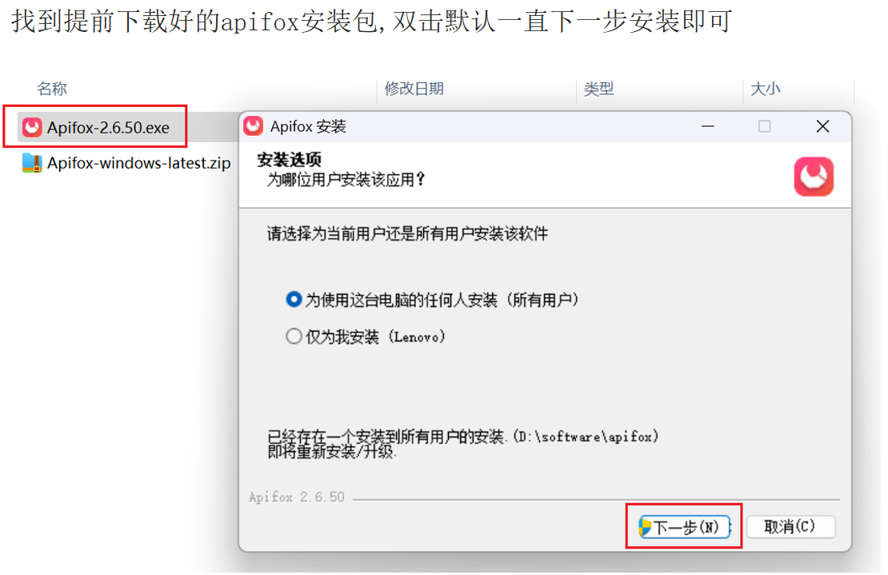

### 导入 Ollama 的 API

为了方便程序接入 Ollama 中的大模型，可先通过 Apifox 进行 API 快速体验。资料文件夹中的《Ollama.apifox.json》提供导入内容；《Ollama API 文档.html》可查看详细 API 说明。

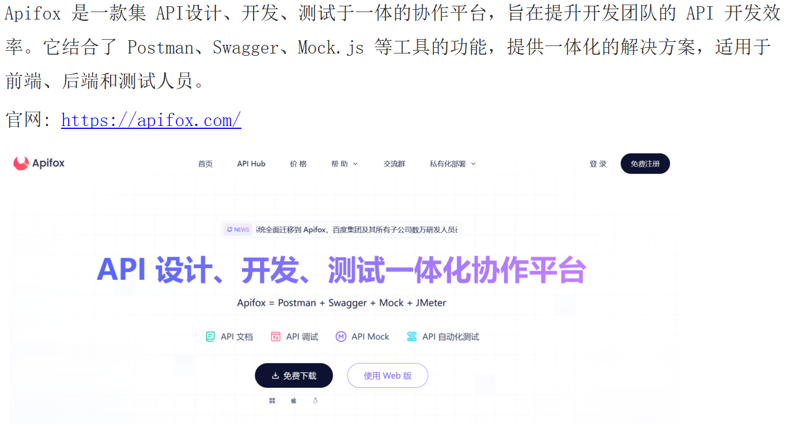

Ollama 支持 7 个 API（这里列出常用），重点学习**对话接口**和**向量化接口**。

**Step 1：打开导入项目** → **Step 2：选择导入的文件** → **Step 3：输入项目名称** → **Step 4：完成导入进入项目**（中间有导入预览直接点击确定）。

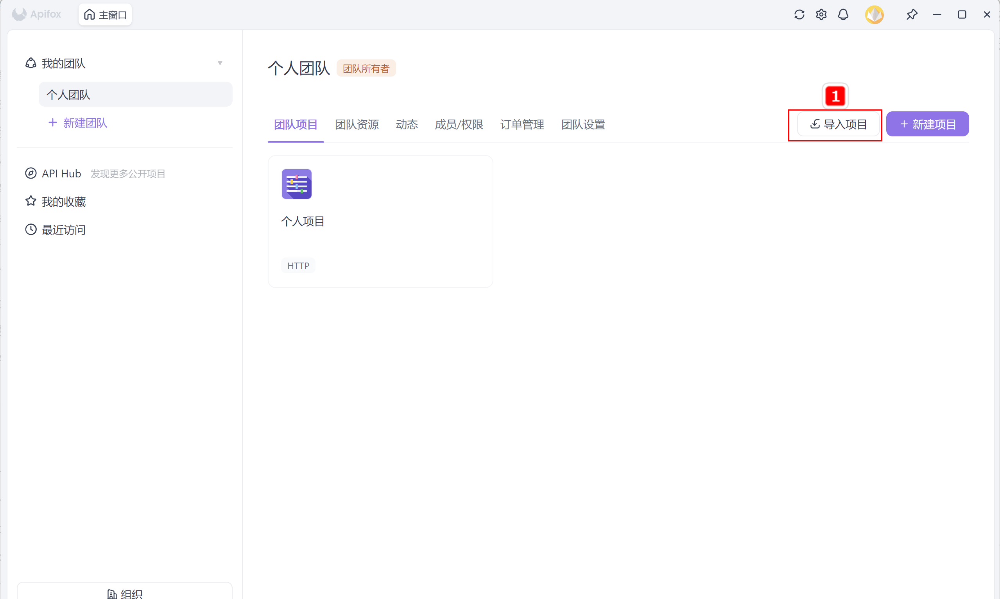


### 配置环境地址

> 本地 URL：http://127.0.0.1:11434
> 远程虚拟机 URL：http://虚拟机ip地址:11434

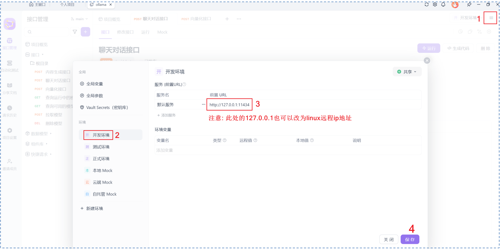

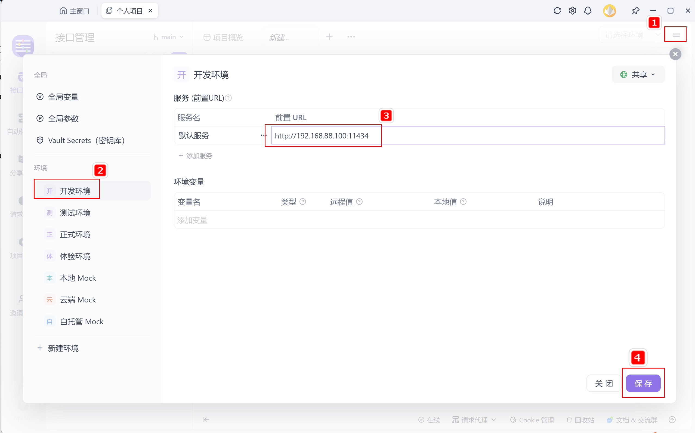

## 聊天对话接口说明

聊天对话接口是实现类 ChatGPT 网页对话功能的关键接口：

> **POST /api/chat**

```json
{
  "model": "qwen2.5:0.5b",
  "messages": [
    {
      "role": "string",
      "content": "string",
      "images": "string"
    }
  ],
  "format": "string",
  "stream": true
}
```

**请求参数**：

| 名称 | 位置 | 类型 | 必选 | 说明 |
| --- | --- | --- | --- | --- |
| model | body | string | 是 | 模型名称 |
| messages | body | [object] | 是 | 聊天消息 |
| role | body | string | 是 | system / user / assistant |
| content | body | string | 是 | 内容 |
| images | body | string | 否 | 图像 |
| format | body | string | 否 | 响应格式 |
| stream | body | boolean | 否 | 是否流式生成 |
| keep_alive | body | string | 否 | 模型内存保持时间（5m） |
| tools | body | [object] | 否 | 工具 |
| temperature | body | number | 否 | 温度值，越高创造性越强（默认 0.8） |
| top_k | body | integer | 否 | 多样度（默认 40） |
| top_p | body | number | 否 | 保守度（默认 0.9） |
| stop | body | [string] | 是 | 停止词 |

**返回示例**：

```json
{
    "model": "llama3.1",
    "created_at": "2024-09-07T09:00:57.035084368Z",
    "message": {
        "role": "assistant",
        "content": "",
        "tool_calls": [
            {
                "function": {
                    "name": "get_current_weather",
                    "arguments": {"format": "celsius", "location": "Paris"}
                }
            }
        ]
    },
    "done_reason": "stop",
    "done": true,
    "total_duration": 14452649821,
    "load_duration": 21370256,
    "prompt_eval_count": 213,
    "prompt_eval_duration": 11306354000,
    "eval_count": 25,
    "eval_duration": 3082983000
}
```

**返回数据结构（状态码 200）**：model 模型 / created_at 响应时间 / message 响应内容（role、content、tool_calls）/ done / total_duration 总耗时 / load_duration 模型加载耗时 / prompt_eval_count 提示词 token 消耗数 / eval_count 响应 token 消耗数 等。

## 案例：聊天对话接口


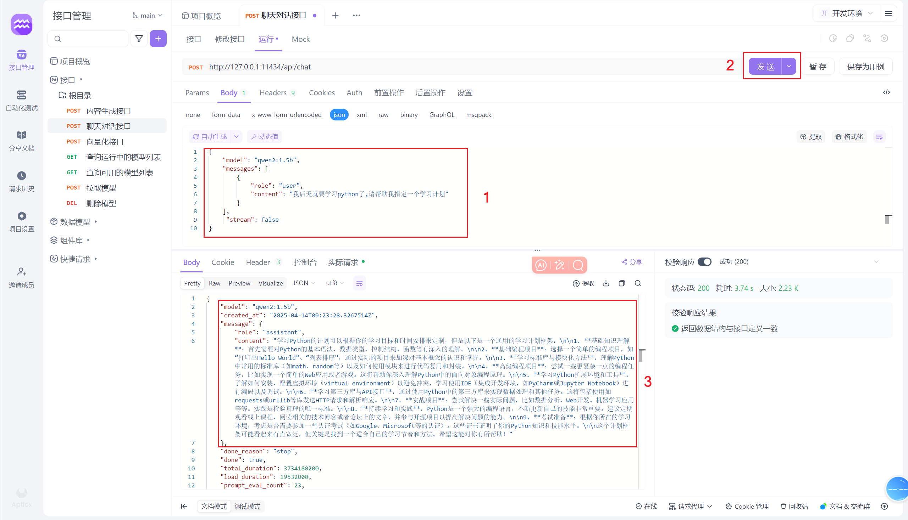

## 拓展：图片识别演示

随着技术与算力进步，大模型逐渐分化出多种类型：

- **大语言模型**（文生文，如对话聊天）：Qwen、ChatGLM3、Baichuan、Mistral、LLaMA3、YI、InternLM2、DeepSeek、Gemma、Grok 等
- **文本嵌入模型**（内容向量化，用于模型微调）：text2vec、openai-text embedding、m3e、bge、nomic-embed-text 等
- **重排模型**（向量化数据优化增强）：bce-reranker-base_v1、bge-reranker-large 等
- **多模态模型**（文本/图片输入，生成文本或图片，如拍照批改作业）：Qwen-VL、Qwen-Audio、DeepSeek-VL、Llava、MiniCPM-V、InternVL 等
- **语音识别/语音播报**：Whisper、VoiceCraft、StyleTTS 2 等
- **扩散模型**（文生图、文生视频）：AnimateDiff、StabilityAI 系列等

> Ollama 目前仅支持大语言模型、文本嵌入模型、多模态模型。可先体验多模态模型：

**Step 1：私有化多模态大模型**（LLaVA 是开源多模态大模型，可同时处理文本、图像，实现跨模态理解与生成）：

```shell
ollama run llava:7b
ollama run llava:latest
```

**Step 2：准备图片素材**，图片问答需用 Base64 转换：

```python
import base64

def main():
    # 读取文件内容
    with open("../assets/Snipaste_2024-06-22_16-01-31.png", "rb") as file:
        bytes_data = file.read()
    # 将字节数据编码为Base64字符串
    base64_str = base64.b64encode(bytes_data).decode('utf-8')
    # 打印Base64字符串
    print(base64_str)

if __name__ == "__main__":
    main()
```

**Step 3：调用多模态接口**（聊天对话接口，图片信息通过 `images` 字段传入，可传多张，即使 1 张也要用列表：`["图片字符串格式"]`）：


## 拓展：向量化接口

> 本质就是把文字向量化转换：

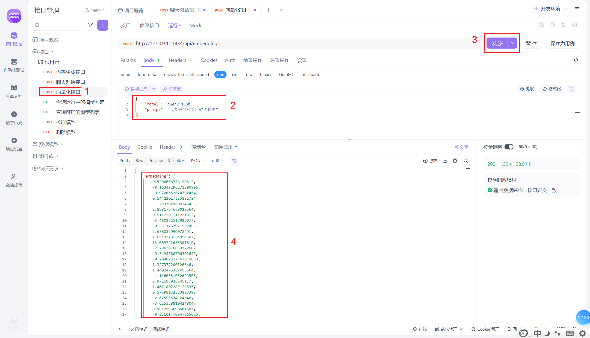

---

# 六、基于 ChatBox 与 Ollama 快速搭建聊天机器人

## 学习目标

掌握 ChatBox 环境搭建，完成 ChatBox 集成 Ollama 实现对话。

## ChatBox

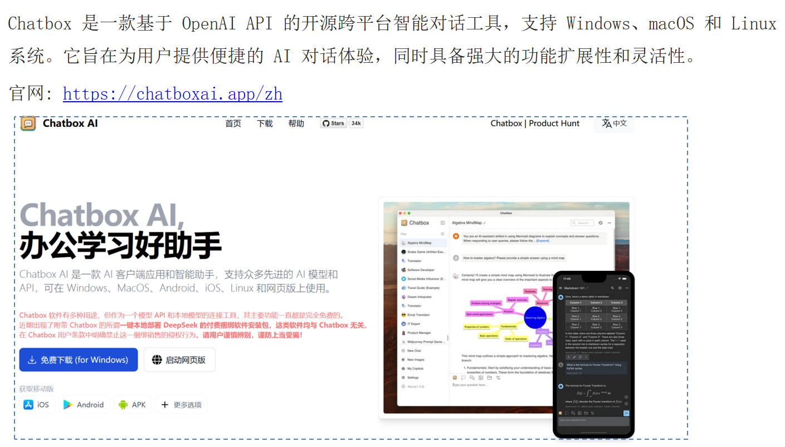

ChatBox 功能特点：

- 一键免费拥有你自己的 ChatGPT/Gemini/Claude/Ollama 应用
- 与文档和图片聊天
- 代码神器：生成与预览
- 支持本地大模型
- 支持多平台 AI 接入
- 支持插件扩展

## 安装 ChatBox

ChatBox 提供 Windows 桌面安装方式（安装文件见资料文件夹 `Chatbox-1.9.8-Setup.exe`）：

**Step 1：桌面 Win 安装** → **Step 2：访问 ChatBox**

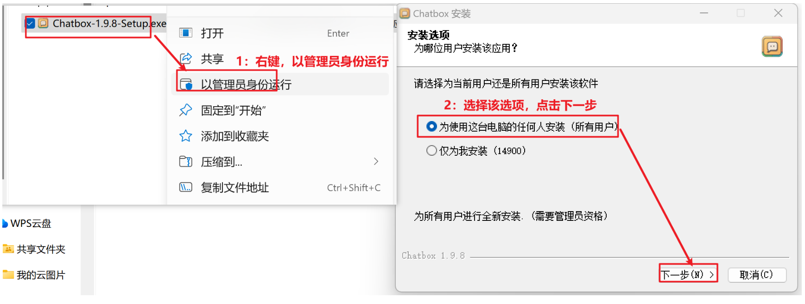

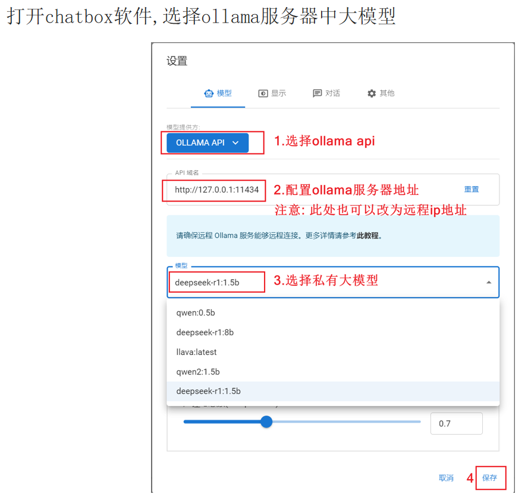

## ChatBox 界面介绍

**主界面**：左侧功能菜单（对话菜单、功能菜单）+ 模型选择。

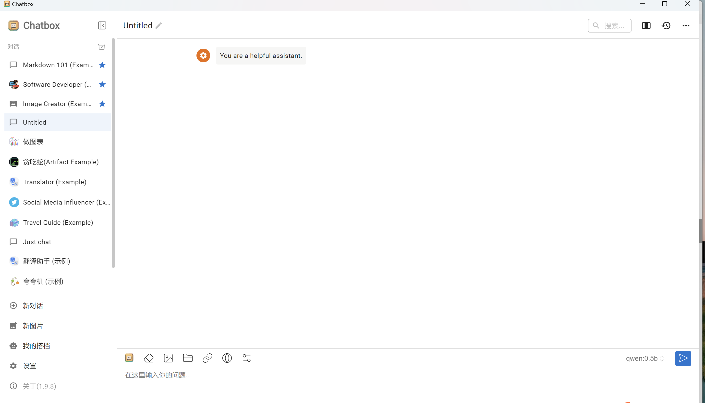

**对话聊天界面**：点击【立即开始】进入聊天界面。

- 聊天区域：发送文本、图片等信息与大模型对话
- 聊天历史：显示历史对话列表
- 聊天设置：对话模型切换与参数设置

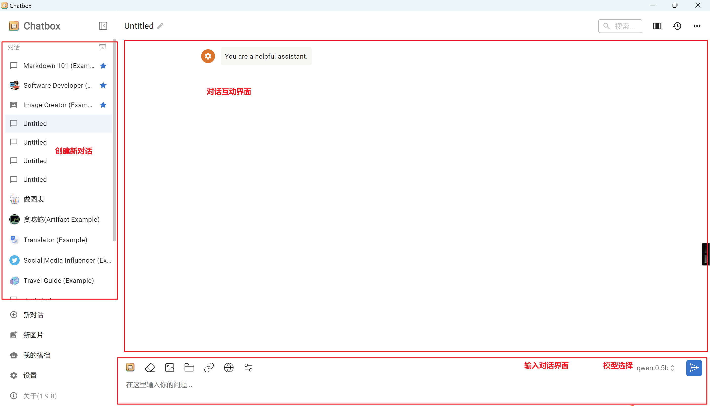

## ChatBox 集成 Ollama

**Step 1：运行本地大模型**：

```shell
ollama run qwen2 --keepalive 1h
```

> `--keepalive` 参数设置大模型被加载到内存中的存活时长为 1 小时。

**Step 2：配置 Ollama 信息**：进入对话聊天界面，点击设置按钮，在【模型】菜单中按图填写信息。

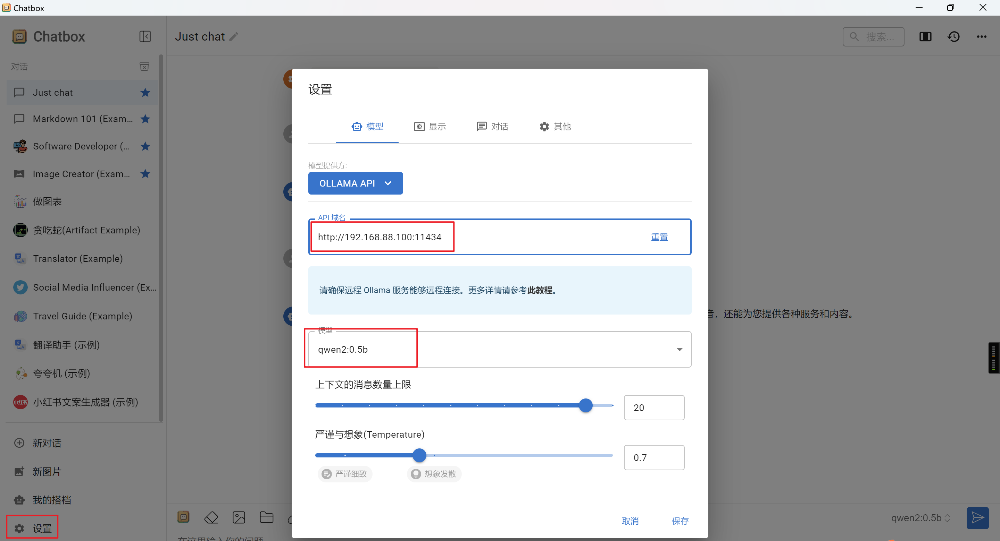

**Step 3：开始对话**：配置完成后返回对话界面，选择通义大模型即可开始对话。

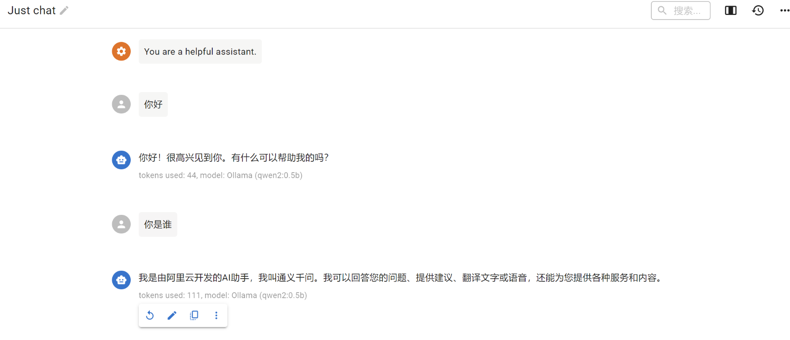

## 下午小结

- 掌握 ChatBox 环境搭建
  - 完成 ChatBox 软件安装
  - 实现 ChatBox 调用 Qwen / deepseek 大模型实现聊天机器人

---

# 七、附件：网络三要素与 HTTP 基础

## 网络三要素：协议、IP 地址、端口（端口号）

注意：`https://www.baidu.com:443` 中 `www.baidu.com` 是域名，是百度 IP 地址的别名。访问流程：

1. 先在本地 hosts 文件中查找 `www.baidu.com` 对应的 IP 地址，有则直接访问。
   - hosts 文件位置：`C:\Windows\System32\drivers\etc`
2. 若本地 hosts 没有对应 IP，则去公共域名解析系统中查找（一定有）。

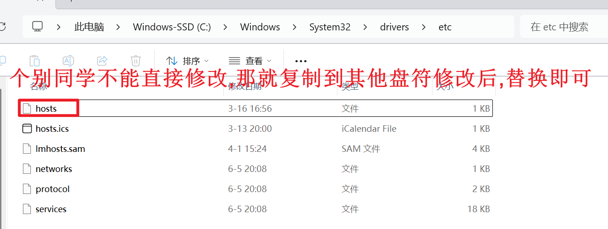

## 【补充】HTTP 基础知识

### 什么是 HTTP

HTTP（超文本传输协议，HyperText Transfer Protocol）是互联网上应用最广泛的网络协议，是客户端和服务器之间进行通信的规则集合，允许将 HTML 文档从 Web 服务器传输到 Web 浏览器。简而言之，HTTP 是 Web 浏览器和 Web 服务器之间的"语言"，使用户能浏览网页、下载文件、提交表单等。

### HTTP 请求特征

**请求方法**：定义客户端希望执行的操作类型。

- **GET**：请求获取指定资源，参数直接拼接在 URL 上。举例：`http://www.baidu.com:80/index.html?username=test&pwd=123`
- **POST**：向服务器提交数据（通常用于表单提交），重要参数信息放到请求体。

**请求网址（URL）**：统一资源定位符，俗称网址。包含协议（HTTP/HTTPS）、服务器地址、端口号和资源路径。

**请求头（Headers）**：包含请求的附加信息。

- **Host**：指定服务器的主机名和端口号
- **User-Agent**：描述客户端的信息（如浏览器类型）
- **Accept**：指定客户端能够接收的媒体类型
- **Content-Type**：指示请求体的媒体类型（如 `application/json`）
- **Authorization**：包含认证信息（如 Bearer Token）

**请求体（Request Body）**：携带客户端发送的数据，通常在 POST、PUT 等方法中使用。

- 表单数据：`username=test&password=123456`
- JSON 数据：`{"username": "test", "password": "123456"}`

### GET 与 POST 对比

| 方法 | 用途 | 幂等性 |
| --- | --- | --- |
| **GET** | 请求资源，从服务器获取数据（加载网页、查询） | 幂等（多次请求不影响资源） |
| **POST** | 提交数据（表单提交、文件上传） | 非幂等（多次请求可能影响资源） |

### HTTP 状态码分类

1. 信息响应（100–199）
2. 成功响应（200–299）
3. 重定向消息（300–399）
4. 客户端错误响应（400–499）
5. 服务端错误响应（500–599）

**常见的状态码**：

- **200 OK**：请求成功，响应中包含请求的数据
- 302 Found：资源临时移动到新 URL
- **404 Not Found**：请求的资源不存在
- **500 Internal Server Error**：服务器内部错误，无法完成请求
- 502 Bad Gateway：服务器作为网关时收到无效响应

