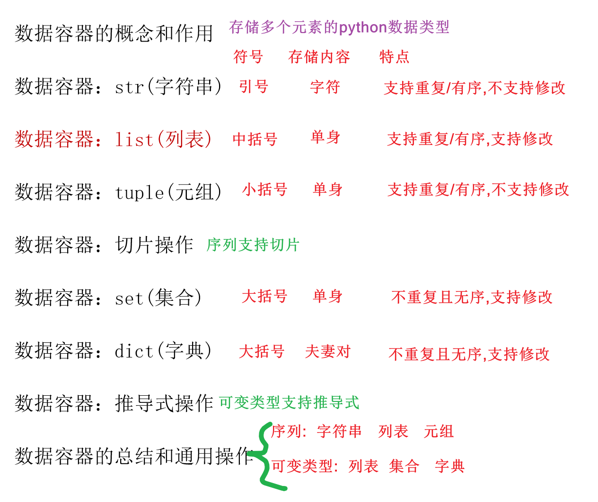
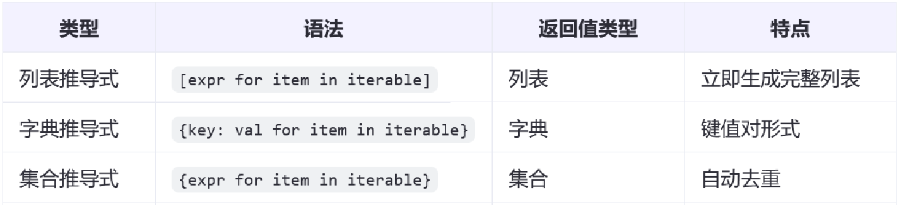
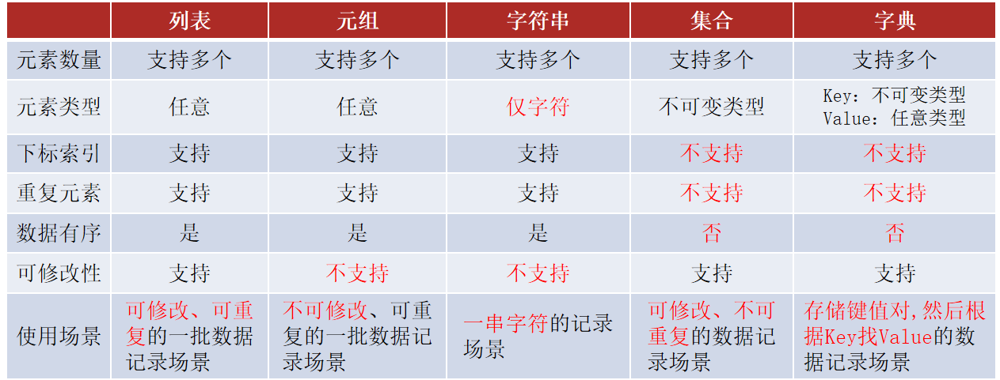
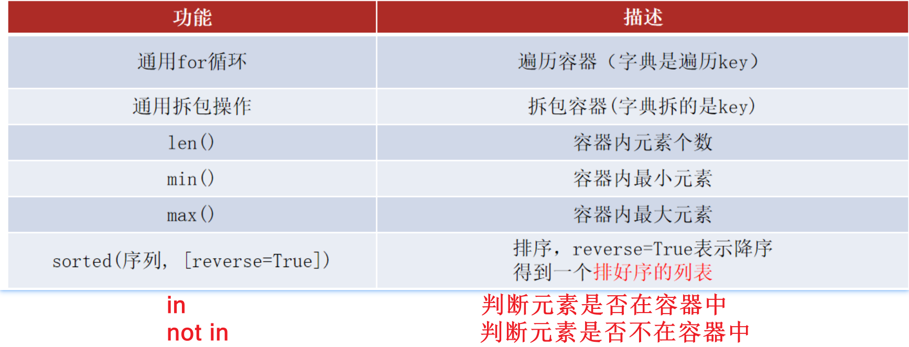
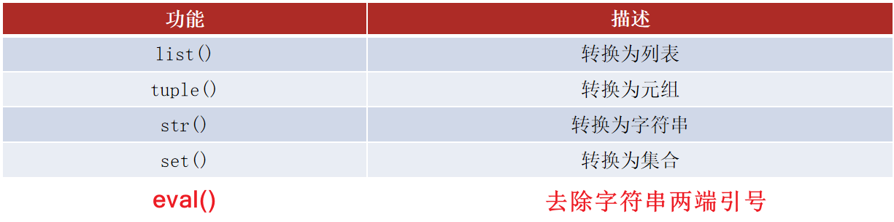

# 五大容器
> 本篇知识点：① 容器入门　② 字符串容器　③ 列表容器　④ 元组容器　⑤ 序列详解　⑥ 集合容器　⑦ 字典容器　⑧ 推导式　⑨ 五大容器总结对比

---

## 今日大纲

1. 容器入门
2. 字符串 / 列表 / 元组 / 集合 / 字典 五大容器详解
3. 序列详解（切片、运算）
4. 推导式详解
5. 五大容器总结对比（分类、通用操作、容器转换）

---

# 一、容器入门

> ==容器概念：可以容纳多个元素的 python 数据类型，就是容器==
> ==容器分类：字符串 str、列表 list、元组 tuple、集合 set、字典 dict==



> ==有序可重复：字符串、列表、元组==
> 无序不重复：集合、字典
> ==本身内容可以修改：列表、集合、字典==
> 不可以修改的：字符串、元组

---

# 二、字符串容器【重点】

> ==**字符串是不可变类型**==

## 字符串的定义

```properties
定义空字符串: ''  ""   ''''''   """"""   str()
定义非空字符串: '字符内容'  "字符内容"   '''字符内容'''   """字符内容"""
注意: 引号可以嵌套包裹
```

```python
# 定义空字符串
s1 = ''
s2 = ""
s3 = ''''''
s4 = """"""
s5 = str()
# 定义非空字符串
s6 = 'abcd'
s7 = "abcd"
s8 = '''ab
cd'''
s9 = """ab
cd"""
# 字符串引号嵌套
s10 = "我最近看了一本书,书名是'钢铁是怎样练成的'! "
print(s10, type(s10))
```

## 字符串的下标索引

```properties
正索引: 从左到右,从0开始依次递增
负索引: 从右到左,从-1开始依次递减
字符串名[索引]: 查询指定索引位置处的元素
```

```python
ss = "abcdefg"
print(ss[0])   # a
print(ss[-1])  # g
# 注意: 如果访问了不存在的索引,就会报索引越界异常
# print(ss[7])
```

## 字符串的查 / 删

```properties
查
    字符串名[索引]: 查询指定索引位置处的元素
    字符串名.count(元素): 查询元素出现次数(不存在返回0)
    字符串名.index(元素): 查询元素索引位置(不存在报错,多个返回第一个)
    len(字符串名): 查询元素总个数
删
    del 字符串名: 删除整个字符串
```

```python
ss = 'abcdeaaabb'
# 注意:字符串不支持修改操作(元素的增删改)
# ss.append('f') # 报错
# del ss[0]  # 报错
# ss[0] = 'f' # 报错

print(ss[0])         # 索引查询
print(len(ss))       # 元素个数
print(ss.count('a')) # 出现次数
print(ss.index('a')) # 索引位置
del ss               # 删除整个字符串
```

## 字符串的特有操作

```properties
replace(旧字符串,新字符串,替换几次): 替换,默认替换所有
strip(): 去除两端空白
split(分隔符,切几次): 按分隔符切割成列表
分隔符.join(容器): 用分隔符拼接容器中的字符串
startswith(字符串) / endswith(字符串): 判断开头/结尾
encode(编码) / decode(编码): 编码/解码
upper() / lower(): 转大写/小写
find(元素): 从左往右查找索引,不存在返回-1
rfind(元素): 从右往左查找索引,不存在返回-1
isdigit(): 判断是否是数字
```

```python
# 1. replace 替换
s1 = '你TMD哦,真的TMD哦!'
new_s1 = s1.replace('TMD', '***')
print(new_s1)

# 2. strip 去除两端空白
s3 = '    张三 18    '
print(s3.strip())

# 3. split 切割成列表
s4 = "苹果,香蕉,橘子,火龙果,榴莲"
print(s4.split(','))

# 4. join 拼接
s5 = ['苹果', '香蕉', '橘子', '火龙果', '榴莲']
print('-'.join(s5))  # 苹果-香蕉-橘子-火龙果-榴莲

# 5. startswith / endswith
names = ['张三', '张三丰', '李四', '张强', '王强', '李强']
for name in names:
    if name.startswith('张'):
        print(name)
for name in names:
    if name.endswith('强'):
        print(name)

# 编码/大小写/isdigit
print('你好'.encode('utf8'))
print('ABCabc'.upper())
print('10'.isdigit())

# 6. find / rfind
ss = 'abcdeaaabb'
print(ss.find('a'))   # 0
print(ss.find('f'))   # -1 (不存在返回-1)
```

## 字符串的遍历

```python
ss = 'abcde'
# for循环方式
for s in ss:
    print(s)
# while循环方式
index = 0
while index < len(ss):
    s = ss[index]
    print(s)
    index += 1
```

## 字符串的特点

- 可以容纳多个元素
- 元素只能是字符
- 元素可以重复
- 元素不可以修改
- 元素是有序的，有下标索引
- 支持 for / while 循环

---

# 三、列表容器【重点】

> ==**列表是可变类型**==

## 列表的定义

```properties
定义空列表:  []  或者 list()
定义非空列表: [元素1,元素2,元素3, ...]
列表支持嵌套: [ [元素...] , [元素...] ]
```

```python
l1 = []
l2 = list()
l3 = ['张三', '李四', 10, 20, 3.14, True, False]
l4 = [l1, l2, l3]  # 列表嵌套
```

## 列表的下标索引

```python
name_list = ['张三', '李四', '王五']
age_list = [18, 28, 38]
print(name_list[0])   # 张三
print(name_list[-1])  # 王五
# 嵌套列表索引
stu_list = [name_list, age_list]
print(stu_list[0][0])   # 张三
print(stu_list[1][-1])  # 38
```

## 列表的增删改查

```properties
增
    列表名.append(元素): 追加元素        [重点重点]
    列表名.extend(容器): 把容器中的元素依次取出追加
    列表名.insert(索引,元素): 指定位置插入
删
    列表名.pop(索引): 删除指定索引元素    [重点]
    del 列表名[索引]: 删除指定索引元素
    列表名.remove(元素): 删除指定元素(一次只删一个)  [重点]
    列表名.clear(): 清空所有元素
    del 列表名: 删除整个列表
改
    列表名[索引] = 新元素: 修改指定位置元素  [重点]
查
    列表名[索引]: 查询指定位置元素        [重点重点]
    列表名.count(元素): 元素出现次数       [重点]
    列表名.index(元素): 元素索引位置
    len(列表名): 元素总个数               [重点]
```

```python
names = []
# 增
names.append('张三')
names.extend(['张三', '李四', '王五'])
names.insert(0, '熊大')
# 改
names[0] = '老大'
# 查
print(names[0])
print(names.count('张三'))
print(names.index('张三'))
print(len(names))
# 删
names.pop(0)
del names[0]
names.remove('张三')
names.clear()
del names
```

## 列表的遍历

```python
names = ['熊大', '熊二', '张三', '李四', '王五']
# for循环方式
for name in names:
    print(name)
# while循环方式
index = 0
while index < len(names):
    name = names[index]
    print(name)
    index += 1
```

## 列表的特点

1. 支持容纳多个元素
2. 支持 for 循环遍历
3. 支持修改操作
4. 能存储任意类型数据
5. 有下标索引 → 支持 while 循环
6. 有下标索引 → 有序（存进去和取出来顺序一致）
7. 有下标索引 → 可以重复

---

# 四、元组容器

> ==**元组是不可变类型**==

## 元组的定义

```properties
定义空元组: () 或者 tuple()
定义非空元组: (元素1,元素2,元素3,...)
注意!!!: 如果元组中只有一个元素,必须加逗号  格式: (元素,)
```

```python
t1 = ()
t2 = tuple()
t3 = ('张三', '李四', 10, 20, 3.14, True, False)
t4 = (t1, t2, t3)   # 元组嵌套
t5 = ('张三',)      # 注意: 单元素元组必须加逗号
```

## 元组的查与遍历

```python
names = ('张三', '李四', '王五', '张三')
print(names[0])          # 索引查询
print(names.count('张三'))  # 出现次数
print(names.index('张三'))  # 索引位置
print(len(names))        # 长度
# 遍历(与列表相同,for/while均可)
for name in names:
    print(name)
```

## 元组的特点

1. 支持容纳多个元素
2. 支持 for 循环遍历
3. **不支持修改操作**
4. 能存储任意类型数据
5. 有下标索引 → 支持 while 循环、有序、可以重复

---

# 五、序列详解

> ==五大容器中属于序列的有：字符串、列表、元组==

```properties
1.序列支持切片(截取部分内容): 序列[开始索引:结束位置:步长]
    注意1: 序列有两套索引,正索引从0开始,负索引从-1开始
    注意2: 步长决定截取方向,正步长从左到右,负步长从右到左
    注意3: 开始索引留空默认从头开始
    注意4: 结束位置=结束索引+1,留空默认到尾部

2.序列支持运算符
    + : 序列+序列 → 拼接返回一个新序列
    * : 序列*x → 序列内容乘以x份返回新序列
```

### 切片示例

```python
s = 'abcde'
print(s[1:4:2])   # 'bd'
l = ['a', 'b', 'c', 'd', 'e']
print(l[1:4:2])   # ['b', 'd']
t = ('a', 'b', 'c', 'd', 'e')
print(t[1:4:2])   # ('b', 'd')
```

### 运算示例

```python
s = 'abcde'
l = ['a', 'b', 'c', 'd', 'e']
t = ('a', 'b', 'c', 'd', 'e')
print(s + s)  # 拼接
print(l * 2)  # 复制
# 注意: +是拼接返回新列表,append是直接修改原有列表
print(l + ['f'])
l.append('f')
print(l)
```

### 课后练习（切片）

```python
my_list = ['a', 'b', 'c', 'd', 'e', 'f', 'g']
# ['a', 'b', 'c']      → my_list[:3]
# ['c', 'd', 'e']      → my_list[2:5]
# ['e', 'f', 'g']      → my_list[4:]
# ['a', 'c', 'e', 'g'] → my_list[::2]
# ['b', 'd', 'f']      → my_list[1::2]
# 倒序                 → my_list[::-1]
# ['g', 'f']           → my_list[-1:-3:-1]
# ['e', 'd', 'c']      → my_list[-3:-6:-1]
# ['c', 'b', 'a']      → my_list[2::-1]
# ['g', 'e', 'c', 'a'] → my_list[::-2]
# ['f', 'd', 'b']      → my_list[-2::-2]
```

（元组、字符串的切片练习格式完全一致，自行对照练习。）

---

# 六、集合容器

> ==**集合是可变类型**==

## 集合的定义

```properties
定义空集合: 集合名 = set()
定义非空集合: 集合名 = {元素1,元素2,元素3...}
集合核心特点: 无序不重复,元素只能是不可变类型(整数,浮点数,布尔值,字符串,元组)
```

```python
d1 = {}          # 注意: 空的{}代表是字典
s1 = set()       # 定义空集合
s2 = {'张三', '李四', 10, 10, 3.14, True, False}  # 自带去重功能
s3 = {10, 3.14, True, "123", ('a', 'b')}  # 只能放不可变类型
# 注意: 集合中不能放列表/集合/字典,否则报错 TypeError: unhashable type
```

## 集合的增删改查

```properties
增
    集合名.add(元素): 添加元素
删
    集合名.pop(): 随机删除一个元素
    集合名.remove(元素): 删除指定元素(一次只删一个)
    集合名.clear(): 清空
    del 集合名: 删除整个集合
改
    集合1.difference_update(集合2): 修改为差集
    集合1.update(集合2): 修改为并集
查
    len(集合名): 元素个数
```

```python
names = set()
names.add('张三')
names.add('李四')
names.add('王五')
names.difference_update({'张三', '赵六'})  # 差集
names.update({'张三', '赵六'})             # 并集
print(len(names))
names.pop()        # 随机删除一个
names.remove('张三')
names.clear()
del names
```

## 集合的遍历

```python
names = {'老大', '熊二', '张三', '李四', '王五'}
for name in names:
    print(name)
# 注意: 集合没有索引,不支持while循环
```

## 集合的特点

1. 支持容纳多个元素
2. 支持 for 循环遍历
3. 支持修改操作
4. 只能存储不可变类型数据
5. 没有下标索引 → 不支持 while 循环
6. 没有下标索引 → 无序（自带去重功能）
7. 没有下标索引 → 不重复

---

# 七、字典容器【重点】

> ==**字典是可变类型**==

## 字典的定义

```properties
定义空字典:  字典名 = {}  和  字典名 = dict()
定义非空字典: 字典名 = {k1:v1 , k2:v2 , k3:v3 ...}
注意: 键key只能是不可变类型且不能重复, 值value可以是任意类型且可以重复
```

```python
d1 = {}
d2 = dict()
d3 = {"张三": 18, "李四": 28, '王五': 38}
# 字典的嵌套
score_dict = {
    "张三": {'语文': 99, '数学': 88, '英语': 98},
    "李四": {'语文': 89, '数学': 68, '英语': 100},
    "王五": {'语文': 79, '数学': 98, '英语': 99},
}
```

## 字典的键 key

```properties
字典名[key]:  根据指定的键key获取值value
字典名.get(key):  根据指定的键key获取值value
```

```python
info_dict = {"张三": 18, "李四": 28, '王五': 38, '张三': 38}
# 注意: 如果key重复,不报错,新值替换旧值
print(info_dict['张三'])
# 嵌套取值
score_dict = {"张三": {'语文': 99, '数学': 88}, "李四": {'语文': 89, '数学': 68}}
print(score_dict['张三']['数学'])
print(score_dict['李四']['英语'])
```

## 字典的增删改查

```properties
增
    字典名[新key] = value: 添加键值对
改
    字典名[旧key] = value: 修改旧key对应的值
删
    字典名.pop(key): 根据key删除键值对
    del 字典名[key]: 根据key删除键值对
    字典名.clear(): 清空
    del 字典名: 删除整个字典
查
    字典名[key] / 字典名.get(key): 根据key获取value
    len(字典名): 键值对个数
    字典名.keys(): 所有key
    字典名.values(): 所有value
    字典名.items(): 所有键值对(每个键值对封装为元组)
```

```python
score_dict = {}
# 增
score_dict['李四'] = 80
score_dict['张三'] = 99
score_dict['张三'] = 100   # 同key覆盖旧值
# 改
score_dict['王五'] = 99
# 查
print(score_dict['张三'])
print(score_dict.get('王五'))
print(len(score_dict))
names = list(score_dict.keys())
scores = list(score_dict.values())
kvs = score_dict.items()
# 删
score_dict.pop('张三')
del score_dict['王五']
score_dict.clear()
del score_dict
```

## 字典的遍历

```python
score_dict = {'李四': 80, '王五': 99, '赵六': 90, '张三': 100, '田七': 100}
# 方式1(推荐): 直接遍历字典获取key,再根据key找value
for k in score_dict:
    v = score_dict.get(k)
    print(f"{k}的分数是:{v}")
# 方式2(推荐): 获取所有键值对,拆包直接拿到k,v
for k, v in score_dict.items():
    print(f"{k}的分数是:{v}")
```

## 字典的特点

1. 支持容纳多个元素
2. 支持 for 循环遍历
3. 支持修改操作
4. 每个元素是键值对：key 只能是不可变类型，value 可以是任意类型
5. 没有下标索引 → 不支持 while 循环
6. 没有下标索引 → 无序
7. 没有下标索引 → 键不能重复

---

# 八、推导式详解

> ==五大容器中支持推导式的有：列表、集合、字典==

Python 的推导式（Comprehension）是一种简洁、优雅的语法，用于创建数据结构，能够通过一行代码生成列表、字典、集合或生成器表达式。



## 列表推导式

```python
# 需求: 生成存储了1-10的列表
nums2 = [i for i in range(1, 11)]
print(nums2)
# 需求: 生成存储了1-10中偶数的列表
nums2 = [i for i in range(1, 11) if i % 2 == 0]
print(nums2)
```

## 集合推导式

```python
nums2 = {i for i in range(1, 11)}
print(nums2)
```

## 字典推导式

```python
nums2 = {i: i for i in range(1, 11)}
print(nums2)
```

## 生成器推导式

```python
# 注意: 以下不是元组推导式
nums = (i for i in range(1, 11))
print(nums)          # 生成器对象
t = tuple(nums)      # 转元组
print(t)
```

---

# 九、五大容器总结对比

## 分类功能

```properties
是否是序列
    序列: 列表 元组 字符串
    非序列: 集合 字典

是否是可变类型
    可变类型: 列表、集合、字典
    不可变类型: 元组、字符串
```



## 通用操作



```python
# 1.定义五大容器
s = 'cbedaa'
l = ['c', 'b', 'e', 'd', 'a', 'a']
t = ('c', 'b', 'e', 'd', 'a', 'a')
se = {'c', 'b', 'e', 'd', 'a', 'a'}
d = {'c': 1, 'b': 1, 'e': 1, 'd': 1, 'a': 1}

# len() 元素个数 / min() 最小元素 / max() 最大元素
print(len(s), min(s), max(s))
# sorted(容器) 默认升序排序 / sorted(容器, reverse=True) 反转
print(sorted(l))
print(sorted(l, reverse=True))
# in / not in 判断元素是否在容器中
print('c' in s)
print('c' not in d)
# 拆包 (五个容器都支持)
a, b, c = '123'
print(a, b, c)
a, b, c = [1, 2, 3]
a, b, c = (1, 2, 3)
a, b, c = {1, 2, 3}
a, b, c = {1: 'a', 2: 'a', 3: 'a'}
```

## 容器转换



```python
l = [2, 1, 3, 1]
t = (2, 1, 3, 1)
s = '2131'
ss = {2, 1, 3, 1}
d = {2: 'a', 1: 'a', 3: 'a'}

# list(其他容器): 转列表
print(list(t), list(s), list(ss), list(d))
# tuple(其他容器): 转元组
print(tuple(l), tuple(s), tuple(ss), tuple(d))
# set(其他容器): 转集合(自带去重)
print(set(l), set(t), set(s), set(d))
# str(其他容器): 转字符串
print(str(l))   # '[2, 1, 3, 1]'
print(str(d))   # "{2: 'a', 1: 'a', 3: 'a'}"

# TODO 需求: 上述的字符串结果,如何再转换回去?
print(list('[2, 1, 3, 1]'))  # 结果是有问题的
# 拓展: 用 eval(字符串)自动去除引号,还原成原容器
print(eval('[2, 1, 3, 1]'))   # 列表
print(eval('(2, 1, 3, 1)'))   # 元组
print(eval('{1, 2, 3}'))      # 集合
print(eval("{2: 'a', 1: 'a', 3: 'a'}"))  # 字典
# eval还可以把字符串中的整数/浮点数/布尔值变成本身类型
print(eval('10'), eval('3.14'), eval('True'))
# 注意: eval不要直接去除非上述类型外的引号
# print(eval('你好')) # 报错
```

