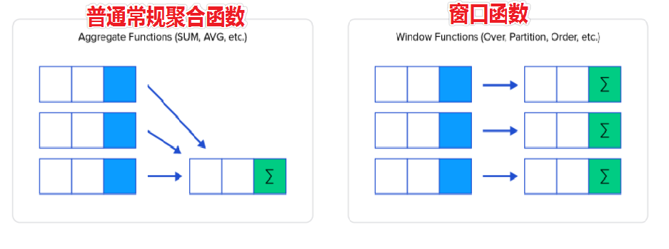

# MySQL函数
> 本篇知识点：① 内置函数简介　② 开窗函数（窗口函数基础/PARTITION BY/排名函数/CTE）

---

## 今日大纲

1. 内置函数简介
2. 开窗函数：窗口函数基础用法、PARTITION BY 分区、排名函数、CTE

---

# 一、内置函数简介

> MySQL 中有很多内置函数，除了之前学习的聚合函数之外，还有：数值函数、字符串函数、时间日期函数、流程控制函数、加解密函数、开窗函数等。

**内置函数该如何学习？**

- 熟悉常用的内置函数，其他用到再查帮助文档
- 官网文档：https://dev.mysql.com/doc/refman/8.0/en/functions.html
- 在 mysql 命令行或 DataGrip 中通过 `HELP '函数名'` 查看指定函数帮助文档（示例：`help 'count';`）

---

# 二、开窗函数

> ==作用：查询每一行数据时，使用指定的窗口函数对每行关联的一组数据进行处理。==



```properties
基本语法: <window function> OVER (ORDER BY 列名, ...)
OVER(...)的作用就是设置每一行数据关联的一组数据范围,OVER()时,每行关联的数据范围都是整张表的数据。
<window function>可以使用之前学过的聚合函数(COUNT、SUM、AVG、MAX、MIN等),也可以使用ROW_NUMBER、RANK、DENSE_RANK等排序函数。

常用排序函数:
RANK(): 产生的排名序号,有并列的情况出现时序号不连续
DENSE_RANK(): 产生的排序序号是连续的,有并列的情况出现时序号会重复
ROW_NUMBER(): 返回连续唯一的行号,排名序号不会重复

其他函数:
NTILE(X): 将每个分区的数据均匀的分成X组,返回每行对应的组号
LAG(字段,[N],[M]): 返回分区中当前行前第N行的指定字段的内容,如果没有,默认返回M
LEAD(字段,[N],[M]): 返回分区中当前行后第N行的指定字段的内容,如果没有,默认返回M
```

## 1. 窗口函数简介

> 窗口函数是 MySQL 8.0 以后加入的功能，之前需要通过定义临时变量和大量的子查询才能完成的工作，使用窗口函数实现起来更加简洁高效。

```sql
-- 数据准备
CREATE TABLE `students`
(
    `ID`     INT(11)       NOT NULL AUTO_INCREMENT,
    `Name`   VARCHAR(24)   NOT NULL,
    `Gender` VARCHAR(8)    NOT NULL,
    `Score`  DECIMAL(5, 2) NOT NULL,
    PRIMARY KEY (`ID`)
);

INSERT INTO `students` VALUES
(1, 'smart', 'Male', 90.00),
(2, 'linda', 'Female', 81.00),
(3, 'lucy', 'Female', 83.00),
(4, 'david', 'Male', 94.00),
(5, 'Tom', 'Male', 92.00),
(6, 'Jack', 'Male', 88.00);

-- 查询: 计算每个同学分数和整体平均分的差值
SELECT *,
       AVG(score) OVER ()         AS `avg`,
       score - AVG(score) OVER () AS `difference`
FROM students;
```

## 2. 窗口函数基础用法

> 基础语法：`<window function> OVER(...)`
> OVER(...) 设置每行数据关联的窗口数据范围；OVER() 时，每行关联的数据范围都是整张表的数据。

**典型应用场景 1：计算每个值和整体平均值的差值**

```sql
-- 需求: 计算每个学生的Score分数和所有学生整体平均分的差值
SELECT *,
       AVG(score) OVER ()         AS avg_score,
       score - AVG(score) OVER () AS diff
FROM students;
```

**典型应用场景 2：计算每个值占整体之和的占比**

```sql
-- 需求: 计算每个学生的Score分数占所有学生分数之和的百分比
SELECT *,
       SUM(score) OVER () AS sum_score,
       score / SUM(score) OVER () * 100
FROM students;
```

## 3. PARTITION BY 分区

> 基本语法：`<window function> OVER(PARTITION BY 列名, ...)`
> PARTITION BY 按照指定列对整张表的数据进行分区；分区后，窗口函数作用在该行数据关联的分区上，不再是整张表上。

```sql
-- 需求: 计算每个学生的Score分数和同性别学生平均分的差值
SELECT *,
       AVG(score) OVER (PARTITION BY gender)         AS gender_score,
       score - AVG(score) OVER (PARTITION BY gender) AS diff
FROM students;
```

**PARTITION BY 和 GROUP BY 的区别**

- PARTITION BY 用在窗口函数中，结果是：**一进一出**
- GROUP BY 用在分组聚合中，结果是：**多进一出**

## 4. 排名函数

> 基本语法：`<ranking function> OVER (ORDER BY 列名, ...)`
> OVER() 中指定 ORDER BY 对每一行关联的分区数据进行排序，然后使用排序函数对分区内的每行数据产生一个排名序号。

```sql
-- 需求: 按照不同科目,对学生的分数从高到低排名(要求:连续可重复)
SELECT *,
       DENSE_RANK() OVER (PARTITION BY course ORDER BY score DESC) AS dr
FROM tb_score;
```

**典型应用：获取指定排名的数据**

```sql
-- 需求: 获取每个科目,排名第二的学生信息
SELECT *
FROM (
    SELECT *,
           DENSE_RANK() OVER (PARTITION BY course ORDER BY score DESC) AS dr
    FROM tb_score
) t
WHERE dr = 2;
```

## 拓展：CTE（公用表表达式）

> CTE（Common Table Expression）：类似于子查询，相当于一张临时表，可以在 CTE 结果的基础上进行进一步的查询操作。

```sql
/*
基础语法:
WITH tmp1 AS (查询语句),
     tmp2 AS (查询语句),
     tmp3 AS (查询语句)
SELECT 字段名 FROM 表名;
*/

-- 需求: 获取每个科目,排名第二的学生信息(CTE写法)
WITH temp AS (
    SELECT *,
           DENSE_RANK() OVER (PARTITION BY course ORDER BY score DESC) AS dr
    FROM tb_score
)
SELECT * FROM temp WHERE dr = 2;
```

