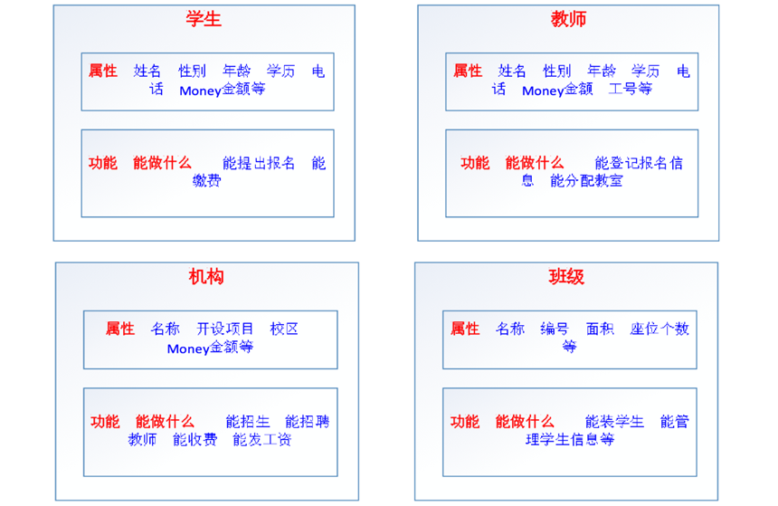
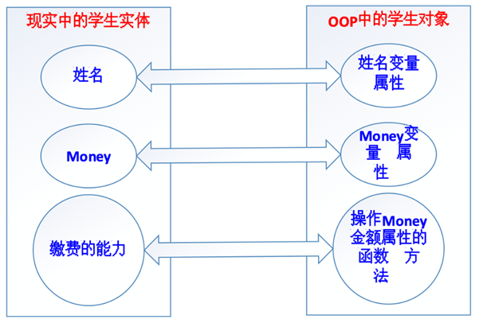
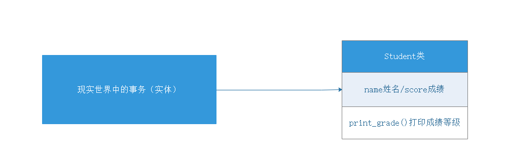
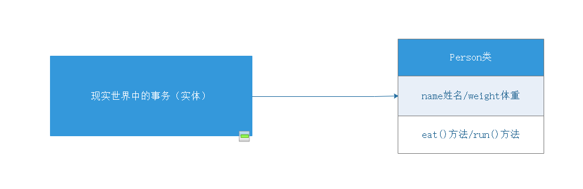
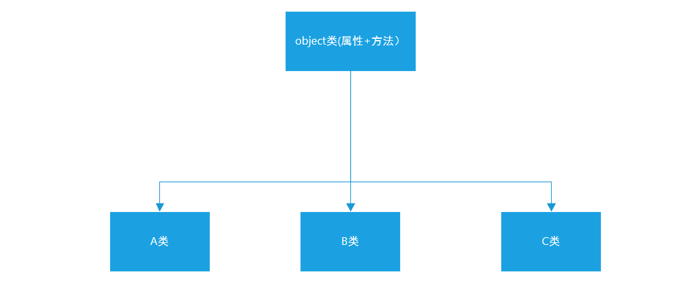
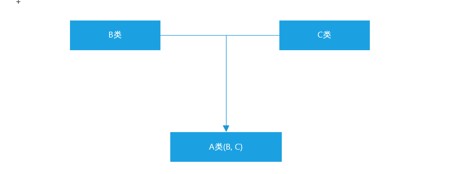
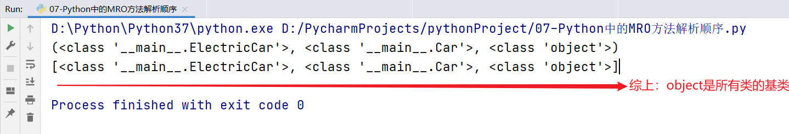
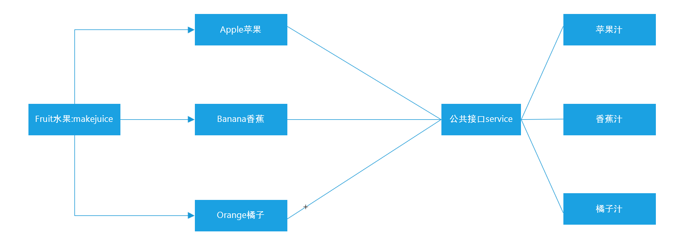

# 面向对象编程

## 1.1 面向对象基础


## 一、面向对象编程思想

### 1 什么是面向过程

传统的面向过程的编程思想总结起来就八个字——自顶向下，逐步细化！

→ 将要实现的功能描述为一个从开始到结束按部就班的连续的“步骤”

→ 依次逐步完成这些步骤，如果某一个步骤的难度较大，又可以将该步骤再次细化为若干个子步骤，以此类推，一直到结尾并得到我们想要的结果

就是把要开发的系统分解为若干个步骤，每个步骤就是函数，当所有步骤全部完成以后，则这个系统就开发完毕了！

举个栗子：大家以来传智教育报名学习这件事情，可以分成哪些步骤？开始 → 学员**提出**报名，**提供**相关材料 → 学生**缴纳**学费，**获得**缴费凭证 → 教师凭借学生缴费凭证进行**分配**班级 → 班级**增加**学生信息 → 结束所谓的面向过程，就是将上面分析好了的步骤，依次执行就行了！

### 2 什么是面向对象

思考：上面的整个报名过程，都有哪些动词？

**提出、提供、缴纳、获得、分配、增加**

有动词就一定有实现这个动作的实体！

所谓的模拟现实世界，就是使计算机的编程语言在解决相关业务逻辑的时候，与真实的业务逻辑的发生保持一致，需要使任何一个动作的发生都存在一个支配给该动作的一个实体（主体），因为在现实世界中，任何一个功能的实现都可以看做是一个一个的实体在发挥其各自的“功能”（能力）并在内部进行协调有序的调用过程！

### 3 举个栗子：使用面向对象实现报名系统开发

### ☆ 第一步：分析哪些动作是由哪些实体发出的

**学生**提出报名

**学生**提供相关资料

**学生**缴费

**机构**收费

**教师**分配教室

**班级**增加学生信息

于是，在整个过程中，一共有四个实体：**学生、机构、教师、班级**！在现实中的一个具体的实体，就是计算机编程中的一个==对象==！

### ☆ 第二步：定义这些实体，为其增加相应的属性和功能

属性就是实体固有的某些特征特性信息，在面向对象的术语中，属性就是以前的变量。

比如

一个人的属性有：身高、体重、姓名、年龄、学历、电话、籍贯、毕业院校等

一个手机的属性有：价格、品牌、操作系统、颜色、尺寸等

功能就是就是实体可以完成的动作，在面向对象的术语中，功能就是封装成了函数或方法



### ☆ 第三步：让实体去执行相应的功能或动作

学生提出报名

学生提供相关资料

教师登记学生信息

学生缴费

机构收费

教师分配教室

班级增加学生信息

### 4 面向对象编程思想迁移

以前写代码，首先想到的是需要实现什么功能——调用系统函数，或者自己自定义函数，然后按部就班的执行就行了！

以后写代码，首先想到的是应该由什么样的主体去实现什么样的功能，再把该主体的属性和功能统一的进行封装，最后才去实现各个实体的功能。

注意：面向对象并不是一种技术，而是一种思想，是一种解决问题的最基本的思维方式！

所以，面向对象的核心思想是：不仅仅是简单的将功能进行封装（封装成函数），更是对调用该功能的主体进行封装，实现某个主体拥有多个功能，在使用的过程中，先得到对应的主体，再使用主体去实现相关的功能！

### 5 面向对象要比面向过程好？

一个面试题：面向过程和面向对象的区别？

① 都可以实现代码重用和模块化编程，面向对象的模块化更深，数据也更封闭和安全

② 面向对象的思维方式更加贴近现实生活，更容易解决大型的复杂的业务逻辑

③ 从前期开发的角度来看，面向对象比面向过程要更复杂，但是从维护和扩展的角度来看，面向对象要远比面向过程简单！

④ 面向过程的代码执行效率比面向对象高

## 二、面向对象的基本概念

### 1 面向对象中两个比较重要概念

### ☆ 1.1 对象

对象，object，现实业务逻辑的一个动作实体就对应着OOP编程中的一个对象！



所以：① 对象使用属性（property）保存数据！② 对象使用方法（method）管理数据！

### ☆ 1.2 类

对象如何产生？又是如何规定对象的属性和方法呢？

答：在Python中，采用类（class）来生产对象，用类来规定对象的属性和方法！也就是说，在Python中，要想得到对象，必须先有类！

为什么要引入类的概念？ 类本来就是对现实世界的一种模拟，在现实生活中，任何一个实体都有一个类别，==类就是具有相同或相似属性和动作的一组实体的集合！==所以，在Python中，对象是指现实中的一个具体的实体，而既然现实中的实体都有一个类别，所以，OOP中的对象也都应该有一个类！

一个对象的所有应该具有特征特性信息，都是由其所属的类来决定的，但是每个对象又可以具有不同的特征特性信息，比如，我自己（人类）这个对象，名字叫老王，性别男，会写代码，会教书；另一个对象（人类）可能叫赵薇，性别女，会演戏，会唱歌！

### 2 类的定义

在Python中，我们可以有两种类的定义方式：Python2（经典类）和 Python3（新式类）

经典类：不由任意内置类型派生出的类，称之为经典类

```
`class 类名:
    # 属性
    # 方法
`
```

新式类：

```
`class 类名(object):
    # 属性
    # 方法
`
```

这就是一个类，只不过里面什么都没有！其中，类名既可以使用大写形式也可以使用小写形式，遵守一般的标识符的命名规则（以字母、数字和下划线构成，并且不能以数字开头），一般为了和方法名相区分，类名的首字母一般大写！（大驼峰法）

基本语法：

```
`class Person(object):
    # 属性
    # 方法（函数）
    def eat(self):
        print('吃零食')
    def drink(self):
        print('喝可乐')
`
```

### 3 类的实例化（创建对象）

类的实例化就是把抽象的事务具体为现实世界中的实体。

类的实例化就是==通过类得到对象！==

类只是对象的一种规范，类本身基本上什么都做不了，必须利用类得到对象，这个过程就叫作==类的实例化！==

基本语法：

```
`对象名 = 类名()
`
```

在其他的编程语言中，类的实例化一般是通过new关键字实例化生成的，但是在Python中，我们不需要new关键字，只需要类名＋()括号就代表类的实例。

案例：把Person类实例化为为对象p1

```
`# 1、定义一个类
class Person(object):
    # 定义相关方法
    def eat(self):
        print('吃零食')
    def drink(self):
        print('喝可乐')

# 2、实例化对象
p1 = Person()
# 3、调用类中的方法
p1.eat()
p1.drink()

p2 = Person()
`
```

类是一个抽象概念，在定义时，其并不会真正的占用计算机的内存空间。但是对象是一个具体的事务，所以其要占用计算机的内存空间。

### 4 类中的self关键字

self也是Python内置的关键字之一，其指向了==类实例对象本身==。

```
`# 1、定义一个类
class Person():
    # 定义一个方法
    def speak(self):
        print(self)
        print('Nice to meet you!')

# 2、类的实例化（生成对象）
p1 = Person()
print(p1)
p1.speak()

p2 = Person()
print(p2)
p2.speak()
`
```

一句话总结：类中的self就是谁实例化了对象，其就指向谁。

## 三、对象的属性添加与获取

### 1 什么是属性

在Python中，任何一个对象都应该由两部分组成：属性 + 方法

属性即是特征，比如：人的姓名、年龄、身高、体重…都是对象的属性。

​                                                车的品牌、型号、颜色、载重量...都是对象的属性。

对象属性既可以在类外面添加和获取，也能在类里面添加和获取。

### 2 在类的外面添加属性和获取属性

### ☆ 2.1 设置

```
`对象名.属性 = 属性值
`
```

案例：

```
`# 1、定义一个Person类
class Person(object):
    pass

# 2、实例化Person类，生成p1对象
p1 = Person()
# 3、为p1对象添加属性
p1.name = '老王'
p1.age = 18
p1.address = '北京市顺义区京顺路99号'
`
```

### ☆ 2.2 获取

在Python中，获取对象属性的方法我们可以通过`对象名.属性`来获取

```
`# 1、定义一个Person类
class Person():
    pass

# 2、实例化Person类，生成p1对象
p1 = Person()
# 3、为p1对象添加属性
p1.name = '老王'
p1.age = 18
p1.address = '北京市顺义区京顺路99号'

# 4、获取p1对象的属性
print(f'我的姓名：{p1.name}')
print(f'我的年龄：{p1.age}')
print(f'我的住址：{p1.address}')
`
```

### 3 在类的内部获取外部定义的属性

```
`# 1、定义一个Person类
class Person():
    def speak(self):
        print(f'我的名字：{self.name}，我的年龄：{self.age}，我的住址：{self.address}')

# 2、实例化Person类，生成p1对象
p1 = Person()
# 3、添加属性
p1.name = '孙悟空'
p1.age = 500
p1.address = '花果山水帘洞'
# 4、调用speak方法
p1.speak()
`
```

遗留一个问题：目前我们的确可以通过`对象.属性`的方式设置或获取对象的属性，但是这种设置属性的方式有点繁琐，每次定义一个对象，就必须手工为其设置属性，在我们面向对象中，对象的属性能不能在实例化对象时，直接进行设置呢？

答：可以，但是需要使用魔术方法

## 四、魔术方法

### 1 什么是魔术方法

魔术变量：`__name__`，`__file__`这些都是魔术变量（拥有特殊功能的变量）

在Python中，`__xxx__()`的函数叫做魔法方法，指的是具有==特殊功能==的函数。

魔术方法都有自己的触发条件：

`__init__()`当实例化对象时，其会自动被触发（被调用）

`__del__()`当手工删除对象或对象被销毁时，其会自动被触发（被调用）

### 2 `__init__()`方法(初始化方法或构造方法)

思考：人的姓名、年龄等信息都是与生俱来的属性，可不可以在生产过程中就赋予这些属性呢？

答：可以，使用`__init__()` 方法，其作用：实例化对象时，连带其中的参数，会一并传给`__init__`函数自动并执行它。`__init__()`函数的参数列表会在开头多出一项，它永远指代新建的那个实例对象，Python语法要求这个参数必须要有，名称为self。

```
`# 1、定义一个类
class Person():
    # 初始化实例对象属性
    def __init__(self, name, age):
        # 赋予name属性、age属性给实例化对象本身
        # self.实例化对象属性 = 参数
        self.name = name
        self.age = age

# 2、实例化对象并传入初始化属性值
p1 = Person('孙悟空', 500)
# 3、调用p1对象自身属性name与age
print(p1.name)
print(p1.age)
`
```

① __init__()方法，在创建一个对象时默认被调用，不需要手动调用

② __init__(self)中的self参数，不需要开发者传递，python解释器会自动把当前的对象

引用传递过去。

### 3 `__str__()`方法

当使用print输出对象的时候，默认打印对象的内存地址。如果类定义了`__str__`方法，那么就会打印从在这个方法中 return 的数据。(另外要特别注意__str__方法返回==字符串类型==的数据)

没有使用`__str__()`方法的类：

```
`# 1、定义一个类
class Car():
    # 首先定义一个__init__方法，用于初始化实例对象属性
    def __init__(self, brand, model, color):
        self.brand = brand
        self.model = model
        self.color = color

    # 定义一个__str__内置魔术方法，用于输出小汽车的相关信息
    def __str__(self):
        return f'汽车品牌：{self.brand}，汽车型号：{self.model}，汽车颜色：{self.color}'

# 2、实例化对象c1
c1 = Car('奔驰', 'S600', '黑色')
print(c1)
`
```

① `__str__`这个魔术方法是在类的外部，使用print(对象)时，自动被调用的

② 在类的内部定义`__str__`方法时，必须使用return返回一个字符串类型的数据

### 4 `__del__()`方法（删除方法或析构方法）

__init__方法与__del__方法时一对

当删除对象时（调用del删除对象或者文件执行结束后），python解释器会自动调用`__del__()`方法。

```
`class Person():
    # 构造函数__init__
    def __init__(self, name, age):
        self.name = name
        self.age = age

    # 析构方法__del__
    def __del__(self):
        print(f'{self}对象已经被删除')

# 实例化对象
p1 = Person('白骨精', 100)
# 删除对象p1
del p1
`
```

`__del__()`方法在使用过程中，比较简单，但是其在实际开发中，有何作用呢？

答：主要用于关闭文件操作、关闭数据库连接等等。

### 5 总结对比

提到魔术方法：① 这个方法在什么情况下被触发 ② 这个方法有什么实际的作用

`__init__()`：初始化方法或者称之为“构造函数”，在对象初始化时执行，其主要作用就是在对象初始化时，对对象进行初始化操作（如赋予属性）

`__str__()`：对象字符串方法，当我们在类的外部，使用print方法输出对象时被触发，其主要功能就是对对象进行打印输出操作，要求方法必须使用return返回==字符串==格式的数据。

`__del__()`：删除方法或者称之为“析构方法”，在对象被删除时触发（调用del删除对象或文件执行结束后），其主要作用就是适用于关闭文件、关闭数据库连接等等。

## 五、面向对象的三大特性

### 1 面向对象有哪些特性

三种：封装性、继承性、多态性

### 2 Python中的封装

在Python代码中，封装有两层含义：

① 把现实世界中的主体中的属性和方法书写到类的里面的操作即为封装

```
`class Person():
    # 封装属性
    # 封装方法
`
```

② 封装可以为属性和方法添加为私有权限，不能直接被外部访问

### 3 封装中的私有属性和私有方法

在面向对象代码中，我们可以把属性和方法分为两大类：公有（属性、方法）、私有（属性、方法）

Python：公有（属性、方法），私有（属性、方法）

Java：公有（属性、方法），受保护（属性、方法），私有（属性、方法）

公有属性和公有方法：无论在类的内部还是在类的外部我们都可以对属性和方法进行操作。

但是有些情况下，我们不希望在类的外部对类内部的属性和方法进行操作。我们就可以把这个属性或方法封装成私有形式。

### 4 私有属性的访问限制

设置私有属性和私有方法的方式非常简单：在属性名和方法名 前面 加上两个下划线 `__` 即可。

基本语法：

```
`class Girl():
    def __init__(self, name):
        self.name = name
        self.__age = 18

xiaomei = Girl('小美')
print(xiaomei.name)
print(xiaomei.__age)  # 报错，提示Girl对象没有__age属性
`
```

类中的私有属性和私有方法，不能被其子类继承。

由以上代码运行可知，私有属性不能在类的外部被直接访问。但是出于种种原因，我们想在外部对私有属性进行访问，该如何操作呢？

答：我们可以定义一个统计的访问"接口"（函数），专门用于实现私有属性的访问。

### 5 私有属性设置与访问"接口"

外部可以通过特定的"接口"来实现对私有属性的方法。

接口就是我们通常说的一个函数，这个函数可以实现对某些属性的访问（设置与获取）

在Python中，一般定义函数名' get_xx '用来获取私有属性，定义' set_xx '用来修改私有属性值。

```
`class Girl():
    def __init__(self, name):
        self.name = name
        self.__age = 18

    # 公共方法：提供给外部的访问接口
    def get_age(self):
        # 内部访问：允许直接访问
        # 外部访问：根据需求要添加限制条件
        return self.__age

    # 公共方法：提供给外部的设置接口
    def set_age(self, age):
        self.__age = age

girl = Girl('小美')
girl.set_age(19)
print(girl.get_age())
`
```

### 6 私有方法

私有方法的定义方式与私有属性基本一致，在方法名的前面添加两个下划线`__方法名()`

### 7 封装性到底有何意义

① 以面向对象的编程思想进行项目开发

② 封装数据属性：明确的区分内外，控制外部对隐藏的属性的操作行为（过滤掉异常数据）

```
`class People():
    def __init__(self, name, age):
        self.__name = name
        self.__age = age

    def tell_info(self):
        print('name:<%s> age:<%s>' % (self.__name, self.__age))

    # 对私有属性的访问接口
    def set_info(self, name, age):
        if not isinstance(name, str):
            print('名字必须是字符串类型')
            return
        if not isinstance(age, int):
            print('年龄必须是数字类型')
            return
        self.__name = name
        self.__age = age

p = People('jack', 38)
p.tell_info()

p.set_info('jennifer', 18)
p.tell_info()

p.set_info(123, 35)
p.tell_info()
`
```

③ 私有方法封装的意义：降低程序的复杂度

```
`class ATM():
    def  __card(self):
         print('插卡')
    def  __auth(self):
         print('用户认证')
    def __input(self):
          print('输入取款金额')
    def __print_bill(self):
          print('打印账单')
    def __take_money(self):
          print('取款')

    # 定义一个对外提供服务的公共方法
    def withdraw(self):
          self.__card()
          self.__auth()
          self.__input()
          self.__print_bill()
          self.__take_money()

atm = ATM()
atm.withdraw()
`
```

## 六、面向对象的实战案例

### 1 学生成绩案例

需求：定义学员信息类，包含姓名、成绩属性，定义成绩打印方法（90分及以上显示优秀，80分及以上显示良好，70分及以上显示中等，60分及以上显示合格，60分以下显示不及格）

学员对象（属性、方法）



```
`# 1、定义学员信息类
class Student():
    # 2、定义学员对象属性
    def __init__(self, name, score):
        self.name = name
        self.score = score

    # 3、定义一个方法，用于打印学员的成绩等级
    def print_grade(self):
        if self.score >= 90:
            print(f'学员姓名：{self.name}，学员成绩：{self.score}，优秀')
        elif self.score >= 80:
            print(f'学员姓名：{self.name}，学员成绩：{self.score}，良好')
        elif self.score >= 70:
            print(f'学员姓名：{self.name}，学员成绩：{self.score}，中等')
        elif self.score >= 60:
            print(f'学员姓名：{self.name}，学员成绩：{self.score}，及格')
        else:
            print(f'学员姓名：{self.name}，学员成绩：{self.score}，不及格')

# 4、实例化对象
tom = Student('Tom', 80)
tom.print_grade()

jennifier = Student('Jennifier', 59)
jennifier.print_grade()
`
```

### 2 小明减肥案例

需求：小明体重75.0公斤，小明每次跑步会减掉0.1公斤，小明每次吃东西体重增加0.2公斤。

分析：① 对象：小明② 属性：姓名、体重③ 方法：跑步、吃东西



```
`# 1、定义Person类
class Person():
    # 2、初始化对象属性，name和weight
    def __init__(self, name, weight):
        self.name = name
        self.weight = weight

    # 3、定义一个__str__方法打印对象的信息
    def __str__(self):
        return f'姓名：{self.name}，目前体重：{self.weight}KG'

    # 4、定义一个run方法代表跑步
    def run(self):
        self.weight -= 0.1

    # 5、定义一个eat方法代表吃饭
    def eat(self):
        self.weight += 0.2

# 6、实例化对象
xiaoming = Person('小明', 75.0)
print(xiaoming)

# 7、吃饭
xiaoming.eat()
print(xiaoming)

# 8、减肥跑步
xiaoming.run()
print(xiaoming)
`
```


---

## 1.2 面向对象高级


## 一、Python中的继承

### 1 什么是继承

我们接下来来聊聊Python代码中的“继承”：类是用来描述现实世界中同一组事务的共有特性的抽象模型，但是类也有上下级和范围之分，比如：生物 => 动物 => 哺乳动物 => 灵长型动物 => 人类 => 黄种人

从哲学上说，就是共性与个性之间的关系，比如：白马和马！所以，我们在OOP代码中，也一样要体现出类与类之间的共性与个性关系，这里就需要通过类的继承来体现。简单来说，如果一个类A使用了另一个类B的成员（属性和方法），我们就可以说A类继承了B类，同时这也体现了OOP中==代码重用的特性==！

### 2 继承的基本语法

假设A类要继承B类中的所有属性和方法（私有属性和私有方法除外）

```
`class B(object):
    pass

class A(B):
    pass

a = A()
a.B中的所有公共属性
a.B中的所有公共方法
`
```

案例：Person类与Teacher、Student类之间的继承关系

```
`class Person(object):
    def eat(self):
        print('i can eat food!')

    def speak(self):
        print('i can speak!')

class Teacher(Person):
    pass

class Student(Person):
    pass

teacher = Teacher()
teacher.eat()
teacher.speak()

student = Student()
student.eat()
studnet.speak()
`
```

### 3 与继承相关的几个概念

继承：一个类从另一个已有的类获得其成员的相关特性，就叫作继承！

派生：从一个已有的类产生一个新的类，称为派生！

很显然，继承和派生其实就是从不同的方向来描述的相同的概念而已，本质上是一样的！

父类：也叫作基类，就是指已有被继承的类！

子类：也叫作派生类或扩展类

扩展：在子类中增加一些自己特有的特性，就叫作扩展，没有扩展，继承也就没有意义了！

单继承：一个类只能继承自一个其他的类，不能继承多个类，单继承也是大多数面向对象语言的特性！

多继承：一个类同时继承了多个父类， （C++、Python等语言都支持多继承）

### 4 单继承

单继承：一个类只能继承自一个其他的类，不能同时继承多个类。这个类会有具有父类的属性和方法。

基本语法：

```
`# 1、定义一个共性类（父类）
class Person(object):
    pass
# 2、定义一个个性类（子类）
class Student(Person):
    pass
`
```

案例：比如汽车可以分为两种类型（汽油车、电动车）

```
`# 1、定义一个共性类（车类）
class Car(object):
    def run(self):
        print('i can run')
# 2、定义汽油车
class GasolineCar(Car):
    pass
# 3、定义电动车
class EletricCar(Car):
    pass

bwm = GasolineCar()
bwm.run()
`
```

### 5 单继承(多层继承)

在Python继承中，如A类继承了B类，B类又继承了C类。则根据继承的传递性，则A类也会自动继承C类中所有属性和方法（公共）

```
`class C(object):
    def func(self):
        print('我是C类中的相关方法func')

class B(C):
    pass

class A(B):
    pass

a = A()
a.func()
`
```

### 6 编写面向对象代码中的常见问题

### 6.1 类名问题

**问题：在定义类时，其没有遵循类的命名规则**

**答：**在Python中，类理论上是区分大小写的（在Python中类可以全部大写也可以全部小写）。但是要遵循一定的命名规范：首字母必须是字母或下划线，其中可以包含字母、数字和下划线，而且要求其命名方式采用大驼峰。

电动汽车：EletricCar

父类：Father

子类：Son

### 6.2 继承问题

**问题2：父类一定要继承object么？Car(object)**

**答：**在Python面向对象代码中，建议在编写父类时，让其自动继承object类。但是其实不写也可以，因为默认情况下，Python中的所有类都继承自object。



### 6.3 书写问题

**问题：初始化对象属性的魔法方法?**

**答:** 在定义魔术方法`__init__`名字经常会错误的写为`__int__`

### 7 多继承

什么是多继承？

Python语言是少数支持多继承的一门编程语言，所谓的多继承就是允许一个类同时继承自多个类的特性。



基本语法：

```
`class B(object):
    pass

class C(object):
    pass

class A(B, C):
    pass

a = A()
a.B中的所有属性和方法
a.C中的所有属性和方法
`
```

案例：汽油车、电动车 => 混合动力汽车（汽车 + 电动）

```
`class GasolineCar(object):
    def run_with_gasoline(self):
        print('i can run with gasoline')

class ElectricCar(object):
    def run_with_eletric(self):
        print('i can run with eletric')

class HybridCar(GasolineCar, ElectricCar):
    pass

tesla = HybridCar()
tesla.run_with_gasoline()
tesla.run_with_eletric()
`
```

注意：虽然多继承允许我们同时继承自多个类，但是实际开发中，应尽量避免使用多继承，因为如果两个类中出现了相同的属性和方法就会产生命名冲突。

### 8 子类重写父类属性和方法

**什么是重写？**

重写也叫作==覆盖==，就是当子类成员与父类成员名字相同的时候，从父类继承下来的成员会重新定义！

此时，通过子类实例化出来的对象访问相关成员的时候，真正其作用的是子类中定义的成员！

注意: 如果子类中的属性和方法与父类中的属性或方法同名，则子类中的属性或方法会对父类中同名的属性或方法进行覆盖（重写）

```
`class  Father(object):
       # 属性
       # 方法

class Son(Father):
       # 默认继承父类属性和方法
       # 自己的属性和方法
`
```

**重写的意义?**

继承让子类继承父类的所有公共属性和方法，但是如果仅仅是为了继承公共属性和方法，继承就没有实际的意义了，应该是在继承以后，子类应该有一些自己的属性和方法。

Animal 的子类 Cat和Dog 继承了父类的属性和方法，但是我们狗类Dog 有自己的叫声'汪汪叫'，猫类 Cat 有自己的叫声 '喵喵叫' ，这时我们需要对父类的 call() 方法进行重构。如下：

```
`class Animal(object):
    def eat(self):
        print('i can eat')

    def call(self):
        print('i can call')

class Dog(Animal):
    pass

class Cat(Animal):
    pass

wangcai = Dog()
wangcai.eat()
wangcai.call()

miaomiao = Cat()
miaomiao.eat()
miaomiao.call()
`
```

Dog、Cat子类重写父类Animal中的call方法：

```
`class Animal(object):
    def eat(self):
        print('吃')
    # 公共方法
    def call(self):
        print('叫')

class Dog(Animal):
    # 重写父类的call方法
    def call(self):
        print('汪汪叫')

class Cat(Animal):
    # 重写父类的call方法
    def call(self):
        print('喵喵叫)

wangcai = Dog()
wangcai.eat()
wangcai.call()

miaomiao = Cat()
miaomiao.eat()
miaomiao.call()
`
```

**思考：重写父类中的call方法以后，此时父类中的call方法还在不在？**

**答：**还在，只不过是在其子类中找不到了。类方法的调用顺序，当我们在子类中重构父类的方法后，Cat子类的实例先会在自己的类 Cat 中查找该方法，当找不到该方法时才会去父类 Animal 中查找对应的方法。

### 9 super()调用父类属性和方法

**super()作用：**调用父类属性或方法

**super()完整写法：**`super(当前类名, self).属性或方法()`，在Python3以后版本中，调用父类的属性和方法我们只需要使用`super().属性或super().方法名()`就可以完成调用了。

案例：Car汽车类、GasolineCar汽油车、ElectricCar电动车

```
`class Car(object):
    def __init__(self, brand, model, color):
        self.brand = brand
        self.model = model
        self.color = color

    def run(self):
        print('i can run')

class GasolineCar(Car):
    def run(self):
        print('i can run with gasoline')

class ElectricCar(Car):
    def __init__(self, brand, model, color, battery):
        super().__init__(brand, model, color)
        # 电池属性
        self.battery = battery

    def run(self):
        print(f'i can run with electric，i have a {self.battery} + "kwh battery"')

bwm = GasolineCar('宝马', 'X5', '白色')
bwm.run()

tesla = ElectricCar('特斯拉', 'Model S', '红色', 70)
tesla.run()
`
```

### 10 MRO属性或MRO方法：方法解析顺序

MRO(Method Resolution Order)：方法解析顺序，我们可以通过`类名.__mro__`或`类名.mro()`获得“类的层次结构”，方法解析顺序也是按照这个“类的层次结构”寻找到。

```
`class Car(object):
    def __init__(self, brand, model, color):
        self.brand = brand
        self.model = model
        self.color = color

    def run(self):
        print('i can run')

class GasolineCar(Car):
    def run(self):
        print('i can run with gasoline')

class ElectricCar(Car):
    def __init__(self, brand, model, color, battery):
        super().__init__(brand, model, color)
        # 电池属性
        self.battery = battery

    def run(self):
        print(f'i can run with electric，i has a {self.battery} + "kwh battery"')

print(ElectricCar.__mro__)
print(ElectricCar.mro())
`
```



说明：有MRO方法解析顺序可知，在类的继承中，当某个类创建了一个对象时，调用属性或方法，首先在自身类中去寻找，如找到，则直接使用，停止后续的查找。如果未找到，继续向上一级继承的类中去寻找，如找到，则直接使用，没有找到则继续向上寻找...直到object类，这就是Python类继承中，其方法解析顺序。

综上：object类还是所有类的基类（因为这个查找关系到object才终止）

## 二、Python中多态(了解)

### 1 什么是多态

多态指的是一类事物有多种形态。

定义：多态是一种使用对象的方式，子类重写父类方法，调用不同子类对象的相同父类方法，可以产生不同的执行结果。

不同对象 => 使用相同方法 => 产生不同的执行结果。

① 多态依赖继承（不是必须的）

② 子类方法必须要重写父类方法

首先定义一个父类，其可能拥有多个子类对象。当我们调用一个公共方法（接口）时，传递的对象不同，则返回的结果不同。

**多态好处：**调用灵活，有了多态，更容易编写出通用的代码，做出通用的编程，以适应需求的不断变化！

### 2 多态原理图



公共接口service就是多态的体现，随着传入水果对象的不同，能返回不同的结果。

### 3 多态代码实现

多态：可以基于继承也可以不基于继承

```
`'''
首先定义一个父类，其可能拥有多个子类对象。当我们调用一个公共方法（接口）时，传递的对象不同，则返回的结果不同。
'''
class Fruit(object):
    def makejuice(self):
        print('i can make juice')

class Apple(Fruit):
    # 重写父类方法
    def makejuice(self):
        print('i can make apple juice')

class Banana(Fruit):
    # 重写父类方法
    def makejuice(self):
        print('i can make banana juice')

class Orange(Fruit):
    # 重写父类方法
    def makejuice(self):
        print('i can make orange juice')

# 定义一个公共接口（专门用于实现榨汁操作）
def service(obj):
    # obj要求是一个实例化对象，可以传入苹果对象/香蕉对象
    obj.makejuice()

# 调用公共方法
service(Orange())
`
```

### 扩展：在Python中还有哪些多态的案例呢？

+ 多态体现

+加号只有一个，但是不同的对象调用+方法，其返回结果不同。

如果加号的两边都是数值类型的数据，则加号代表运算符

如果加号的两边传入的是字符串类型的数据，则加号代表合并操作，返回合并后的字符串

'a' + 'b' = 'ab'

如果加号的两边出入序列类型的数据，则加号代表合并操作，返回合并后的序列

[1, 2, 3] + [4, 5, 6] = [1, 2, 3, 4, 5, 6]

## 三、面向对象其他特性（重点）

### 1 类属性

Python中，属性可以分为==实例属性==和==类属性==。

类属性就是 类对象中定义的属性，它被该类的所有实例对象所共有。通常用来记录 与这类相关 的特征，类属性 不会用于记录 具体对象的特征。

在Python中，一切皆对象。类也是一个特殊的对象，我们可以单独为类定义属性。

```
`class Person(object):
    # 定义类属性
    count = 0
    def __init__(self, name, age):
        self.name = name
        self.age = age

p1 = Person('Tom', 23)
p2 = Person('Harry', 26)
`
```

### 2 类属性代码实现

定义count类属性，用于记录实例化Person类，产生对象的数量。

```
`class Person(object):
    # 定义类属性count
    count = 0

    # 定义一个__init__魔术方法，用于进行初始化操作
    def __init__(self, name):
        self.name = name
        # 对count类属性进行+1操作，用于记录这个Person类一共生成了多少个对象
        Person.count += 1

# 1、实例化对象p1
p1 = Person('Tom')
p2 = Person('Harry')
p3 = Person('Jennifer')
# 2、在类外部输出类属性
print(f'我们共使用Person类生成了{Person.count}个实例对象')
`
```

### 3 类方法

为什么需要类方法，在面向对象中，特别强调数据封装性。所以不建议直接在类的外部对类属性进行直接获取。所以我们如果想操作类属性，建议使用类方法。

```
`class Tool(object):
    # 定义一个类属性count
    count = 0
    # 定义一个__init__初始化方法
    def __init__(self, name):
        self.name = name
        Tool.count += 1
    # 封装一个类方法：专门实现对Tool.count类属性进行操作
    @classmethod
    def get_count(cls):
        print(f'我们使用Tool类共实例化了{cls.count}个工具')

t1 = Tool('斧头')
t2 = Tool('榔头')
t3 = Tool('铁锹')

Tool.get_count()
`
```

类方法主要用于操作类属性或类中的其他方法。

### 4 静态方法

在开发时，如果需要在类中封装一个方法，这个方法：

① 既 不需要访问实例属性或者调用实例方法

② 也 不需要访问类属性或者调用类方法

这个时候，可以把这个方法封装成一个静态方法

```
`# 开发一款游戏
class Game(object):
    # 开始游戏，打印游戏功能菜单
    @staticmethod
    def menu():
        print('1、开始游戏')
        print('2、游戏暂停')
        print('3、退出游戏')

# 开始游戏、打印菜单
Game.menu()
`
```

### 5 综合案例

需求分析:

​       设计一个`Game`类

属性：

​       定义一个类属性`top_score`记录游戏的历史最高分

​       定义一个实例属性`player_name`记录当前游戏的玩家姓名

方法：

​       静态方法`show_help`显示游戏帮助信息

​       类方法`show_top_score`显示历史最高分

​       实例方法`start_game`开始当前玩家的游戏

实例代码:

```
`'''
设计一个`Game`类
    属性：
    定义一个类属性`top_score`记录游戏的历史最高分
    定义一个实例属性`player_name`记录当前游戏的玩家姓名
    方法：
    静态方法`show_help`显示游戏帮助信息
    类方法`show_top_score`显示历史最高分
    实例方法`start_game`开始当前玩家的游戏
'''
class Game(object):
    # 1、定义类属性
    top_score = 0
    # 2、定义__init__初始化方法实现
    def __init__(self, player_name):
        self.player_name = player_name
    # 3、定义静态方法
    @staticmethod
    def show_help():
        print('-' * 40)
        print('【Start】开始游戏')
        print('【Stop】结束游戏')
        print('-' * 40)
    # 4、定义类方法 => 专门用于调用类属性（封装性）
    @classmethod
    def show_top_score(cls):
        print(f'本游戏的历史最高分：{Game.top_score}')
    # 5、定义实例方法
    def start_game(self):
        print(f'{self.player_name}开始游戏')

Game.show_help()       # 调用静态方法
Game.show_top_score()  # 调用类方法

game = Game('itheima')
game.start_game()
`
```

##
