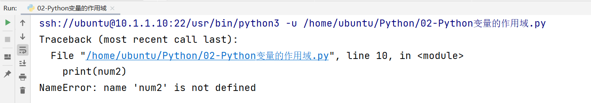

# 闭包和装饰器

## 2.1 闭包


## 一、全局变量和局部变量

### 1 作用域

在Python代码中，作用域分为两种情况：全局作用域 与 局部作用域

### 2 变量的作用域

在全局定义的变量 => 全局变量

在局部定义的变量 => 局部变量

### 3 全局变量与局部变量的访问范围

① 在全局作用域中可以访问全局变量，在局部作用域中可以访问局部变量

```
`# 全局作用域（全局变量）
num1 = 10
def func():
    # 局部作用域（局部变量）
    num2 = 20
    # ① 在局部访问局部变量
    print(num2)

# ① 在全局访问全局变量
print(num1)
# 调用函数
func()
`
```

② 在局部作用域中可以访问全局变量

```
`# 全局作用域（全局变量）
num1 = 10
def func():
    # 局部作用域（局部变量）
    # ② 在局部作用域中可以访问全局变量
    print(num1)

# 调用函数
func()
`
```

③ 在全局作用域中不能访问局部变量

```
`# 全局作用域（全局变量）
num1 = 10
def func():
    # 局部作用域（局部变量）
    num2 = 20

# 调用函数
func()
# 在全局作用域中调用局部变量num2
print(num2)
`
```

运行结果：



### 4 问题：为什么在全局作用域中无法访问局部变量

答：主要原因在于，在Python的底层存在一个“垃圾回收机制”，主要的作用就是回收内存空间。加快计算机的运行。我们在Python代码中定义的变量也是需要占用内存的，所以Python为了回收已经被已经过的内存，会自动将函数运行以后的内部变量和程序直接回收。

## 二、闭包

### 1 闭包的作用

​        在==函数嵌套==的前提下，内部函数==使用了外部函数的变量==，并且外部函数==返回了内部函数==，我们把这个使用外部函数变量的内部函数称为闭包。

### 2 闭包的构成条件（三步走）

第一步：有嵌套

第二步：有引用

第三步：有返回

```
`'''
闭包程序三步走：① 有嵌套 ② 有引用 ③ 有返回
'''

def func():
    num = 20  # 局部变量
    def inner():
        print(num)
    return inner  # 实际上inner函数并没有执行，只是返回了inner函数在内存中的地址

f = func()  # 相当于把inner在内存中的地址0x...赋值给变量f
f()  # 找到inner函数的内存地址，并执行器内部的代码（num=20)，在于闭包函数保留了num=20这个局部变量
`
```

闭包的作用：正常情况下，当执行func()的时候，函数内部的变量num = 20，会随着函数的func函数的结束而被垃圾回收机制所回收。所以闭包的真正作用：就是可以在全局作用域中，实现间接对局部变量进行访问。

### 3 注意事项

注意点:

由于闭包引用了外部函数的变量，则外部函数的变量没有及时释放，消耗内存。

### 4 在闭包的内部实现对外部变量的修改

错误版本：

```
`'''
Python闭包：① 有嵌套 ② 有引用 ③ 有返回
'''

def outer():
    num = 10
    def inner():
        # 这种写法无法实现通过闭包修改外部的局部变量
        num = 20
    print('outer函数中的num：', num)  # 10
    inner()  # 执行函数inner，让num=20生效
    print('outer函数中的num：', num)  # 10
    return inner

f = outer()
f()
`
```

正确版本：

新知识点：nonlocal关键字（在函数内部修改函数外部的变量，这个变量非全局变量）

老知识点：global关键字（在函数内部声明变量，代表引用全局作用域中的全局变量）

```
`'''
Python闭包：① 有嵌套 ② 有引用 ③ 有返回
'''

def outer():
    num = 10
    def inner():
        # 这种写法无法实现通过闭包修改外部的局部变量'
        nonlocal num
        num = 20
    print('outer函数中的num：', num)  # 10
    inner()  # 执行函数inner，让num=20生效
    print('outer函数中的num：', num)  # 20
    return inner

f = outer()
f()
`
```

### 5 闭包的综合案例

闭包的作用：可以在全局作用域中间接访问局部变量（在函数执行以后）

```
`'''
闭包编写三步走：① 有嵌套 ② 有引用 ③ 有返回
分析：
执行f = func()的时候，result赋值为0，然后定义inner，返回inner，最终结果f = inner函数的内存地址
执行f(1)，相当于执行inner函数，nonlocal引用局部变量result=0，然后进行+1操作，弹出0+1=1
继续执行
执行f(2)，相当于执行inner函数，声明nonlocal result，代表还是引用外部的局部变量，由于此时外部的result已经被
f(1)更改为1了，所以由于局部变量一直没有消失，所以此时result=1，执行+2操作，最终结果为3
'''
def func():
    result = 0
    def inner(num):
        nonlocal result
        result += num
        print(result)
    return inner

f = func()
f(1)  # 1
f(2)  # 3
`
```


---

## 2.2 装饰器


## 一、装饰器入门

### 1 什么是装饰器

在不改变现有函数源代码以及函数调用方式的前提下，实现给函数增加额外的功能。

装饰器的本质就是一个闭包函数（三步：① 有嵌套 ② 有引用 ③ 有返回）

有返回代表外部函数返回内部函数的内存地址（内部函数的名称），不带

### 2 装饰器的雏形

```
`# 要求：把登录功能封装起来（比如封装成一个函数，添加这个登录不能影响现有功能函数）
'''
装饰器：本质是一个闭包，有嵌套、有引用、有返回（返回的是函数的内存地址）
参数fn在check中也是一个局部变量
参数fn：就是要装饰的函数的函数名，如comment，如download
'''
def check(fn):
    def inner():
        # 开发登录功能
        print('登录功能')
        # 调用原函数
        fn()
    return inner

# 评论功能（前提：登录）
def comment():
    print('评论功能')

comment = check(comment)
comment()

# 下载功能（前提：登录）
def download():
    print('下载功能')

download = check(download)
download()
`
```

### 3 装饰器定义

```
`'''
装饰器：本质就是一个闭包 ① 有嵌套 ② 有引用 ③ 有返回
'''
def check(fn):

    def inner():
        # 开发登录验证功能
        print('验证登录')
        # 执行原有函数
        fn()
    return inner

@check
def comment():
    print('发表评论')

comment()
`
```

### 4 装饰器的作用：获取程序的执行时间

```
`'''
定义获取程序的执行时间装饰器 => 闭包（① 有嵌套 ② 有引用 ③ 有返回）
'''
import time

def get_time(fn):
    def inner():
        # ① 添加装饰器修饰功能（获取程序的执行时间）
        begin = time.time()
        # ② 调用fn函数，执行原函数代码
        fn()
        end = time.time()
        print(f'这个函数的执行时间：{end - begin}')
    return inner

@get_time
def demo():
    for i in range(1000000):
        print(i)

demo()
`
```

## 二、装饰器进阶

### 1 带有参数装饰器

```
`'''
带有参数的装饰器：① 有嵌套 ② 有引用 ③ 有返回
'''
def logging(fn):
    def inner(*args, **kwargs):
        # 添加装饰器代码（输出日志信息）
        print('-- 日志信息：正在努力计算机 --')
        # 执行要修饰的函数
        fn(*args, **kwargs)  # sum_num(a, b)
    return inner

@logging
def sum_num(*args, **kwargs):
    result = 0
    # *args代表不定长元组参数，args = (10, 20)
    for i in args:
        result += i
    # **kwargs代表不定长字典参数， kwargs = {a:30, b:40}
    for i in kwargs.values():
        result += i
    print(result)

# sum_num带4个参数，而且类型不同，10和20以元组形式传递，a=30，b=40以字典形式传递
sum_num(10, 20, a=30, b=40)
`
```

### 2 带有返回值装饰器

```
`'''
带有返回值的装饰器：① 有嵌套 ② 有引用 ③ 有返回
如果一个函数执行完毕后，没有return返回值，则默认返回None
'''
def logging(fn):
    def inner(*args, **kwargs):
        print('-- 日志信息：正在努力计算 --')
        return fn(*args, **kwargs)  # fn() = sub_num(20, 10) = result
    return inner

@logging
def sub_num(a, b):
    result = a - b
    return result

print(sub_num(20, 10))
`
```

### 3 通用版本的装饰器

```
`'''
通用装饰器：① 有嵌套 ② 有引用 ③ 有返回 ④ 有不定长参数 ⑤ 有return返回值
'''
def logging(fn):
    def inner(*args, **kwargs):
        # 输出装饰器功能
        print('-- 正在努力计算 --')
        # 调用fn函数
        return fn(*args, **kwargs)
    return inner

@logging
def sum_num1(a, b):
    result = a + b
    return result

print(sum_num1(20, 10))

@logging
def sum_num2(a, b, c):
    result = a + b + c
    return result

print(sum_num2(10, 20, 30))
`
```

### 4 装饰器高级：使用装饰器传递参数（了解）

基本语法：

```
`def 装饰器(fn):
    ...

@装饰器('参数')
def 函数():
    # 函数代码
`
```

实例代码：根据传递参数不同，打印不同的日志信息

```
`'''
通用装饰器：① 有嵌套 ② 有引用 ③ 有返回 ④ 有不定长参数 ⑤ 有return返回值
真正问题：通过装饰器传递参数，我们应该如何接收这个参数呢？
答：在logging方法的外侧在添加一个函数，专门用于接收传递过来的参数
'''

def logging(flag):
    # flag = + 或 flag = -
    def decorator(fn):
        def inner(*args, **kwargs):
            if flag == '+':
                print('-- 日志信息：正在努力进行加法运算 --')
            elif flag == '-':
                print('-- 日志信息：正在努力进行减法运算 --')
            return fn(*args, **kwargs)
        return inner
    return decorator

@logging('+')
def sum_num(a, b):
    result = a + b
    return result

@logging('-')
def sub_num(a, b):
    result = a - b
    return result

print(sum_num(10, 20))
print(sub_num(100, 80))
`
```
