# 多任务编程

## 4.1 多任务


## 学习目标

了解多任务的概念

## 一、为什么要有多任务

问题：利用我们目前所学的技术，我们能否实现多任务操作呢？

答：不能，因为之前所写的程序都是单任务的，也就是说一个函数或者方法执行完成 , 另外一个函数或者方法才能执行。要想实现多个任务同时执行就需要使用多任务。多任务的最大好处是充分利用CPU资源，提高程序的执行效率。

思考：我们在使用网盘下载资料的时候，为什么要多个任务同时下载呢？

答：多个任务同时执行可以大大提高程序的执行效率

## 二、什么是多任务

多任务是指在同一时间内执行多个任务。

例如: 现在电脑安装的操作系统都是多任务操作系统，可以同时运行着多个软件。

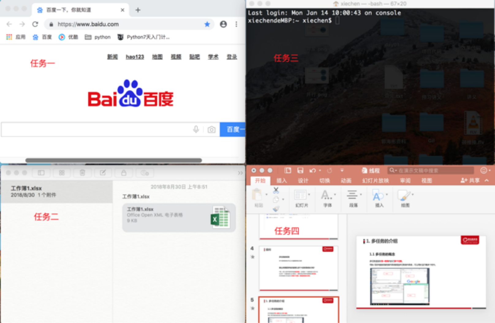

## 三、多任务的两种表现形式

① 并发

② 并行

### 3.1 并发操作

并发：在一段时间内交替去执行多个任务。

例如：对于单核cpu处理多任务,操作系统轮流让各个任务交替执行，假如:软件1执行0.01秒，切换到软件2，软件2执行0.01秒，再切换到软件3，执行0.01秒……这样反复执行下去
, 实际上每个软件都是交替执行的 . 但是，由于CPU的执行速度实在是太快了，表面上我们感觉就像这些软件都在同时执行一样 . 这里需要注意单核cpu是并发的执行多任务的。

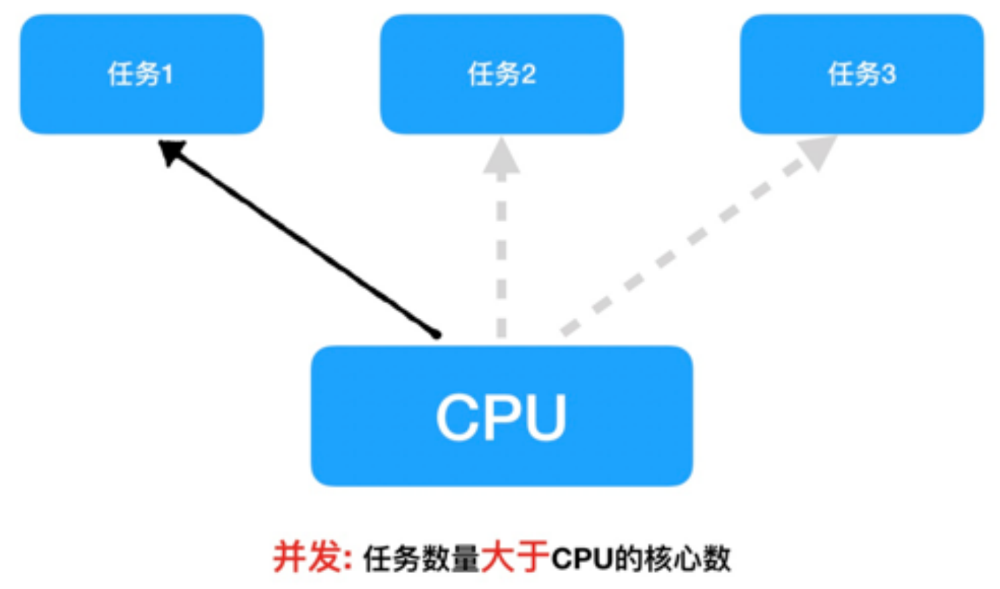

### 3.2 并行操作

并行：在一段时间内真正的同时一起执行多个任务。

对于多核cpu处理多任务，操作系统会给cpu的每个内核安排一个执行的任务，多个内核是真正的一起同时执行多个任务。这里需要注意多核cpu是并行的执行多任务，始终有多个任务一起执行。

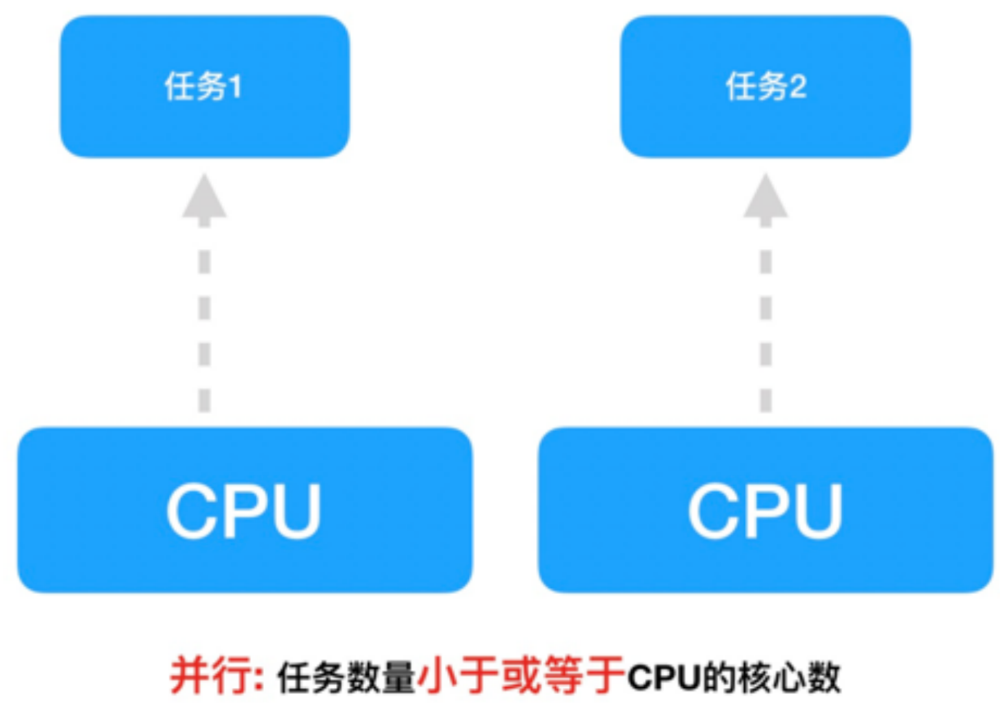


---

## 4.2 多进程


## 学习目标

了解进程的概念以及多进程的作用

掌握多进程完成多任务的工作原理及案例编写

掌握进程编号的获取方式以及进程使用的注意事项

## 一、进程的概念

### 1 程序中实现多任务的方式

在Python中，想要实现多任务可以使用==多进程==来完成。

### 2 进程的概念

进程（Process）是资源分配的最小单位，它是操作系统进行资源分配和调度运行的基本单位，通俗理解：一个正在运行的程序就是一个进程。

例如:正在运行的qq , 微信等 他们都是一个进程。

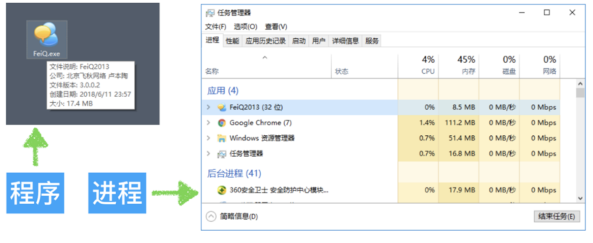

注： 一个程序运行后至少有一个进程

### 3 多进程的作用

### ☆ 未使用多进程

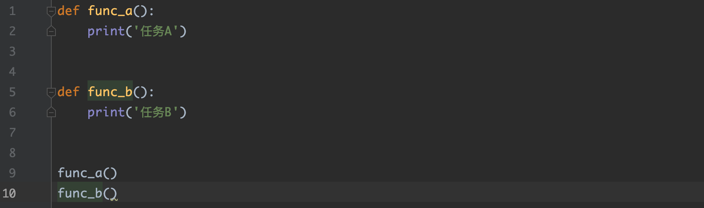

思考:

​         图中是一个非常简单的程序 , 一旦运行hello.py这个程序 , 按照代码的执行顺序 , func_a函数执行完毕后才能执行func_b函数 . 如果可以让func_a和func_b同时运行 , 显然执行hello.py这个程序的效率会大大提升 .

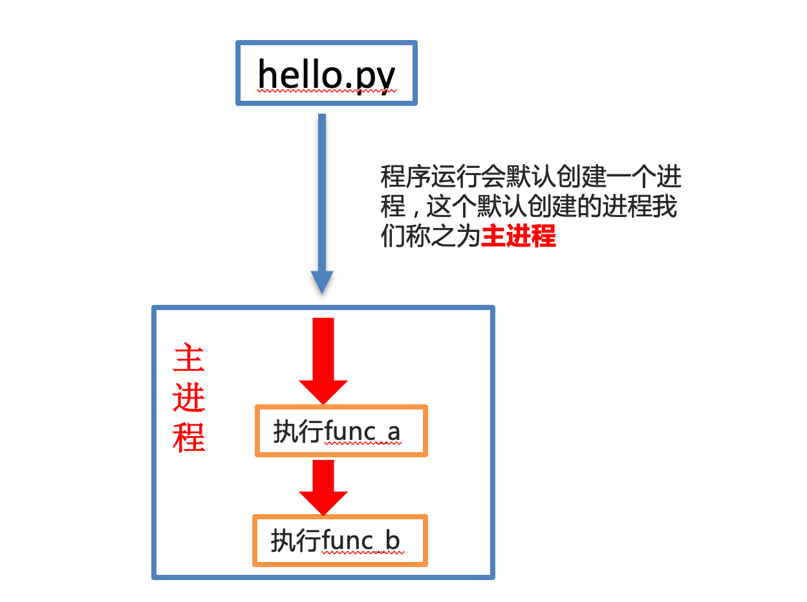

### ☆ 使用了多进程

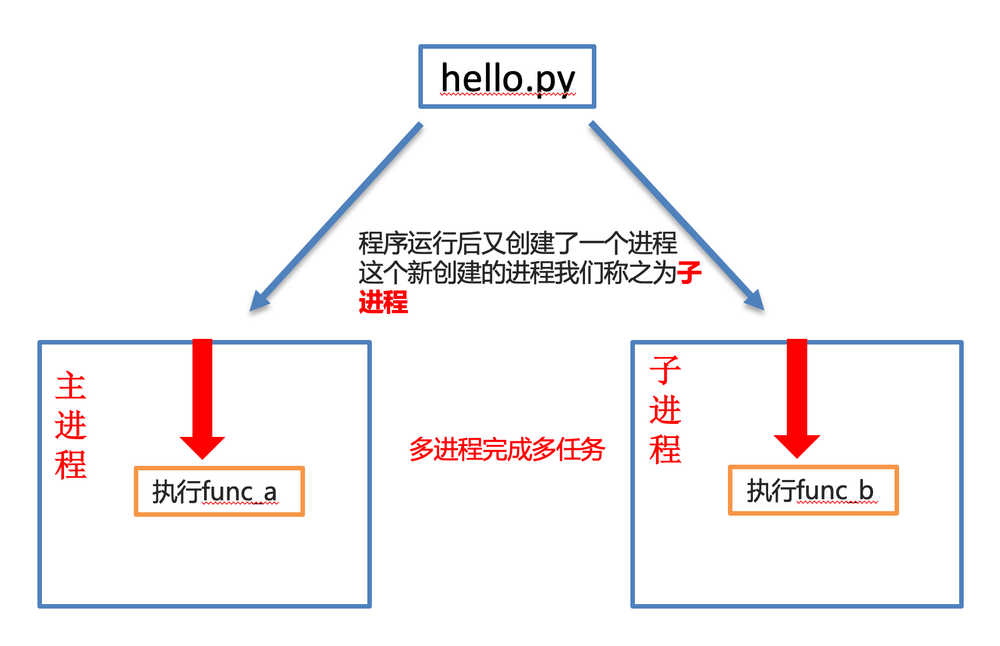

## 二、多进程完成多任务

### 1 多进程完成多任务

```
`① 导入进程包
import multiprocessing

② 通过进程类创建进程对象
进程对象 = multiprocessing.Process()

③ 启动进程执行任务
进程对象.start()
`
```

### 2 通过进程类创建进程对象

```
`进程对象 = multiprocessing.Process([group [, target=任务名 [, name]]])
`
```

参数说明：

 | 参数名
 | 说明

 | target
 | 执行的目标任务名，这里指的是函数名(方法名)

 | name
 | 进程名，一般不用设置

 | group
 | 进程组，目前只能使用None

### 3 进程创建与启动的代码

边听音乐边敲代码：

```
`import multiprocessing
import time

def music():
    for i in range(3):
        print('听音乐...')
        time.sleep(0.2)

def coding():
    for i in range(3):
        print('敲代码...')
        time.sleep(0.2)

if __name__ == '__main__':
    music_process = multiprocessing.Process(target=music)
    coding_process = multiprocessing.Process(target=coding)

    music_process.start()
    coding_process.start()
`
```

### 4 进程执行带有参数的任务

```
`Process([group [, target [, name [, args [, kwargs]]]]])
`
```

参数说明：

 | 参数名
 | 说明

 | args
 | 以元组的方式给执行任务传参，args表示调用对象的位置参数元组，args=(1,2,'anne',)

 | kwargs
 | 以字典方式给执行任务传参，kwargs表示调用对象的字典,kwargs=

案例：args参数和kwargs参数的使用

```
`import multiprocessing
import time

def music(num):
    for i in range(num):
        print('听音乐...')
        time.sleep(0.2)

def coding(count):
    for i in range(count):
        print('敲代码...')
        time.sleep(0.2)

music_process = multiprocessing.Process(target=music, args=(3, ))
coding_process = multiprocessing.Process(target=coding, kwargs={'count': 3})

music_process.start()
coding_process.start()
`
```

案例：多个参数传递

```
`import multiprocessing
import time

def music(num, name):
    for i in range(num):
        print(name)
        print('听音乐...')
        time.sleep(0.2)

def coding(count):
    for i in range(count):
        print('敲代码...')
        time.sleep(0.2)

if __name__ == '__main__':
    music_process = multiprocessing.Process(target=music, args=(3, '多任务开始'))
    coding_process = multiprocessing.Process(target=coding, kwargs={'count': 3})

    music_process.start()
    coding_process.start()
`
```

## 三、获取进程编号

### 1 进程编号的作用

当程序中进程的数量越来越多时 , 如果没有办法区分主进程和子进程还有不同的子进程 , 那么就无法进行有效的进程管理 , 为了方便管理实际上每个进程都是有自己编号的。

### 2 两种进程编号

① 获取当前进程编号

```
`getpid()
`
```

② 获取当前进程的父进程ppid = parent pid

```
`getppid()
`
```

### 3 获取当前进程编号

```
`import os

def work():
    # 获取当前进程的编号
    print('work进程编号', os.getpid())
    # 获取父进程的编号
    print('work父进程的编号', os.getppid())

work()
`
```

案例：获取子进程编号

```
`import multiprocessing
import time
import os

def music(num):
    print('music>> %d' % os.getpid())
    for i in range(num):
        print('听音乐...')
        time.sleep(0.2)

def coding(count):
    print('coding>> %d' % os.getpid())
    for i in range(count):
        print('敲代码...')
        time.sleep(0.2)

if __name__ == '__main__':
    music_process = multiprocessing.Process(target=music, args=(3, ))
    coding_process = multiprocessing.Process(target=coding, kwargs={'count': 3})

    music_process.start()
    coding_process.start()
`
```

案例：获取父进程与子进程编号

```
`import multiprocessing
import time
import os

def music(num):
    print('music>> %d' % os.getpid())
    print('music主进程>> %d' % os.getppid())
    for i in range(num):
        print('听音乐...')
        time.sleep(0.2)

def coding(count):
    print('coding>> %d' % os.getpid())
    print('music主进程>> %d' % os.getppid())
    for i in range(count):
        print('敲代码...')
        time.sleep(0.2)

if __name__ == '__main__':
    print('主进程>> %d' % os.getpid())
    music_process = multiprocessing.Process(target=music, args=(3, ))
    coding_process = multiprocessing.Process(target=coding, kwargs={'count': 3})

    music_process.start()
    coding_process.start()
`
```

## 四、进程应用注意点

### 1 进程间不共享全局变量

实际上==创建一个子进程就是把主进程的资源进行拷贝产生了一个新的进程==，这里的主进程和子进程是互相独立的。


案例：

```
`import multiprocessing

my_list = []

def write_data():
    for i in range(3):
        my_list.append(i)
        print('add:', i)
    print(my_list)

def read_data():
    print('read_data', my_list)

if __name__ == '__main__':
    # 创建写入数据进程
    write_process = multiprocessing.Process(target=write_data)
    # 创建读取数据进程
    read_process = multiprocessing.Process(target=read_data)

    # 启动进程执行相关任务
    write_process.start()
    time.sleep(1)
    read_process.start()
`
```

原理分析：

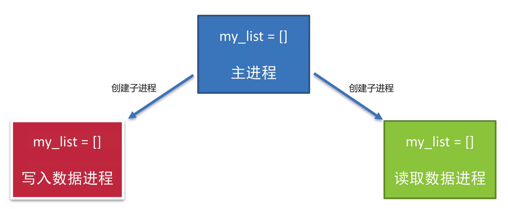

三个进程分别操作的都是自己进程里面的全局变量my_list, 不会对其它进程里面的全局变量产生影响，所以进程之间不共享全局变量，只不过进程之间的全局变量名字相同而已，但是操作的不是同一个进程里面的全局变量。

知识点小结：

创建子进程会对主进程资源进行拷贝，也就是说子进程是主进程的一个副本，好比是一对双胞胎，之所以进程之间不共享全局变量，是因为操作的不是同一个进程里面的全局变量，只不过不同进程里面的全局变量名字相同而已。

### 2 主进程与子进程的结束顺序

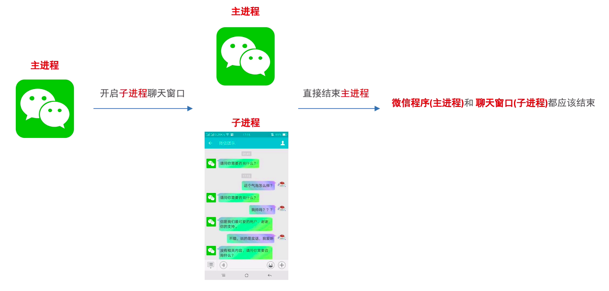

代码演示：

```
`import multiprocessing
import time

# 工作函数
def work():
    for i in range(10):
        print('工作中...')
        time.sleep(0.2)

if __name__ == '__main__':
    # 创建子进程
    work_process = multiprocessing.Process(target=work)
    # 启动子进程
    work_process.start()

    # 延迟1s
    time.sleep(1)
    print('主进程执行完毕')
`
```

执行结果：

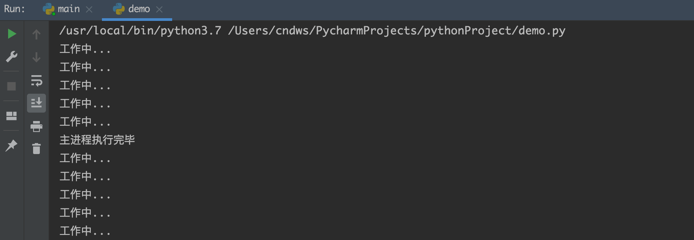

### ☆ 解决方案一：设置守护进程

```
`import multiprocessing
import time

# 工作函数
def work():
    for i in range(10):
        print('工作中...')
        time.sleep(0.2)

if __name__ == '__main__':
    # 创建子进程
    work_process = multiprocessing.Process(target=work)
    # 设置守护主进程，主进程退出后子进程直接销毁，不再执行子进程中的代码
    work_process.daemon = True
    # 启动子进程
    work_process.start()

    # 延迟1s
    time.sleep(1)
    print('主进程执行完毕')
`
```

### ☆ 解决方案二：销毁子进程

```
`import multiprocessing
import time

# 工作函数
def work():
    for i in range(10):
        print('工作中...')
        time.sleep(0.2)

if __name__ == '__main__':
    # 创建子进程
    work_process = multiprocessing.Process(target=work)
    # 启动子进程
    work_process.start()

    # 延迟1s
    time.sleep(1)

    # 让子进程直接销毁，表示终止执行， 主进程退出之前，把所有的子进程直接销毁就可以了
    work_process.terminate()

    print('主进程执行完毕')
`
```

提示: 以上两种方式都能保证主进程退出子进程销毁


---

## 4.3 多线程


## 学习目标

了解线程的概念以及多线程的作用

掌握多进程完成多任务的工作原理及案例编写

## 一、线程的概念

### 1 线程的概念

在Python中，想要实现多任务还可以使用多线程来完成。

### 2 为什么使用多线程？

进程是分配资源的最小单位 , 一旦创建一个进程就会分配一定的资源 , 就像跟两个人聊QQ就需要打开两个QQ软件一样是比较浪费资源的 .

线程是程序执行的最小单位 , 实际上进程只负责分配资源 , 而利用这些资源执行程序的是线程 , 也就说进程是线程的容器 , 一个进程中最少有一个线程来负责执行程序 。同时线程自己不拥有系统资源，只需要一点儿在运行中必不可少的资源，但它可与同属一个进程的其它线程共享进程所拥有的全部资源 。这就像通过一个QQ软件(一个进程)打开两个窗口(两个线程)跟两个人聊天一样 , 实现多任务的同时也节省了资源。

### 3 多线程的作用

```
`def func_a():
    print('任务A')

def func_b():
    print('任务B')

func_a()
func_b()
`
```

#### ☆ 单线程执行

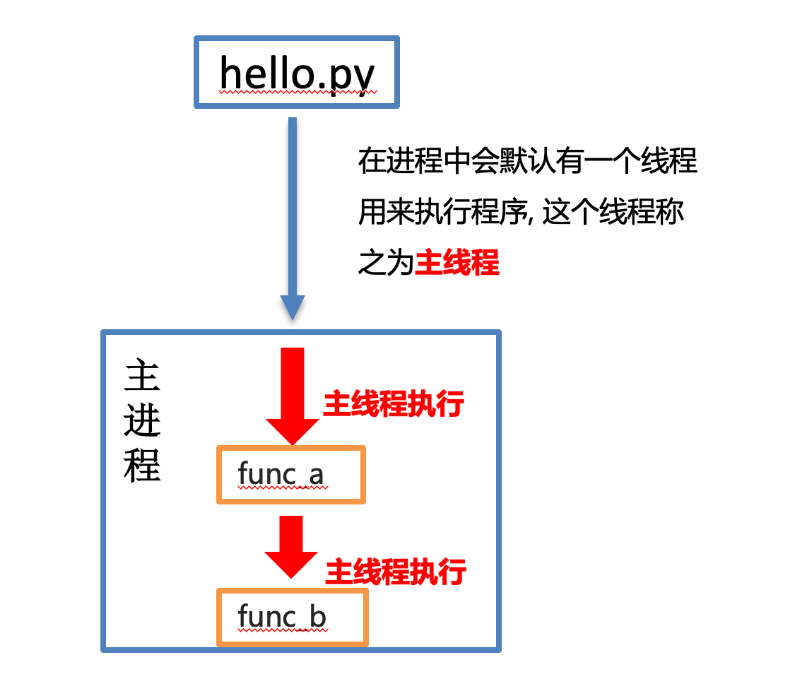

#### ☆ 多线程执行

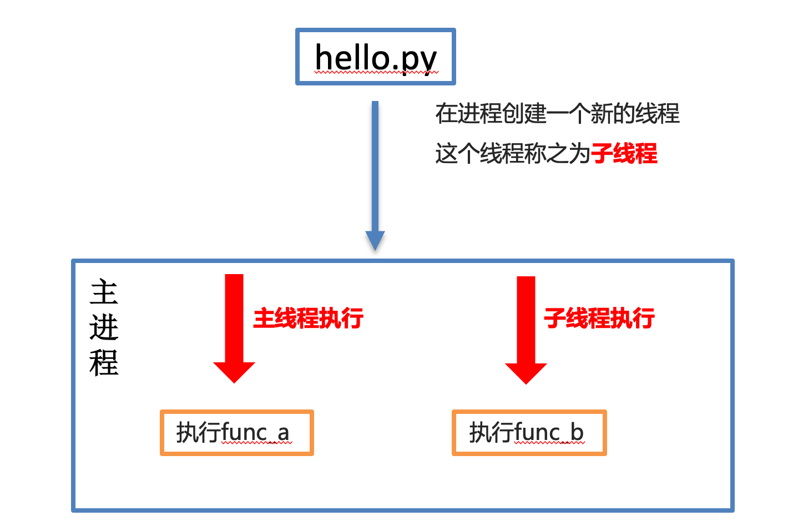

## 二、多线程完成多任务

### 1 多线程完成多任务

```
`① 导入线程模块
import threading

② 通过线程类创建线程对象
线程对象 = threading.Thread(target=任务名)

② 启动线程执行任务
线程对象.start()
`
```

 | 参数名
 | 说明

 | target
 | 执行的目标任务名,这里指的是函数名(方法名)

 | name
 | 线程名，一般不用设置

 | group
 | 线程组，目前只能使用None

### 2 线程创建与启动代码

单线程案例：

```
`import time

def music():
    for i in range(3):
        print('听音乐...')
        time.sleep(0.2)

def coding():
    for i in range(3):
        print('敲代码...')
        time.sleep(0.2)

if __name__ == '__main__':
    music()
    coding()
`
```

多线程案例：

```
`import time
import threading

def music():
    for i in range(3):
        print('听音乐...')
        time.sleep(0.2)

def coding():
    for i in range(3):
        print('敲代码...')
        time.sleep(0.2)

if __name__ == '__main__':
    music_thread = threading.Thread(target=music)
    coding_thread = threading.Thread(target=coding)

    music_thread.start()
    coding_thread.start()
`
```

### 3 线程执行带有参数的任务

 | 参数名
 | 说明

 | args
 | 以元组的方式给执行任务传参

 | kwargs
 | 以字典方式给执行任务传参

```
`import time
import threading

def music(num):
    for i in range(num):
        print('听音乐...')
        time.sleep(0.2)

def coding(count):
    for i in range(count):
        print('敲代码...')
        time.sleep(0.2)

if __name__ == '__main__':
    music_thread = threading.Thread(target=music, args=(3, ))
    coding_thread = threading.Thread(target=coding, kwargs={'count': 3})

    music_thread.start()
    coding_thread.start()
`
```

### 4 主线程和子线程的结束顺序

```
`import time
import threading

def work():
    for i in range(10):
        print('work...')
        time.sleep(0.2)

if __name__ == '__main__':
    # 创建子进程
    work_thread = threading.Thread(target=work)
    # 启动线程
    work_thread.start()

    # 延时1s
    time.sleep(1)
    print('主线程执行完毕')
`
```

### ☆ 设置守护线程方式一

```
`import time
import threading

def work():
    for i in range(10):
        print('work...')
        time.sleep(0.2)

if __name__ == '__main__':
    # 创建子线程并设置守护主线程
    work_thread = threading.Thread(target=work, daemon=True)
    # 启动线程
    work_thread.start()

    # 延时1s
    time.sleep(1)
    print('主线程执行完毕')
`
```

### ☆ 设置守护线程方式二

```
`import time
import threading

def work():
    for i in range(10):
        print('work...')
        time.sleep(0.2)

if __name__ == '__main__':
    # 创建子线程
    work_thread = threading.Thread(target=work)
    # 设置守护主线程
    work_thread.setDaemon(True)
    # 启动线程
    work_thread.start()

    # 延时1s
    time.sleep(1)
    print('主线程执行完毕')
`
```

### 5 线程间的执行顺序

```
`for i in range(5):
    sub_thread = threading.Thread(target=task)
    sub_thread.start()
`
```

思考：当我们在进程中创建了多个线程，其线程之间是如何执行的呢？按顺序执行？一起执行？还是其他的执行方式呢？

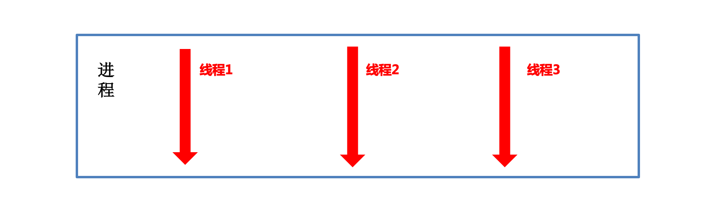

答：线程之间的执行是无序的，验证

### ☆ 获取当前线程信息

```
`# 通过current_thread方法获取线程对象
current_thread = threading.current_thread()

# 通过current_thread对象可以知道线程的相关信息，例如被创建的顺序
print(current_thread)
`
```

### ☆ 线程间的执行顺序

```
`import threading
import time

def get_info():
    # 可以暂时先不加，查看效果
    time.sleep(0.5)
    current_thread = threading.current_thread()
    print(current_thread)

if __name__ == '__main__':
    # 创建子线程
    for i in range(10):
        sub_thread = threading.Thread(target=get_info)
        sub_thread.start()
`
```

总结：线程之间执行是无序的，是由CPU调度决定某个线程先执行的。

### 6 线程间共享全局变量

### ☆ 线程间共享全局变量

多个线程都是在同一个进程中 , 多个线程使用的资源都是同一个进程中的资源 ，因此多线程间是共享全局变量

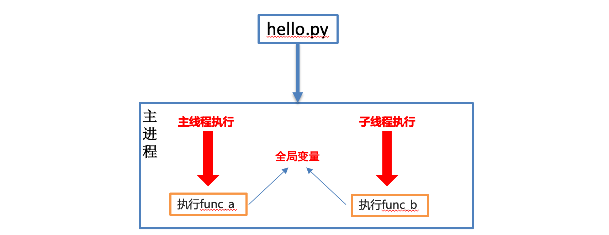

示例代码：

```
`import threading
import time

my_list = []

def write_data():
    for i in range(3):
        print('add：', i)
        my_list.append(i)
    print(my_list)

def read_data():
    print('read：', my_list)

if __name__ == '__main__':
    write_thread = threading.Thread(target=write_data)
    read_thread = threading.Thread(target=read_data)

    write_thread.start()
    time.sleep(1)
    read_thread.start()
`
```

## 三、进程和线程对比

### 1 关系对比

① 线程是依附在进程里面的，没有进程就没有线程。

② 一个进程默认提供一条线程，进程可以创建多个线程。


### 2  区别对比

① 进程之间不共享全局变量

② 线程之间共享全局变量

③ 创建进程的资源开销要比创建线程的资源开销要大

④ 进程是操作系统资源分配的基本单位，线程是CPU调度的基本单位

### 3 优缺点对比

#### 3.1 进程优缺点:

​   优点：可以用多核

​   缺点：资源开销大

#### 3.2 线程优缺点

​   优点：资源开销小

​   缺点：不能使用多核


---

## 4.4 多协程


## 一、python中的生成器

根据程序设计者制定的规则循环生成数据，当条件不成立时则生成数据结束

数据不是一次性全部生成出来，而是使用一个，再生成一个，可以节约大量的内存。

创建生成器的方式

① 生成器推导式

② yield 关键字

### ☆ 生成器推导式

与列表推导式类似，只不过生成器推导式使用小括号。

```
`# 创建生成器
my_generator = (i * 2 for i in range(5))
print(my_generator)

# next获取生成器下一个值
# value = next(my_generator)
# print(value)

# 遍历生成器
for value in my_generator:
    print(value)
`
```

生成器相关函数：

```
`next 函数获取生成器中的下一个值
for  循环遍历生成器中的每一个值
`
```

### ☆ yield生成器

yield 关键字生成器的特征：在def函数中具有yield关键字

```
`def generator(n):
    for i in range(n):
        print('开始生成...')
        yield i
        print('完成一次...')

g = generator(5)
print(next(g))
print(next(g))
print(next(g))
print(next(g))
print(next(g))              ----->    正常
print(next(g))              ----->    报错
`
```

注意点：

① 代码执行到 yield 会暂停，然后把结果返回出去，下次启动生成器会在暂停的位置继续往下执行

② 生成器如果把数据生成完成，再次获取生成器中的下一个数据会抛出一个StopIteration 异常，表示停止迭代异常

③ while 循环内部没有处理异常操作，需要手动添加处理异常操作

④ for 循环内部自动处理了停止迭代异常，使用起来更加方便，推荐大家使用。

### ☆ yield关键字和return关键字

如果不太好理解`yield`，可以先把`yield`当作`return`的同胞兄弟来看，他们都在函数中使用，并履行着返回某种结果的职责。

这两者的区别是：

有`return`的函数直接返回所有结果，程序终止不再运行，并销毁局部变量；

```
`def example():
    x = 1
    return x

example = example()
print(example)
`
```

而有`yield`的函数则返回一个可迭代的 generator（生成器）对象，你可以使用for循环或者调用next()方法遍历生成器对象来提取结果。

```
`def example():
    x = 1
    y = 10
    while x < y:
        yield x
        x += 1

example = example()
print(example)
`
```

## 二、Python中的协程

**Python 的协程实现确实是从生成器发展而来的**。

 | 特性
 | 生成器 (Generator)
 | 协程 (Coroutine)

 | **主要目的**
 | 生成值序列
 | 执行异步任务

 | **控制流**
 | 单向：调用者 → 生成器
 | 双向：调用者 ↔ 协程

 | **数据流向**
 | 数据向外流动（产出值）
 | 数据双向流动（发送和接收）

 | **调度**
 | 由调用者驱动
 | 由事件循环调度

 | **关键字**
 | `yield`
 | `async`, `await`

 | **类型**
 | `Generator`
 | `Coroutine`

**Python 协程**是由 `async def` 定义的**异步函数**，它是一种实现了 `Awaitable` 协议的**状态保持执行单元**。其执行由**事件循环**调度，通过 `await` 表达式**主动挂起**，将控制权交还调度器，实现**协作式并发**。

**协程三要素：**

- 函数前加 async

- 等待处加 await

- 启动用 asyncio.run

**使用三步骤：**

- 定义 async 函数

- 用 create_task 创建任务

- 用 await 等待结果

**一句话总结：**
协程让 I/O 等待时不闲着，去干其他事！

```
`import asyncio

async def hello(name):           # 1. async 定义协程函数
    print(f"开始: {name}")
    await asyncio.sleep(1)       # 2. await 让出控制权
    print(f"结束: {name}")

async def main():
    await hello("Alice")         # 3. 单个协程调用
    print("---")

    # 4. 并发执行
    task1 = asyncio.create_task(hello("Bob"))
    task2 = asyncio.create_task(hello("Charlie"))
    await task1
    await task2

asyncio.run(main())             # 5. 启动事件循环
`
```

## 三、协程 vs 线程 vs 进程区别

### 1 最全对比

 | 对比项
 | 协程
 | 线程
 | 进程

 | **创建数量**
 | 轻松上万
 | 最多几百
 | 最多几十

 | **适用场景**
 | I/O操作多（网络、文件）
 | I/O操作多
 | 计算密集

 | **内存占用**
 | 很小（几KB）
 | 较大（几MB）
 | 很大（几十MB）

 | **数据共享**
 | 直接共享
 | 小心共享（加锁）
 | 不能直接共享

 | **一句话总结**
 | **单线程内切换做事**
 | **看起来同时做事**
 | **真正同时做事**

### 2 应用场景对比

```
`# 选择指南：
if 主要是网络请求 or 文件读写:    # I/O密集型
    用协程  # 最佳选择

elif 主要是数学计算:              # CPU密集型
    用多进程  # 绕过GIL

else:  # 简单的后台任务
    用多线程  # 简单易用
`
```

### 3 最简记忆法：

- **协程**：单线程魔术师，手里抛接多个球（I/O等待时换件事做）

- **线程**：多个魔术师，但只有一个能表演（GIL限制）

- **进程**：多个魔术师，各自独立表演 （完全独立）

```
`import asyncio
import time
import threading

# 模拟网络请求
def mock_io(delay, name):
    time.sleep(delay)
    return f"{name}完成"

# 1. 普通顺序执行（慢）
def sync_version():
    start = time.time()
    mock_io(1, "任务1")
    mock_io(1, "任务2")
    print(f"同步: {time.time()-start:.1f}秒")

# 2. 多线程执行（快一点）
def thread_version():
    start = time.time()
    t1 = threading.Thread(target=mock_io, args=(1, "线程1"))
    t2 = threading.Thread(target=mock_io, args=(1, "线程2"))
    t1.start()
    t2.start()
    t1.join()
    t2.join()
    print(f"线程: {time.time()-start:.1f}秒")

# 3. 协程执行（最快）
async def async_version():
    start = time.time()

    async def async_io(delay, name):
        await asyncio.sleep(delay)
        return f"{name}完成"

    # 并发执行
    task1 = asyncio.create_task(async_io(1, "协程1"))
    task2 = asyncio.create_task(async_io(1, "协程2"))
    await task1
    await task2

    print(f"协程: {time.time()-start:.1f}秒")

# 运行对比
print("=== 执行时间对比 ===")
sync_version()  # 约2秒
thread_version()  # 约1秒
asyncio.run(async_version())  # 约1秒
`
```

记住：Python中**协程适合网络编程**，因为网络等待时可以做其他事，效率最高
