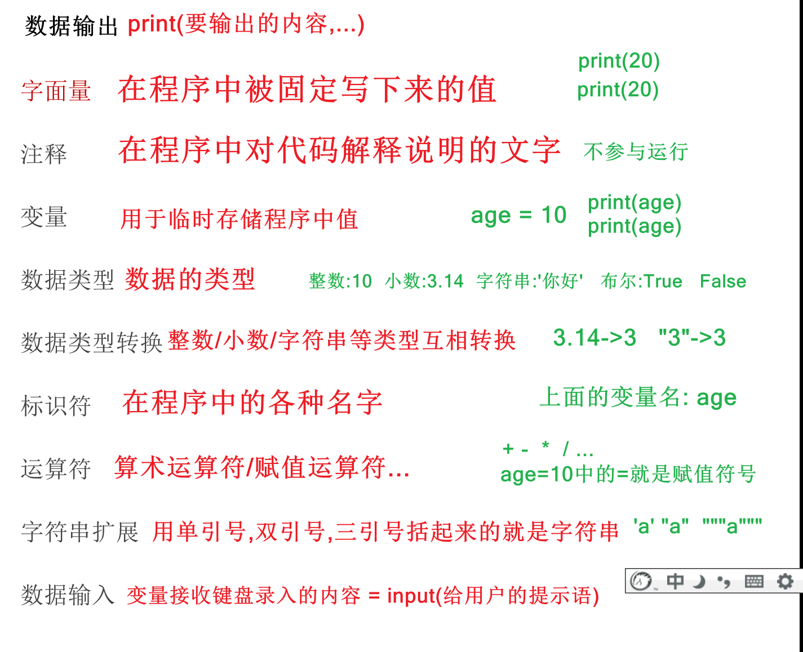
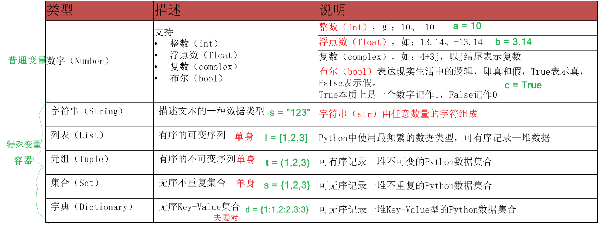

# Python环境和基础语法与if判断
> 本篇要点：① 开发环境　② 基础语法（print/变量/类型/运算符/字符串格式化/input）　③ 判断语句（if/elif/else/嵌套/random）

---

## 大纲

1. Python 开发环境
2. Python 基础语法（print、变量、数据类型、运算符、字符串格式化、input）
3. 判断语句（比较/逻辑运算符、if 系列、random 随机数、综合案例）

---

# 一、开发环境

```properties
python解释器和pycharm开发工具等开发软件建议安装到路径中没有中文且没有特殊字符目录下!!!

本篇要求python解释器3.8及以上
```





---

# 二、Python 基础语法

## print 输出函数【重点】

```properties
print(内容)功能: 输出指定内容到控制台

注意: print可以输出多个内容用逗号分隔
```

```python
print('hello world')
```

## 字面量和注释

```properties
字面量: 在代码中,被写下来的固定的值,就是字面量
字面量基本类型: 字符串,整数,浮点数,布尔
注释: 在代码中,只对代码进行解释说明的文字并不参与运行
注释分类: 单行注释和多行注释
```

```python
"""
单行注释: #
多行注释: 三引号
常用的快捷键:
单行注释快捷键: ctrl+/
复制光标所在行: ctrl+D
格式化代码: ctrl+alt+L
"""
# 打印一个整数
print(10)
# 打印一个浮点数
print(3.14)
# 打印一个字符串
print("你好世界")
# 打印所有的布尔值
print(True)
print(False)
```

## 变量【重点】

```properties
变量的概念: 在程序中用于临时存储计算结果的抽象概念
变量的格式: 变量名 = 变量值
格式解释: 把=后面的变量值赋值给前面的变量
起名建议: 见名知意
```

```python
# 需求: 刚买了新钱包,默认0元,发了工资100存储到了钱包中,然后又花了10元,展示钱包中每次变动后的余额
# 定义钱包变量初始值0
money = 0
print(money)
# 钱包变量值加100
money = money + 100
print(money)
# 钱包变量减10
money = money - 10
print(money)
```

## type 函数查看数据类型

```properties
type(内容)函数功能: 查看指定内容的数据类型
```

```python
# type()函数能够查看数据的类型
lx = type(3.14)
print(lx)

print('---------------------------')

# type()函数查看变量存储数据的类型
a = 20
print(type(a))
```

## 数据类型转换函数

```properties
str(内容): 把指定内容转为字符串类型
int(内容): 把指定内容转为整数类型
float(内容): 把指定内容转为浮点数类型
```

```python
# 1.int(x) : 把x转换为整数类型
# 浮点数->整数  注意:直接把小数部分去掉,导致丢失精度
print(int(3.84))
# 字符串->整数  注意:只有引号中是整数的时候才能转为整数
print(int('100'))
# print(int('3.84')) # 报错
# print(int('你好')) # 报错
print('----------------------------------')
# 2.float(x) : 把x转换为浮点数类型
# 整数->浮点数   注意: 任意整数都能转为浮点数
print(float(10))
# 字符串->浮点数  注意: 只有引号中是数值的时候才能转为浮点数
print(float("3.84"))
print(float("100"))
# print(float("你好")) # 报错
print('----------------------------------')
# 3.str(x) : 把x转为字符串   注意:任意类型都可以转换为字符串
print(str(10))
print(str(3.14))
print(str(True))
```

## 标识符

```properties
命名规则: 必须遵守
    内容限定: 只能是字母,数字(不能以数字开头),下划线_,和汉字(不建议)
    区分大小写
    不能是关键字
命名规范: 建议遵守
    见名知意
    多种命名方法: 下划线命名法(蛇形命名法),大驼峰命名法,小驼峰命名法
```

```python
# 0.导入python关键字
import keyword
print(keyword.kwlist)

# 1.命名规则:
#     内容限定: 只能是字母,数字(不能以数字开头),下划线_,和汉字(不建议)
a1 = 10
# 1a = 10 #报错
姓名 = "张三"
年龄 = 18
print(a1, 姓名, 年龄)
#     区分大小写
a = 10
A = 20
print(A, a)
#     不能是关键字
T = 30
# True = 30 # 报错

# 2.命名规范:
#     见名知意
name = "张三"
age = 18
print(name, age)
#     多种命名方法:
#     下划线命名法(蛇形命名法)
person_name = "张三"
product_name = '小米15'
category_name = '手机'
#     大驼峰命名法
PersonName = "张三"
ProductName = '小米15'
#     小驼峰命名法
personName = "张三"
productName = '小米15'
```

## 运算符

```properties
算术运算符: +  -  *  /  //   %   **
赋值运算符: =  +=  -=  *=  /=  //=  %=  **=
```

```python
# 算术运算符:+ -  *  /  //   %   **
print('1+1的结果是:', 1 + 1)
print('2-1的结果是:', 2 - 1)
print('1*3的结果是:', 1 * 3)
print('9/3的结果是:', 9 / 3)
print('9//2的结果是:', 9 // 2)   # 整除
print('9%2的结果是:', 9 % 2)     # 取余
print('2的6次方的结果是:', 2 ** 6)  # 幂
# 赋值运算符:= += -= *= /= //= %= **=
a = 10
a += 3   # 13
a -= 3   # 10
a *= 3   # 30
a /= 3   # 10.0
a //= 3  # 3.0
a %= 3
print(a)  # 0.0
a **= 3
print(a)  # 0.0
```

## 字符串格式化【重点】

```properties
字符串概念: 是字符的集合，用单引号或双引号或三引号括起来，字符串也可以是空字符串。

字符串拼接: 可以用+号把多个字符串拼接成一个大字符串

占位符方式:
    %s: 给字符串占位
    %d: 给整数占位
    %f: 给浮点数占位
    格式: "%s %d %f" %(变量1,变量2,变量3)

format方式:
    格式: f"{变量}"
```

**定义示例**（三引号支持换行）：

```python
print('hello')
print("hello")
print('''hello''')
print("""hello""")
```

**格式化示例**：

```python
# 需求: 定义三个变量存储你的姓名,年龄,身高,格式化输出到一行上
name = '斌子'
age = 18
height = 188.88
# 方式1: print输出多个内容
print(name, age, height, sep='---')
# 方式2: +拼接多个字符串
s1 = "姓名:" + name + ",年龄:" + str(age) + ",身高:" + str(height)
print(s1)
# 方式3: 占位符方式  %s:转为字符串放到对应位置(任意类型都能转为字符串)
s2 = "姓名:%s,年龄:%s,身高:%s"%(name,age,height)
print(s2)
# 方式4: 占位符方式  %s:给字符串占位 %d给整数占位 %f浮点数占位
s3 = "姓名:%s,年龄:%d,身高:%.3f"%(name,age,height)
print(s3)
# 方式5[掌握]: format格式化方式
s4 = f"姓名:{name},年龄:{age},身高:{height:.3f}"
print(s4)
```

## input 输入函数【重点】

```properties
功能: 获取键盘录入的数据
格式: 变量 = input(提示语)
步骤: 1.先把提示语打印到控制台  2.input获取到用户根据提示语输入的内容  3.把获取到的内容赋值给左边的变量
注意: 默认获取的数据都是字符串类型数据
```

```python
"""
需求: 使用python编写一个简易的登录程序,获取用户录入的用户名和密码
最终格式化输出格式: 您刚才输入的用户名是:xx,密码是:xx
"""
name = input('请您输入用户名:')
password = input('请您输入密码:')
print(f'您刚才输入的用户名是:{name},密码是:{password}')
```

---

# 三、判断语句

## 比较和逻辑运算符

```properties
比较运算符: == !=  >  >=  <   <=

逻辑运算符: and:并且  or:或者  not:取反

注意: 比较运算符和逻辑运算符经常配合使用,结果就是布尔值(True/False)
```

```python
# 布尔类型,直接使用
print(True)
print(False)
# 比较运算符: == != > < >= <=, 比较的结果是布尔类型
print(10 == 5)
print(10 != 5)
print(10 > 5)
# 注意: 字符串数字和正常的整数只能用==和!=判断
print('10' == 5)
# print('10' > 5) # 报错
# and:并且  有False则False
print('admin' == 'admin' and '123' == '123')
# or: 或者  有True则True
print('admin' == 'admin' or '123' == 'abc')
# not: 取反
print(not False)
```

## if 判断语句

### if 语句

```properties
格式如下:
if 条件判断:
    条件满足的时候,执行的代码

注意: python中用缩进代表层级关系,1个缩进就是4个空格
```

```python
# 需求: 如果你的年龄大于等于18,那就可以进入网吧了~
# 1.获取年龄
age = int(input('请您输入年龄:'))
# 2.判断年龄
if age >= 18:
    # 3.给出提示
    print('可以进入网吧了~')
```

### if else 语句

```properties
格式如下:
if 条件判断:
    条件满足的时候,执行的代码
else:
    条件不满足的时候,执行的代码
```

```python
# 需求: 年龄>=18可以进入网吧,否则提示回家写作业
age = int(input('请您输入年龄:'))
if age >= 18:
    print('可以进入网吧了~')
else:
    print('回家写作业吧~')
```

### 综合案例 1：登录系统

> 需求：编写小程序，提示用户录入用户名和密码，判断登录成功还是失败。已知已注册的用户名是 admin，密码是 123456。

```python
# 1.注册(以后是页面注册,后端存储到mysql数据库)
name = 'admin'
pwd = '123456'
# 2.登录(以后页面登录,后端判断登录成功还是失败)
user_name = input('请您输入用户名:')
user_pwd = input('请您输入密码:')
# 3.判断
if user_name == name and user_pwd == pwd:
    print('登录成功~,跳转首页...')
else:
    print('登录失败~,请重新操作')
```

### if elif else 语句

```properties
格式如下:
if 条件判断1:
    条件1满足的时候,执行的代码
elif 条件判断2:
    条件2满足的时候,执行的代码
...
else:
    上述所有条件都不满足的时候,执行的代码
```

### if 多种语句嵌套

```properties
if 条件1:
    满足条件1执行的代码
    if 条件2:
        满足条件2执行的代码
        ...
    else:
        不满足条件2执行的代码
        ...
else:
    不满足条件1执行的代码
```

### 综合练习 2：成绩等级

> 需求：用户输入成绩后判断等级。成绩范围 0-100；等级：90-100 优、80-89 良、60-79 中、0-59 差。

```python
# 1.获取成绩
score = int(input('请输入成绩:'))
# 2.判断成绩,并给出提示
if score < 0 or score > 100:
    print('您输入的成绩无效!')
else:
    if score >= 90:
        print(f'您输入的成绩为:{score},等级为: 优')
    elif score >= 80:
        print(f'您输入的成绩为:{score},等级为: 良')
    elif score >= 60:
        print(f'您输入的成绩为:{score},等级为: 中')
    else:
        print(f'您输入的成绩为:{score},等级为: 差')
```

## random 随机数

```properties
函数概念: 提前组织好的,可以重复使用的,具有特定功能的代码块

生成随机数固定步骤如下:
1.导包: import random
2.生成随机数: 变量 = random.randint(a,b)

注意: 取值范围:左闭右闭[a,b]
```

```python
# 如何查看源代码: 按ctrl+鼠标左键点击对应关键字
# 导包
import random

# 随机生成一个整数,randint(a, b),取值范围:左闭右闭[a,b]
sjs = random.randint(1, 2)
print(sjs)
```

## 综合练习 3：猜数字游戏

> 需求：随机产生一个 1-10 之间的数字，提示用户猜大了/猜小了/猜中了。

### 1 次机会示例【掌握】

```python
# 1.获取一个随机数(范围1-10)
import random

sjs = random.randint(1, 10)
print(f'只有内部人员知道的随机数是:{sjs}')
# 2.获取用户猜的数
cds = int(input('请您输入您猜的数(范围1-10):'))
# 3.拿着用户猜的数和随机数判断,并给出提示
if cds < 1 or cds > 10:
    print('您猜的数无效,请仔细查看提示!')
else:
    if cds == sjs:
        print('猜对了')
    elif cds > sjs:
        print('猜大了')
    else:
        print('猜小了')
```

### 3 次机会示例【了解即可】

> 后续用循环就非常简单了：

```python
import random

sjs = random.randint(1, 10)
print(f'只有内部人员知道的随机数是:{sjs}')
cds = int(input('请您输入您猜的数(范围1-10):'))
if cds < 1 or cds > 10:
    print('您猜的数无效,请仔细查看提示!')
else:
    if cds == sjs:
        print('猜对了,程序停止')
    else:
        if cds > sjs:
            print('猜大了,请继续猜')
        else:
            print('猜小了,请继续猜')
        # 第2次机会
        cds = int(input('请您输入您猜的数(范围1-10):'))
        if cds < 1 or cds > 10:
            print('您猜的数无效,请仔细查看提示!')
        else:
            if cds == sjs:
                print('猜对了,程序停止')
            else:
                if cds > sjs:
                    print('猜大了,请继续猜')
                else:
                    print('猜小了,请继续猜')
                # 第3次机会
                cds = int(input('请您输入您猜的数(范围1-10):'))
                if cds < 1 or cds > 10:
                    print('您猜的数无效,请仔细查看提示!')
                else:
                    if cds == sjs:
                        print('猜对了,程序停止')
                    else:
                        if cds > sjs:
                            print('猜大了,三次机会用完,程序结束')
                        else:
                            print('猜小了,三次机会用完,程序结束')
```

