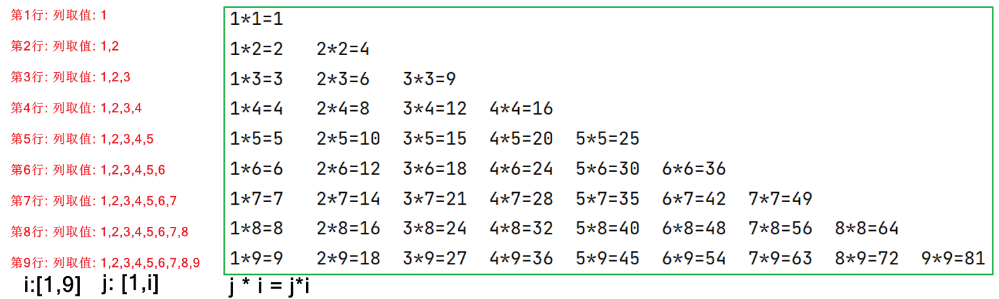
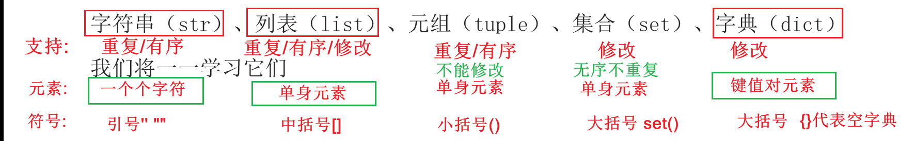

# 循环语句与函数基础和容器入门
> 本篇要点：① while/for 循环与 break/continue　② 函数定义、参数、返回值、None　③ 容器概念　④ 字符串详解（索引/切片/查/特有操作/遍历）

---

## 大纲

1. 循环语句（while、for、break、continue）
2. 函数基础（定义、参数、返回值、None）
3. 容器入门
4. 字符串详解

---

# 一、循环语句

## while 循环语句

### 格式

```properties
# 简化格式
while 条件:
    循环体

# 完整格式
定义变量并赋初始值
while 条件判断:
    循环体(要循环的代码段)
    条件控制

# 嵌套格式
while 条件1:
    满足条件1,循环的内容
    while 条件2:
        满足条件2,循环的内容
```

> 注意：条件判断的结果如果恒为 True，就会出现死循环/无限循环。

### 打印 1-100

```python
# 需求: 在控制台打印出1-100
# 分析: 利用while循环的变量作为输出内容
i = 1
while i <= 100:
    print(i)
    i += 1
```

### 打印 1-100 的偶数

```python
# 方式1:利用变量自增
i = 0
while i <= 100:
    print(i)
    i += 2
# 方式2: 利用if判断
i = 1
while i <= 100:
    if i % 2 == 0:
        print(i)
    i += 1
```

### 求 1-100 的总和

```python
# 1.循环初始变量
i = 1
# 循环外定义求和初始变量
sum = 0
# 2.while 拿着变量做条件判断
while i <= 100:
    # 3.循环体, i此时就依次代表1-100
    sum += i  # sum = sum + i
    # 4.拿着变量做条件控制
    i += 1
# 循环外使用最终结果
print(f"1-100的和为:{sum}")
```

### 猜数字游戏（3 次机会）

```python
import random
sjs = random.randint(1, 100)
print(f'只有内部人员知道的随机数是:{sjs}')
i = 1
while i <= 3:
    cds = int(input('请您输入您猜的数(范围1-100):'))
    if cds < 1 or cds > 100:
        print('您猜的数无效,请仔细查看提示!')
    else:
        if cds == sjs:
            print('猜对了')
            break  # 跳出循环
        elif cds > sjs:
            print('猜大了')
        else:
            print('猜小了')
    i += 1
```

### 猜数字游戏（无限次机会）

```python
import random
sjs = random.randint(1, 100)
while True:
    cds = int(input('请您输入您猜的数(范围1-100):'))
    if cds < 1 or cds > 100:
        print('您猜的数无效,请仔细查看提示!')
    else:
        if cds == sjs:
            print('猜对了')
            exit(0)  # break跳出循环或者exit(0)终止程序
        elif cds > sjs:
            print('猜大了')
        else:
            print('猜小了')
```

### 打印九九乘法表



```python
# while循环嵌套: 外层循环控制行,内层循环控制列
i = 1
while i <= 9:
    j = 1
    while j <= i:
        print(f"{j}*{i}={j * i}", end='\t')
        j += 1
    print()  # 每行结束就换行
    i += 1
```

## for 循环语句

### 格式

```properties
# 基础格式
for 临时变量 in 待处理的数据集:
    循环体

# 配合range格式
for 临时变量 in range(x,y,z):
    循环体
x: 起始值,如果是0可以省略
y: 结束标记,实际结束值是y-1
z: 步长,默认是1

# 嵌套格式
for 临时变量1 in 待处理的数据集:
    for 临时变量2 in 待处理的数据集:
        循环体
```

### 遍历字符串

```python
# 需求: 已知字符串"itcast",要求把每个字符打印到控制台
for _ in "itcast":
    print(_)
```

### 打印 1-100 / 偶数 / 求和

```python
# 打印1-100
for i in range(1, 101):
    print(i)

# 打印1-100的偶数
for i in range(0, 101, 2):
    print(i)

# 求1-100的和
sum = 0
for i in range(1, 101):
    sum += i
print(sum)
```

### 猜数字游戏（for 版）

```python
import random
sjs = random.randint(1, 100)
print(f'只有内部人员知道的随机数是:{sjs}')
for i in range(3):
    cds = int(input('请您输入您猜的数(范围1-100):'))
    if cds < 1 or cds > 100:
        print('您猜的数无效,请仔细查看提示!')
    else:
        if cds == sjs:
            print('猜对了')
            exit(0)
        elif cds > sjs:
            print('猜大了')
        else:
            print('猜小了')
```

### 打印九九乘法表（for 版）

```python
# 外层循环控制行,内层循环控制列
for i in range(1, 10):
    for j in range(1, i + 1):
        print(f'{j}*{i}={j * i}', end='\t')
    print()
```

## break 和 continue

```properties
break: 跳出或者结束当前循环
continue: 跳过本次循环,继续下一次循环

break和continue主要用于操作循环,而且只能操作当前所在的循环!!!
```

### break 示例

```python
"""
需求: 一个人坐有20层的电梯(假设每层都循环播报),坐到第5层就下电梯,结束当前循环
"""
for i in range(1, 21):
    print(f'{i}层到了~')
    if i == 5:
        break
```

### continue 示例

```python
"""
需求: 坐20层电梯,最不愿听到4层到了~,14层到了~,18层到了~
"""
for i in range(1, 21):
    if i == 4 or i == 14 or i == 18:
        continue
    print(f'{i}层到了~')
```

---

# 二、函数基础

## 函数核心知识点

```properties
# 完整定义格式
def 函数名(形参):
    函数体
    return 返回值

# 完整调用格式
变量 = 函数名(实参)

# 注意事项
1. 函数必须先定义,再调用
2. 函数不调用不执行
3. 函数每调用1次就执行1次
4. 定义函数的时候如果有形参,调用函数的时候就必须传入实参
5. 定义函数的时候有return 返回值,调用函数的时候建议使用变量接收返回值后再使用
6. 定义函数的时候没有return 返回值,其实默认函数最后一行补充了return None
```

## 函数的参数

```python
# 需求1: 实现两个数的求和功能
a = 1
b = 2
sum = a + b
print(sum)

# 方式1: 无参无返回值的函数
def get_sum():
    a = 1
    b = 2
    sum = a + b
    print(sum)

get_sum()
get_sum()

# 方式2: 有参无返回值的函数
def get_sum(a, b):
    sum = a + b
    print(sum)

get_sum(1, 2)
get_sum(3, 4)
```

## 函数的返回值

> 注意：return 主职是结束函数，兼职是把后面的值返回给调用者。

```python
# 方式1: 无参有返回值的函数
def get_sum():
    a = 1
    b = 2
    sum = a + b
    return sum

print(get_sum() + 10)

# 方式2: 有参有返回值的函数
def get_sum(a, b):
    sum = a + b
    return sum

h1 = get_sum(1, 2)
h2 = get_sum(h1, 10)
print(h2)
```

## None

```properties
Python中有一个特殊的字面量: None,其类型是: <class 'NoneType'>
无返回值的函数,实际上就是返回了: None这个字面量

None表示: 空的、无实际意义的意思!!!
函数返回的None,就表示,这个函数没有返回什么有意义的内容。
```

```python
# 注意: 如果函数定义的时候没有return 返回值,那么调用的时候就不要接收!!
def show():
    print(3)
    # return None 默认返回了None

# 正确的调用
show()
# 错误的调用(不要接收没有返回值的结果)
a = show()
print(a)
print(a + 10)  # 会报错
```

---

# 三、容器入门

> ==容器概念：可以容纳多个元素的 python 数据类型，就是容器==
> ==容器分类：字符串 str、列表 list、元组 tuple、集合 set、字典 dict==



> ==有序可重复：字符串、列表、元组==
> 无序不重复：集合、字典
> ==本身内容可以修改：列表、集合、字典==
> 不可以修改的：字符串、元组

---

# 四、字符串详解

> ==**字符串是不可变类型**==

## 字符串的定义

```properties
定义空字符串: ''  ""   ''''''   """"""   str()
定义非空字符串: '字符内容'  "字符内容"   '''字符内容'''   """字符内容"""

注意: 引号可以嵌套包裹
```

```python
# 定义空字符串
s1 = ''
s2 = ""
s3 = ''''''
s4 = """"""
s5 = str()
print(s1, s2, s3, s4, s5)
# 定义非空字符串
s6 = 'abcd'
s7 = "abcd"
s8 = '''ab
cd'''
s9 = """ab
cd"""
# 字符串引号嵌套
s10 = "我最近看了一本书,书名是'钢铁是怎样练成的'! "
print(s10, type(s10))
```

## 字符串的下标索引

```properties
索引: 也叫下标,就是咱们所说的编号,有两套编号

正索引: 从左到右,从0开始依次递增
负索引: 从右到左,从-1开始依次递减

字符串名[索引]: 查询指定索引位置处的元素
```

```python
ss = "abcdefg"
# 获取第一个位置的字符
print(ss[0])    # a
print(ss[-7])
# 获取第四个位置的字符
print(ss[3])
print(ss[-4])
# 获取最后一个位置的字符
print(ss[-1])
print(ss[6])
# 注意: 如果访问了不存在的索引,就会报索引越界异常
# print(ss[7])
```

## 字符串的切片操作

```properties
切片的前提: 是容器要有索引!!!
切片的格式: 字符串名[起始索引:结束标记(不含):步长]
切片的特点: 包左不包右,起始索引如果不写默认从头开始,结束标记不写默认到末尾,步长默认是1
切片的方向: 步长如果是正数,0就是头;步长如果是负数,-1就是头
```

```python
# 需求: 定义字符串变量存储'itheima'
s = 'itheima'
# 反转字符串
print(s[::-1])
# 截取出it
print(s[:2])
# 截取出hei
print(s[2:5])
# 截取出ma
print(s[5:])
# 截取出ihia (隔一个取一个)
print(s[::2])
```

## 字符串的查

```properties
字符串名[索引]: 查询指定索引位置处的元素
字符串名.count(元素): 查询指定元素在字符串中出现的次数(如果元素不存在就返回0)
字符串名.index(元素): 查询指定元素在字符串中出现的索引位置(多个只返回第一个,不存在就报错)
len(字符串名): 查询指定字符串的元素总个数
```

```python
s = 'itheima'
print(s[0])          # i
print(s.count('i'))  # 2
print(s.index('i'))  # 0
print(len(s))        # 7
```

## 字符串的特有操作

```properties
replace(旧字符串,新字符串,替换几次): 把指定旧字符串替换为新字符串,默认替换所有
strip(): 默认去除两端的空白
split(分隔符,切几次): 根据指定分隔符切割字符串,默认切所有并放到列表中
分隔符.join(存储了字符串的容器): 用指定分隔符把容器中的字符串拼接成大字符串
startswith(字符串): 判断是否以指定字符串开头
endswith(字符串): 判断是否以指定字符串结尾
encode(编码)/decode(编码): 编码/解码操作
upper()/lower(): 所有字母转大写/小写
find(元素): 从左往右查找元素索引,不存在返回-1
rfind(元素): 从右往左查找元素索引,不存在返回-1
isdigit(): 判断字符串内容是否是数字
```

> 注意：字符串的特有操作并不是修改本身，而是返回新的内容。

```python
# replace: 替换
print("你TMD哦,我TMD真喜欢你!".replace('TMD', '***', 1))
# strip: 去除两端空白
print(" 张三,18 ".strip())
# split: 切割成列表
print(" 张三,18 ".strip().split(','))   # ['张三', '18']
# join: 拼接
print("-".join(['张三', '18']))          # 张三-18
print("的年龄是".join(['张三', '18']))   # 张三的年龄是18
# startswith / endswith
print('张三丰'.startswith('张'))  # True
print('张三丰'.endswith('丰'))    # True
# encode / decode
print('你好'.encode('utf8'))
print(b'\xe4\xbd\xa0\xe5\xa5\xbd'.decode('utf8'))
# upper / lower
print('iTheiMa'.upper())  # ITHEIMA
print('iTheiMa'.lower())  # itheima
# find / rfind
print('itheima'.find('i'))   # 0
print('itheima'.rfind('i'))  # 4
# 已知文件a.b.txt,分别获取文件名和后缀名
name = 'a.b.txt'
print(name.rfind('.'))  # 3
print(name[:3])         # a.b
print(name[3:])         # .txt
# isdigit
print('10'.isdigit())   # True
```

## 字符串的遍历

```properties
# for循环(又叫遍历循环)
for 元素变量 in 字符串:
    循环体

# while循环(用变量充当索引)
index = 0
while index < len(字符串):
    元素变量 = 字符串[index]
    循环体
    index += 1
```

```python
ss = 'abcde'
# for循环方式
for s in ss:
    print(s)
# while循环方式
index = 0
while index < len(ss):
    s = ss[index]
    print(s)
    index += 1
```

## 字符串的特点

- 可以容纳多个元素
- 元素只能是字符
- 元素可以重复
- 元素不可以修改
- 元素是有序的
- 元素有下标索引
- 支持 for 循环遍历
- 支持 while 循环遍历

