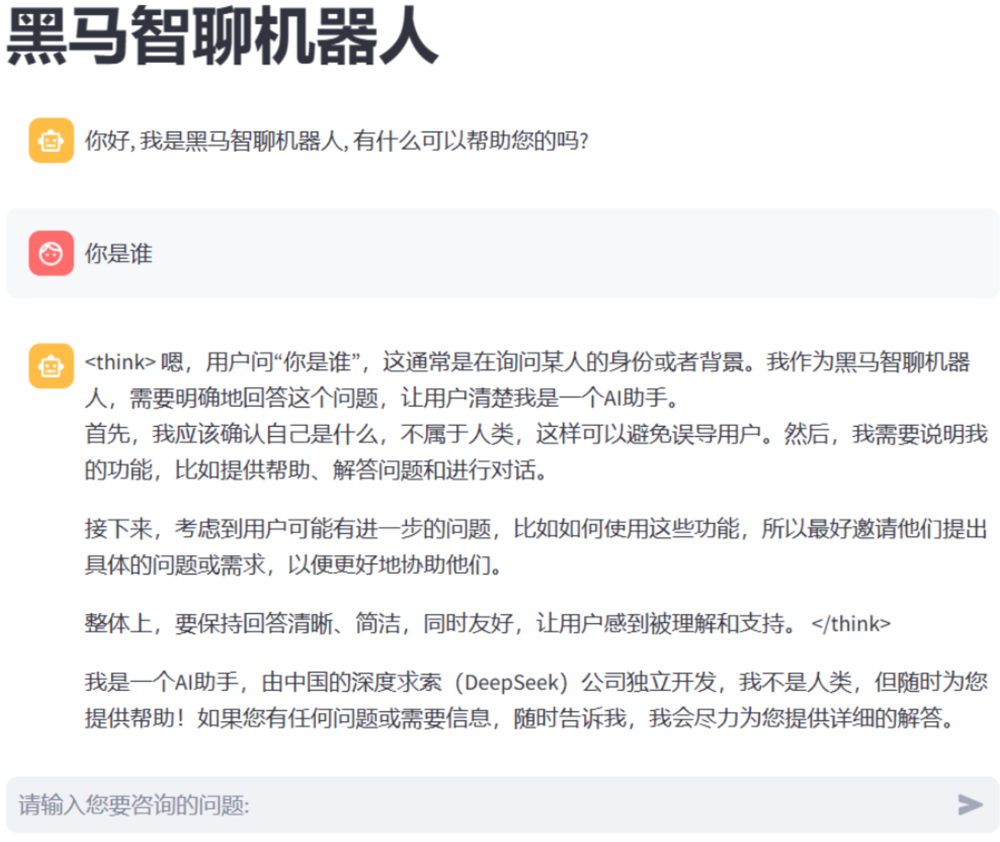
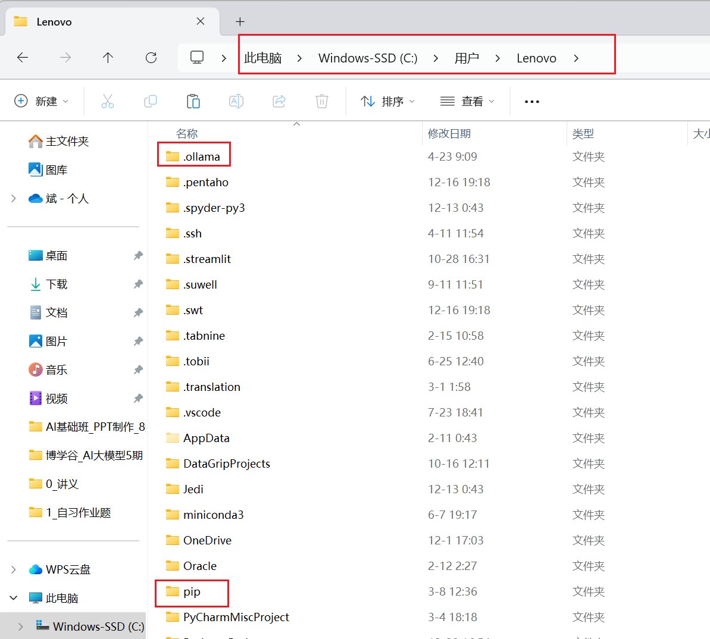
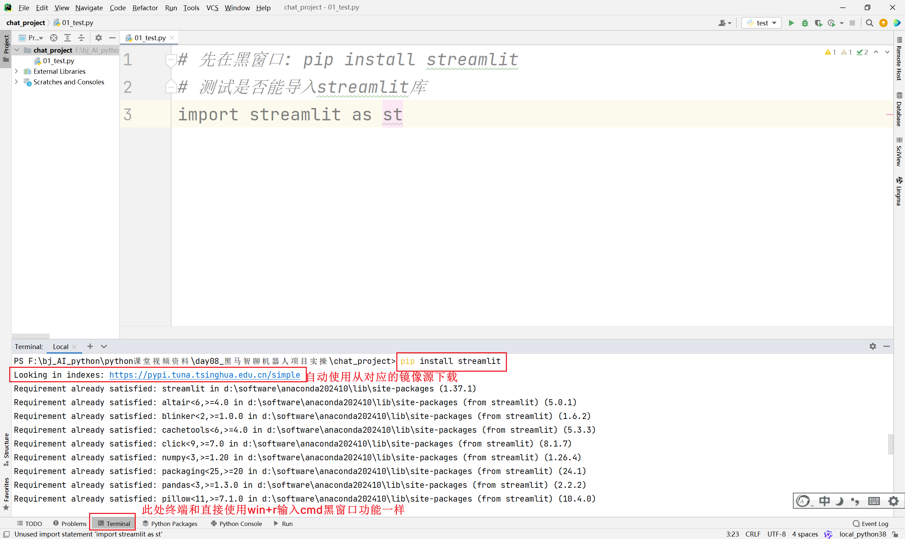
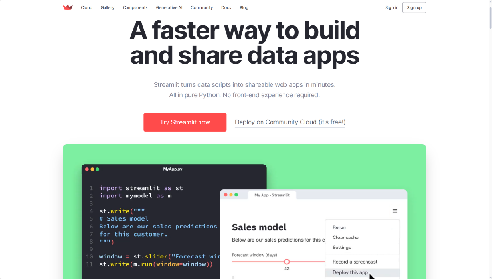
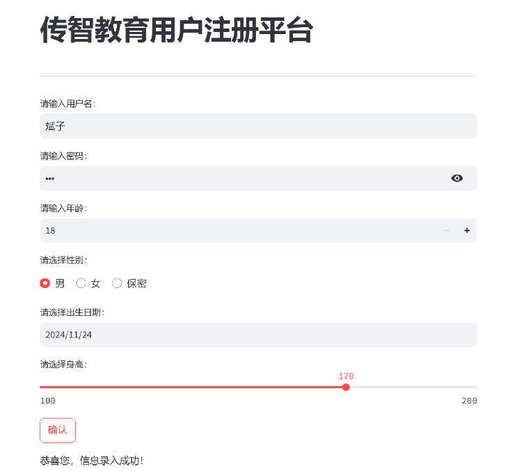

# 智聊机器人项目实操
> 本篇要点：① 项目概述与架构　② 运行环境搭建　③ Streamlit 前端页面　④ Ollama 后端模型调用　⑤ 聊天机器人完整开发

---

## 大纲

1. 项目概述【了解】
2. 项目运行环境【实操】
3. 项目前端页面【熟悉】（Streamlit）
4. 项目后端模型【熟悉】（Ollama）
5. 基于 Ollama 完成聊天机器人开发【重点】

---

# 一、项目概述【了解】

## 项目介绍

随着人工智能技术的飞速发展，聊天机器人在多个领域得到广泛应用，如客户服务、教育辅导、娱乐互动等。然而，现有的许多聊天机器人依赖于云端服务，这不仅可能导致用户数据隐私泄露，还可能因网络延迟影响用户体验。因此，开发一款**本地部署**的聊天机器人显得尤为重要。本地聊天机器人能够在用户本地环境中运行，确保数据的安全性和对话的实时性，同时也能根据用户的个性化需求进行定制和优化。

## 项目演示



## 项目技术架构

- **后端模型**：利用 Ollama 平台的 Qwen 模型，具备出色的自然语言处理能力，为聊天机器人提供核心的对话处理功能。
- **前端界面**：采用 Streamlit 框架搭建用户界面，Streamlit 是简单易用的 Python 库，能够快速创建美观、交互式的 Web 应用。
- **对话交互**：用户通过 Streamlit 界面输入文本，机器人基于 Qwen 模型处理并生成回复展示。
- **模型调用**：后端服务负责将用户输入传递给 Qwen 模型，获取回复返回前端展示。
- **界面展示**：Streamlit 界面提供输入框、发送按钮和对话展示区域。

## 项目开发环境

- **操作系统**：支持 Windows、macOS 和 Linux。
- **依赖软件**：需要安装 Python 环境以及 Ollama 平台和 Streamlit 库。
- **硬件要求**：推荐配置较高的处理器和足够的内存。

---

# 二、项目运行环境【实操】

1. **安装 Ollama 软件并本地部署大模型**：详细步骤参考第二天笔记。
2. **安装 Python 解释器和 PyCharm 开发工具**：详细参考第三天笔记。
3. **在 Python 解释器上安装 streamlit 和 ollama 库**：

### 配置镜像源

> 镜像源不是必须配置的！因为默认 pip 安装库从国外服务器下载非常慢，所以改为从国内镜像源下载。

把资料中 pip 目录复制到本地用户目录下（默认和之前本地安装的 ollama 同一个位置）。



### 安装 streamlit 和 ollama

```shell
pip install streamlit -i https://pypi.tuna.tsinghua.edu.cn/simple
pip install ollama -i https://pypi.tuna.tsinghua.edu.cn/simple
```

安装后 Python 导包测试是否能导入成功。



---

# 三、项目前端页面【熟悉】

## Streamlit 简介

> Streamlit 是一个开源 Python 库，旨在让数据科学家和工程师以最少的代码和配置，将数据分析和模型展示转化为交互式 Web 应用。
> 官网地址：https://streamlit.io



**特点**：

- **简单易用**：API 简洁，几行代码即可创建基本应用，无需复杂前端知识。
- **快速开发**：支持热重载，代码修改后自动更新应用；丰富的内置组件。
- **高度可定制**：支持自定义 CSS，可集成 Plotly、Altair、Pandas 等第三方库。
- **强大的社区支持**：官方文档详细，社区活跃。

**常见组件**：

- 文本和标题：`st.write()`、`st.title()`、`st.header()`、`st.subheader()`
- 输入控件：`st.text_input()`、`st.slider()`、`st.selectbox()`、`st.checkbox()`、`st.button()`
- 显示数据：`st.dataframe()`、`st.table()`、`st.json()`
- 显示图表：`st.pyplot()`、`st.altair_chart()`、`st.plotly_chart()`
- 布局：`st.sidebar()`、`st.columns()`、`st.expander()`

## 入门案例：用户注册平台

> 案例：制作一个用户注册平台，提示用户输入用户名、密码、年龄、性别、出生日期、身高。



```python
import streamlit as st
from datetime import date

# 设置页面标题
st.title("用户注册平台")
# 添加分隔线
st.divider()

# 用户名输入框
username = st.text_input(label='请输入用户名:', max_chars=50, key='username')
# 密码输入框
password = st.text_input(label='请输入密码:', type='password', max_chars=50, key='password')
# 年龄输入框
age = st.number_input(label='年龄', min_value=0, max_value=200, step=1, key='age')
# 性别选择框
gender = st.selectbox(label='性别', options=['请选择...', '男', '女'], index=0, key='gender')
# 是否已婚单选框
st.radio(label='是否已婚', options=['是', '否'], horizontal=True, key='married')
# 出生日期选择器
birthdate = st.date_input(label='出生日期', min_value=date(1900, 1, 1), max_value=date.today(), key='birthdate')
# 身高输入框
height = st.slider(label='身高', min_value=40.0, max_value=300.0, value=175.0, step=0.1, key='height')
# 提交按钮
submit_button = st.button(label='注册')

# 处理表单提交
if submit_button:
    st.success(f"注册成功")
    print(f"注册成功！以下是您的信息:\n用户名: {username}\n密码: {password}\n年龄: {age}\n性别: {gender}\n出生日期: {birthdate}\n身高: {height} cm")
```

## 构建聊天机器人页面

> 注意：由于还没有讲解 python 如何调用后端模型，此处只是简单实现页面效果。

```python
# 1.导包
import streamlit as st

# 2.设置页面标题
st.title("智聊机器人")
# 3.设置页面分隔线
st.divider()
# 4.先让AI说一句话
st.chat_message("assistant").write("你好，我是智聊机器人，请问有什么可以帮你的？")
# 5.用户提问输入框
prompt = st.chat_input('请您输入您的问题:')
# TODO 以后用户的提问是页面获取的prompt写入下方write(),本次先写固定的问题
st.chat_message("user").write('你好')
# 6.AI回答
# TODO 以后AI的回答通过调用大模型获取,本次先写固定的答案
st.chat_message("assistant").write('你好,很高兴与你聊天!')
```

---

# 四、项目后端模型【熟悉】

## 基于 Ollama 完成代码生成

```python
# 1.导包
import ollama

# 注意: ollama默认可以直接调用本地大模型: http://127.0.0.1:11434
# 如果要调用linux大模型,创建Client客户端需要修改url: http://linux服务器ip:11434
# 2.1 获取用户问题
question = "帮我计算一下10的阶乘结果,要求展示python代码以及最终结果"
print(f"用户输入的问题:{question}")
# 2.2 使用ollama本地模型,返回结果
ai_response = ollama.chat(model="qwen2:1.5b", messages=[{"role": "user", "content": question}])
# 2.3 从ai返回结果中获取答案
result = ai_response['message']['content']
print(f"AI返回的答案:{result}")
```

## 基于 Ollama 完成文本扩写

```python
import ollama

question = "从前有座山, 山里有座庙, 请续写该故事"
ai_response = ollama.chat(model="qwen2:1.5b", messages=[{"role": "user", "content": question}])
result = ai_response['message']['content']
print(f"AI返回的答案:{result}")
```

## 基于 Ollama 完成情感标签的分类

```python
import ollama

question = """
你需要对用户的反馈进行原因分类。
分类包括：价格过高、售后支持不足、产品使用体验不佳、其他。
回答格式为：分类结果：xx。
用户的问题是：商品不小心掉地上了, 把地板砸坏了.
"""
ai_response = ollama.chat(model="qwen2:1.5b", messages=[{"role": "user", "content": question}])
result = ai_response['message']['content']
print(f"AI返回的答案:{result}")
```

---

# 五、基于 Ollama 完成聊天机器人开发【重点】

## 抽取后端工具类

文件名：`chat_utils.py`

```python
# 1.导包
import ollama

# 2.确定调用ollama大模型服务器url
# 注意: 如果要求远程访问只需要把127.0.0.1改为对应服务器ip地址即可!
url = "http://127.0.0.1:11434"
new_ollama = ollama.Client(url)

# 3.定义函数
def get_chat_response(messages, model="qwen2:1.5b"):
    # 调用ollama大模型服务器,获取结果
    ai_response = new_ollama.chat(model=model, messages=messages)
    # 从ai返回结果中获取答案
    result = ai_response['message']['content']
    return result

if __name__ == '__main__':
    question1 = "从前有座山,山里有座庙,请续写故事"
    print(get_chat_response([{"role": "user", "content": question1}]))
    question2 = "简介一下斐波那契数列是什么?"
    print(get_chat_response([{"role": "user", "content": question2}]))
```

## 程序入口

文件名：`chat_main.py`

```python
# 1.导包
import streamlit as st

# 2.导入自定义的工具类
import chat_utils

# 3.设置页面标题
st.set_page_config(page_title='智聊机器人', page_icon='🤖')
st.title('智聊机器人')

# 4.分隔线
st.divider()

# 5.判断session_state是否有messages记录,如果没有则创建一个空的列表
if 'messages' not in st.session_state:
    # AI先固定写一个友好欢迎语
    st.session_state.messages = [{"role": "assistant", "content": "你好，我是智聊机器人，请问有什么可以帮你的？"}]

# 默认首次会打印AI的欢迎语,后面打印所有问题
for message in st.session_state.messages:
    st.chat_message(message["role"]).write(message["content"])

# 6.用户提问问题
prompt = st.chat_input('请您输入您的问题:')
if prompt:
    # 如果用户有提问,则将提问写入页面,同时将提问添加到session_state.messages中
    st.chat_message("user").write(prompt)
    st.session_state.messages.append({"role": "user", "content": prompt})

    # 为了提升用户体验,使用spinner组件,让用户知道AI正在思考中
    with st.spinner('正在思考中...'):
        # 调用大模型获取答案,传入最近10条聊天记录
        response = chat_utils.get_chat_response(st.session_state.messages[-10:])
        # 将答案写入页面,同时将答案添加到session_state.messages中
        st.chat_message("assistant").write(response)
        st.session_state.messages.append({"role": "assistant", "content": response})
```

