# MySQL基础入门
> 本篇要点：① 数据库概述　② MySQL 连接　③ SQL 规范与通用语法　④ 库/表/字段/记录操作　⑤ 数据类型

---

## 大纲

1. 数据库概述
2. MySQL 数据库连接（命令连接 / 工具连接 / 工具设置）
3. SQL 规范与 SQL 分类
4. SQL 通用语法
5. 数据库增删改查操作
6. 数据类型
7. 库中表增删改查操作
8. 修改表中字段（增删改）
9. 表中记录操作

---

# 一、数据库概述

```properties
数据库概念: 存储数据的仓库,本质是一个文件系统

数据库分类: 关系型数据和非关系型数据库

关系型数据库: 必须遵循SQL规范,强调以二维表格的形式存储数据
    举例: MySQL  ORACLE  DB2  SqlServer  SQLite

非关系型数据: NoSQL不仅仅是SQL,强调以key-value形式存储数据
    举例: HBase  Redis  MongoDB
```

---

# 二、MySQL 数据库连接

> MySQL 是最好的 RDMS（Relational Database Management System，关系数据库管理系统）应用软件，目前属于 Oracle 旗下产品，是最流行的关系型数据库管理系统。
> 本篇使用 MySQL 8.0 版本（MySQL Community Server）学习。

## 命令连接

```properties
登录:
    方式1: mysql -u用户名 -p密码
    方式2: mysql -u用户名 -p 回车后再输入密码
    方式3: mysql -h主机地址 -p 回车后再输入密码
    注意: localhost默认代表本地主机,或者127.0.0.1也代表本机

登出:
    方式1: exit
    方式2: quit
    方式3: \q
    注意: 在mac/linux中使用ctrl+d/ctrl+c也能退出

查看ip地址
    window: ipconfig
    mac/linux: ifconfig
```

## 工具连接

**创建项目**：先点击 new project，再添加解释器。


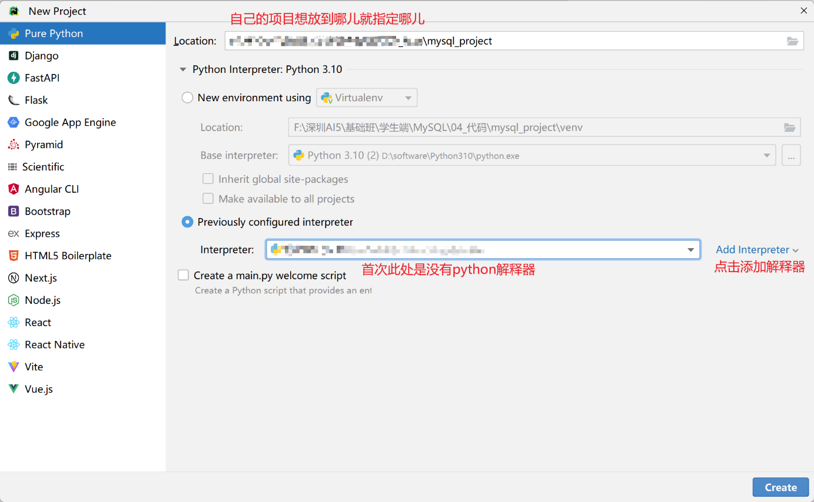

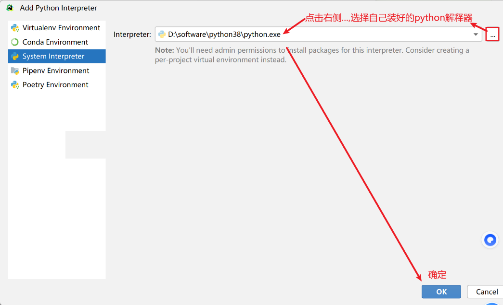

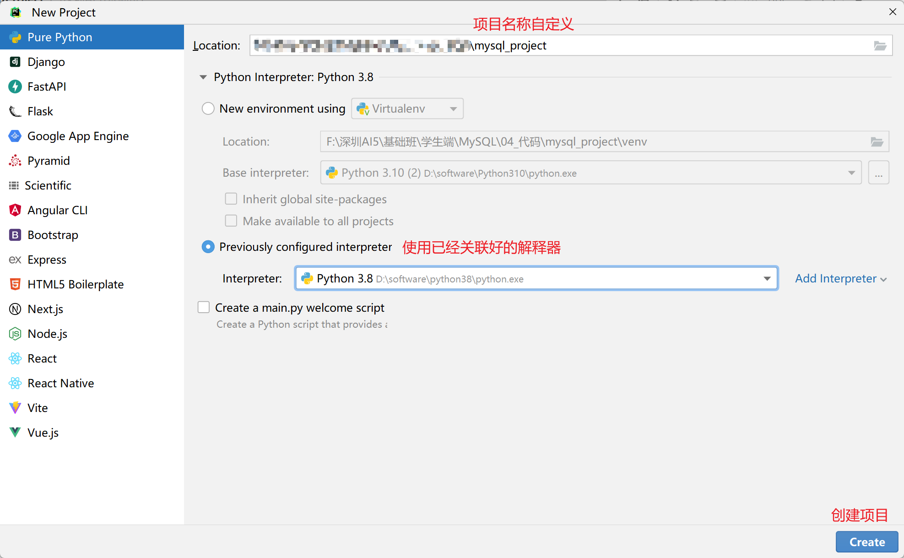

**连接 MySQL 服务**：

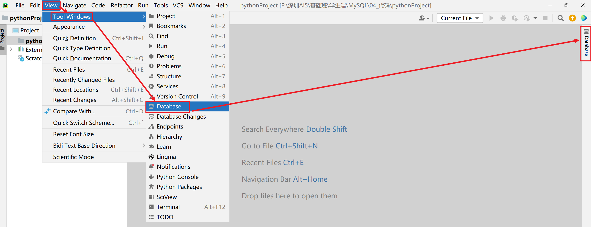

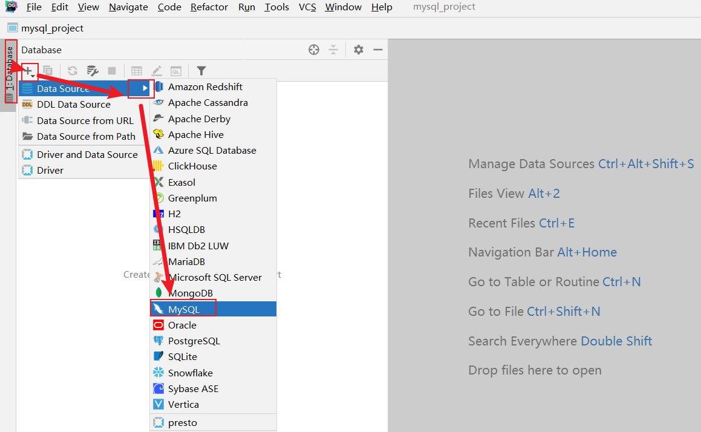

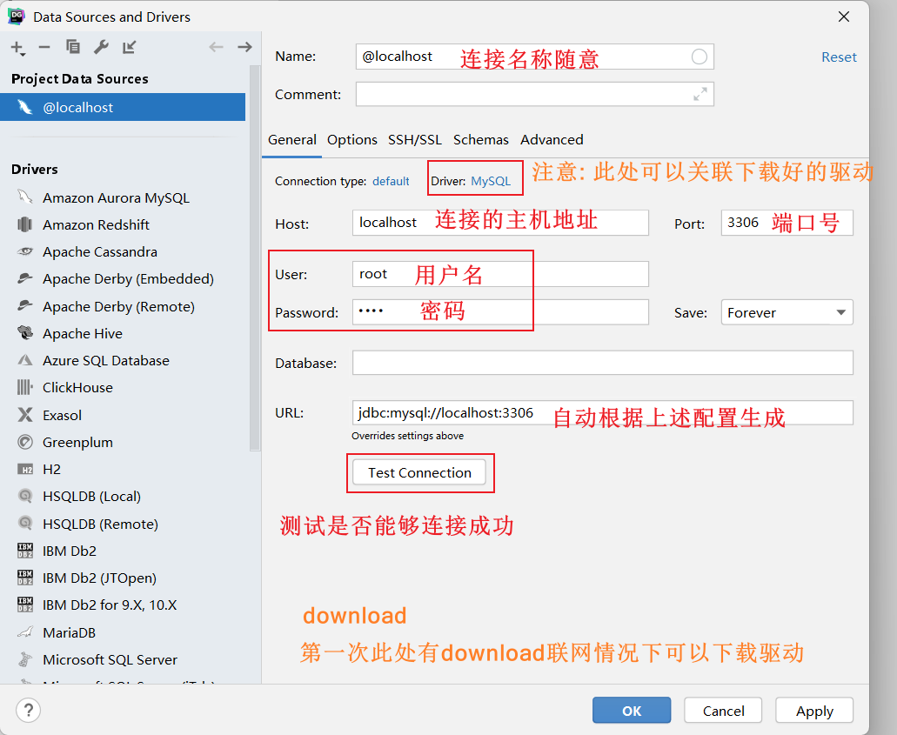

**关联驱动**：

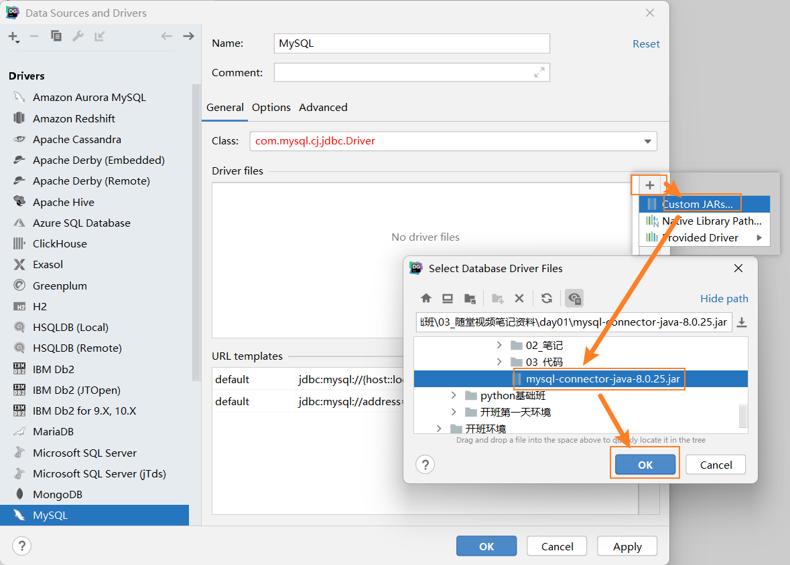

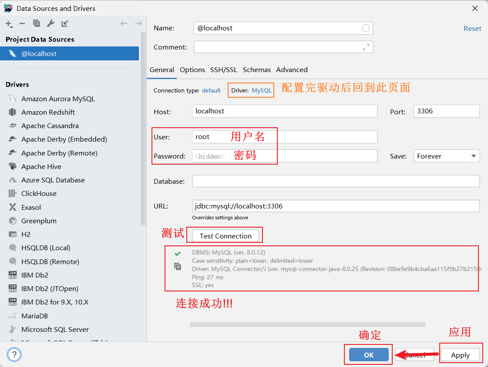

## 工具设置

- **字体**：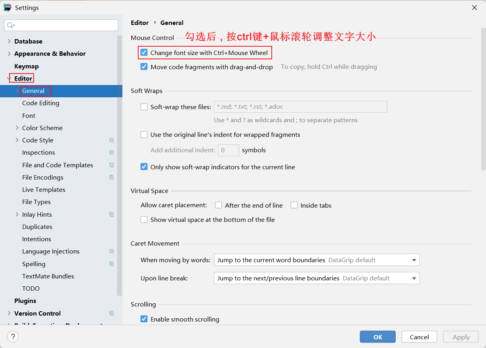
- **主题**：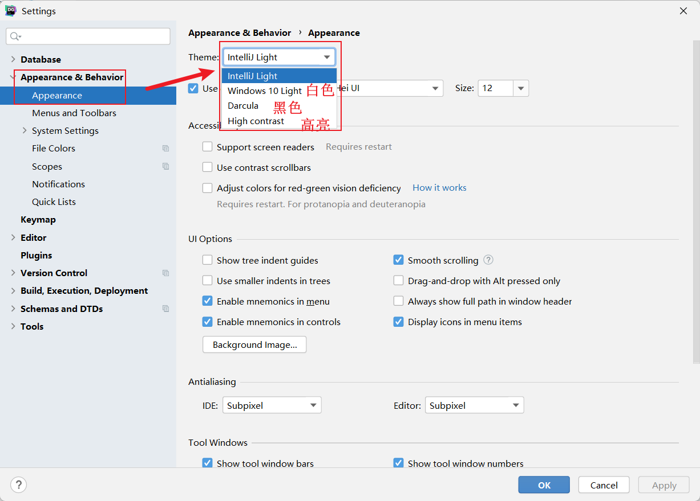
- **MySQL 相关**：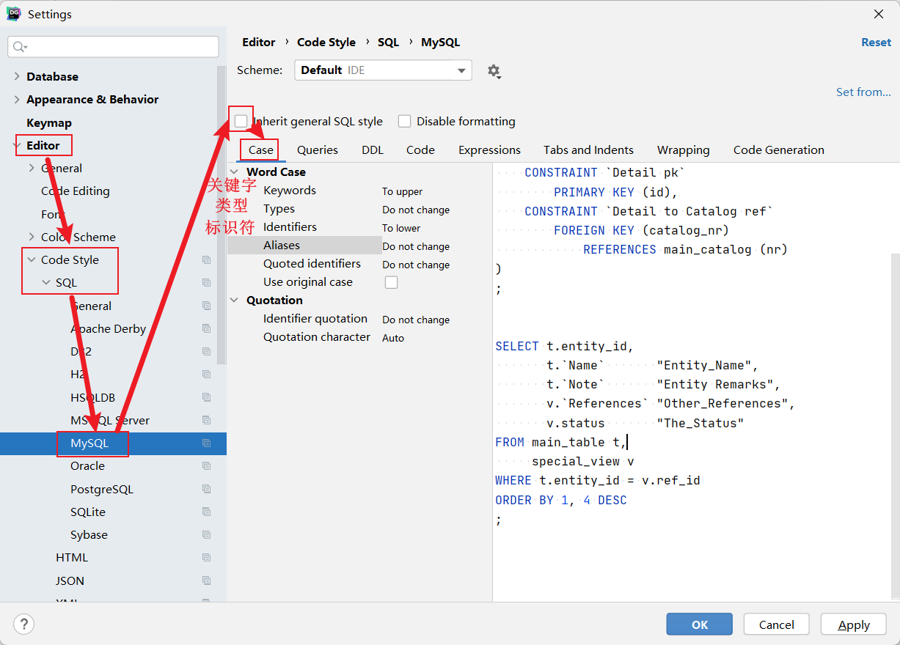　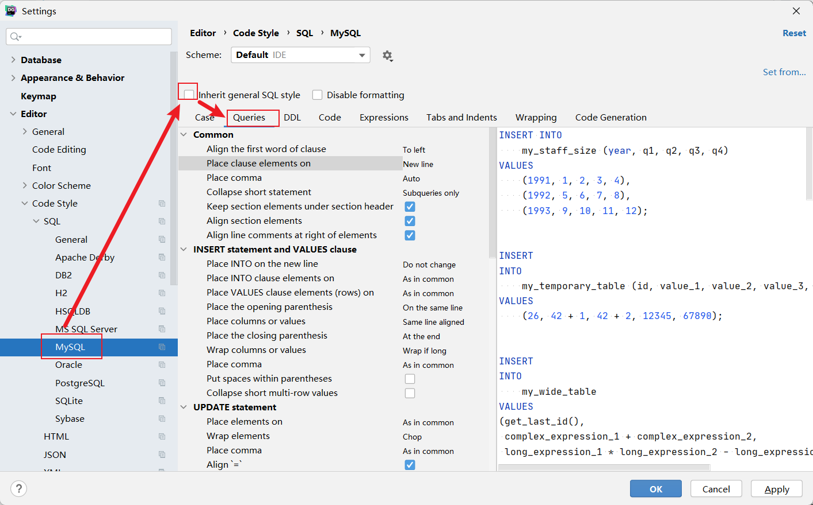
- **插件**：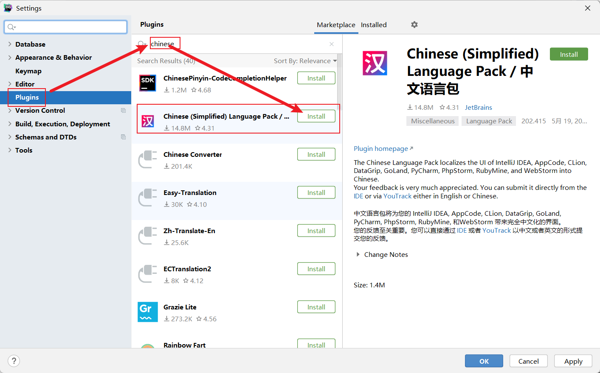
- **方言**：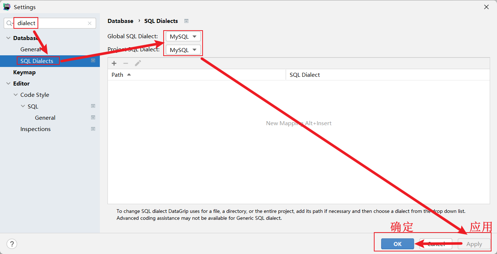

---

# 三、SQL 规范与 SQL 分类

## SQL 简介

```properties
SQL: 结构化查询语言, 是所有关系型数据库都要遵循的规范

大白话解释: 可以理解成sql是普通话,mysql,oracle等是方言
```

## SQL 分类

```properties
DDL: 数据定义语言 (Data Definition Language)
    作用: 用来定义数据库对象:数据库,表,列/字段等。
    关键字: create, drop, alter等

DML: 数据操作语言 (Data Manipulation Language)
    作用: 用来对数据库中表的记录进行更新。
    关键字: insert, delete, update等

DQL: 数据查询语言 (Data Query Language)
    作用: 用来查询数据库中表的记录。
    关键字: select, from, where等

DCL: 数据控制语言 (Data Control Language)
    作用: 用来定义数据库的访问权限和安全级别,及创建用户。
```

---

# 四、SQL 通用语法

```properties
1、SQL语句可以单行或多行书写,以分号结尾。
    举例: select * from 表名 where 条件;
2、可使用空格和缩进来增强语句的可读性
3、MySQL数据库的SQL语句不区分大小写,关键字建议使用大写
    大小写切换快捷键: ctrl+shift+u
4、可以使用 /**/，--，# 的方式完成注释
    /**/: 多行注释,在注释区域内可以随意换行
    -- 和#: 单行注释,写在语句开头,换行后注释截止。注意: -- 后面必须有一个空格
    单行注释快捷键: ctrl+/
    多行注释快捷键: ctrl+shift+/
```

---

# 五、数据库增删改查操作

> ==数据库英文单词: database==

```properties
创建数据库: create database [if not exists] 数据库名;  注意: 默认字符集就是utf8
删除数据库: drop database [if exists] 数据库名;
使用/切换数据库: use 数据库名;
查看所有的数据库名: show databases;
查看当前使用的数据库: select database();
查看指定库的建库语句: show create database 数据库名;
```

```mysql
# 一.数据库的增删改查
# 1.创建数据库
create database test;
create database test;  # 报错,因为test已经存在
# if not exists: 如果库不存在就创建,存在就忽略
create database IF NOT EXISTS test1;
# character set utf8: 设置编码为utf8
create database test3 CHARACTER SET utf8;

# 2.删除数据库
drop database test4;
drop database IF EXISTS test4;   # 存在就删除,不存在就忽略

# 3.切换数据库
use test;

# 4.查看
show databases;                 # 查看所有库
select database();              # 查看当前库
show create database test;      # 查看建库语句
```

---

# 六、数据类型

```properties
字符串类型: varchar(字符长度)

整数类型: int    注意: 默认长度是11,如果int不够用就用bigint

浮点类型: float(python默认) 或者 double(java默认)  decimal(默认是有效位数是10,小数后位数是0)

日期时间: date  datetime  year
```

---

# 七、库中表增删改查操作

> ==表的英文单词: table==

```properties
创建表: create table [if not exists] 表名(字段1名 字段1类型 [字段1约束] , 字段2名 字段2类型 [字段2约束] ...);
删除表: drop table [if exists] 表名;
修改表名: rename table 旧表名 to 新表名;
查看所有表: show tables;
查看指定表的建表语句: show create table 表名;
```

```mysql
# 创建day01_db数据库并使用它
create database day01_db;
use day01_db;

# 需求: 创建学生表,存储学生的姓名,年龄,身高,生日信息
create table student(
    id int,
    name VARCHAR(100),
    age int,
    height float,
    birthday date
);

# 删除表
drop table IF EXISTS test1;
# 修改表名
rename TABLE student to stu;
# 查看所有表
show tables;
# 查看建表语句
show create table stu;
/*
注意:
1.表名字段名都自动加了反引号``,关键字会忽略
2.int加了默认长度11
3.所有字段值设置了默认值null
4.如果是字符串类型还设置了默认编码
5.默认选择了存储引擎(有的版本默认myisam,有的默认innodb)
6.整个表也都设置了默认编码
*/
```

---

# 八、修改表中字段（增删改）

> ==列/纵队的英文单词: column==

```properties
注意: 操作字段本质就是在修改表

添加字段:  alter table 表名 add [column] 字段名 字段类型 [字段约束];
删除字段:  alter table 表名 drop [column] 字段名;
修改字段名和字段类型: alter table 表名 change [column] 旧字段名 新字段名 字段类型 [字段约束];
modify只修改字段类型: alter table 表名 modify [column] 字段名 字段类型 [字段约束];
查看字段信息: desc 表名;
```

```mysql
# 三.表中字段的增删改查
# 添加字段
alter table stu add weight double;
# 注意: 如果字段名是关键字,需要用反引号引起来!!!
alter table stu add `desc` VARCHAR(100);

# 删除字段
alter table stu drop weight;
alter table stu drop `desc`;

# 修改字段
alter table stu change birthday bir DATETIME;
alter table stu change bir birthday DATETIME;
alter table stu change birthday birthday date;
# 注意: 了解modify,因为只能改类型,所以大家以后直接记change即可
alter table stu MODIFY height DOUBLE;

# 查看字段信息
desc stu;
```

---

# 九、表中记录操作

```properties
插入数据记录: insert into 表名 (字段名...) values (具体值...) , (具体值...);
    注意1: 具体值要和前面的字段名以及顺序一一对应上
    注意2: 如果要插入的是所有字段,那么字段名可以省略(默认代表所有列都要插入数据)
    注意3: 如果要插入多条记录,values后多条数据使用逗号分隔

修改数据记录: update 表名 set 字段名=值 [where 条件];
    注意: 如果没有加条件就是修改对应字段的所有数据

删除数据记录: delete from 表名 [where 条件];
    注意: 如果没有加条件就是删除所有数据

清空所有数据:
    方式1: delete from 表名;   注意: 此方式有警告
    方式2: truncate [table] 表名;  注意: 此方式没有警告
```

```mysql
/*
操作库的前提: 先启动mysql服务,并连接它
操作表的前提: 先有库,并使用它
操作数据的前提: 先有表,并有对应字段
*/
create database day02_db;
use day02_db;
create table student(
    id int,
    name VARCHAR(100),
    age int
);

# 插入数据
insert into student(name) values ('张三');
insert into student(name) values ('李四'),('王五'),('赵六');
# 不指定字段本质代表指定所有字段
insert into student values (1,'张三',18),(2,'李四',18),(3,'王五',18);

# 修改数据
update student set age = 28 where name = '李四';
update student set age = 39 where name = '王五' or name = '赵六';
update student set id = 4,age = 40 where name = '赵六';
# 注意: 如果没有加条件,修改的是所有数据(慎用!!!)
# update student set age = 12;

# 删除数据
delete from student where id = 1;
delete from student where id = 2 or id = 3;
# 注意: 如果不加条件删除的是所有数据(慎用!!!)
# delete from student;

# 清空数据: truncate不会警告,官方推荐使用truncate清空数据
truncate table student;
```

