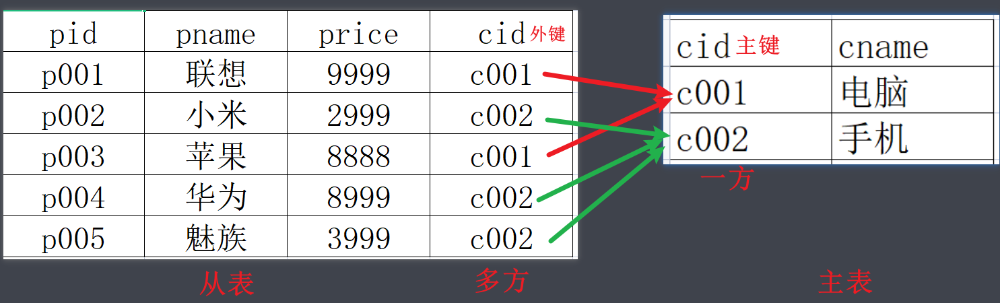
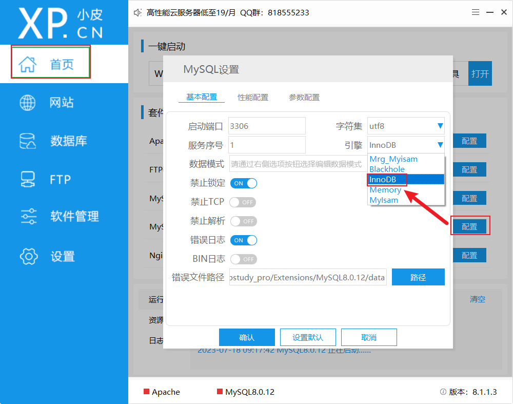
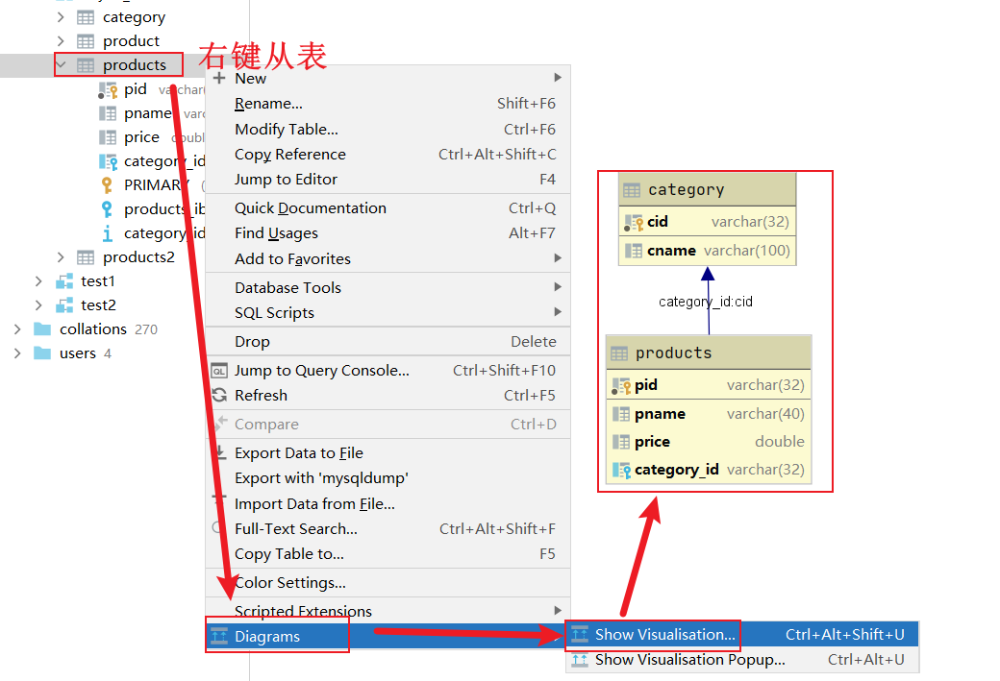
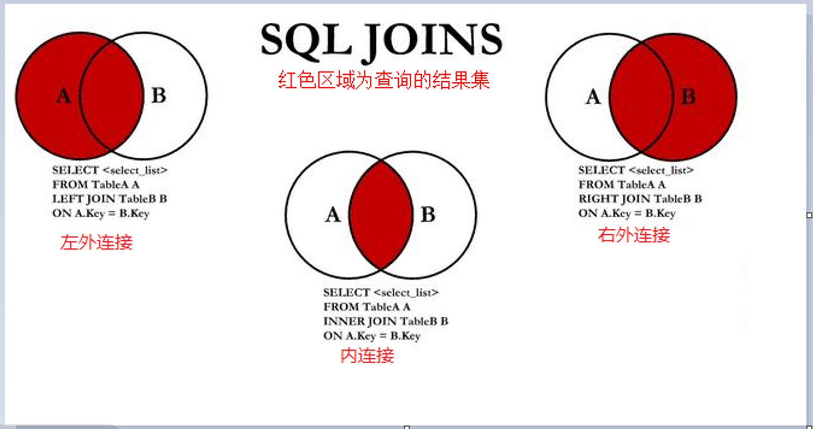
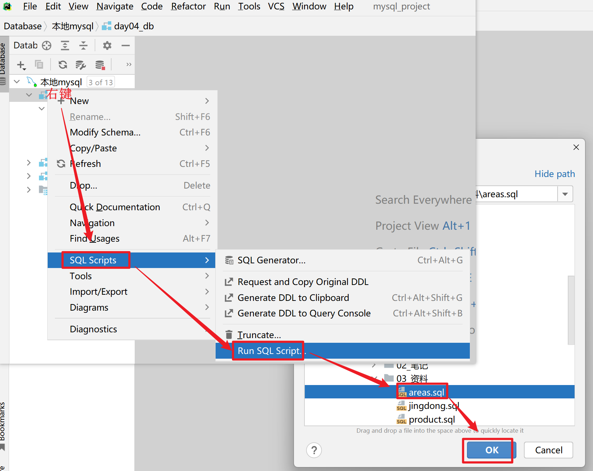
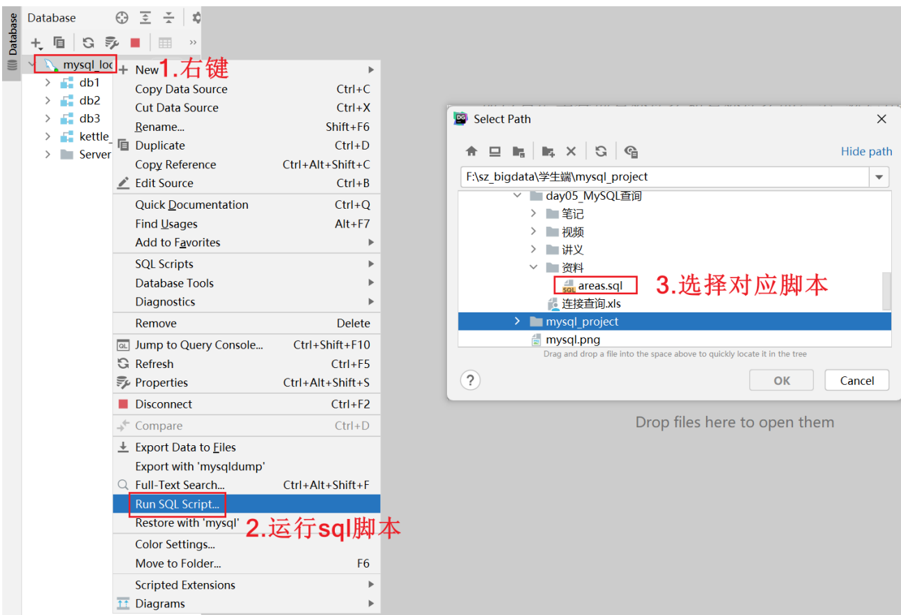

# MySQL多表查询
> 本篇要点：① 多表关系与外键　② 外键约束　③ 连接查询（交叉/内/外/全外）　④ 自连接查询　⑤ 子查询

---

## 大纲

1. 多表关系与外键
2. 外键约束【了解】
3. 连接查询（交叉连接、内连接、左/右外连接、全外连接）
4. 自连接查询
5. 子查询

---

# 一、多表关系与外键

> ==本质：把多个表通过主外键关联关系连接（join）合并成一个大表，再去查询==

## 多表关系

- **一对一**：一个人一个身份证号
- ==**一对多**：一个分类下有多个商品==
- **多对多**：课程和学生，一般要借助中间表，把多对多变成一对多

## 外键



```properties
外键概念: 在从表(多方)创建一个字段,引用主表(一方)的主键,对应的这个字段就是外键。

外键特点:
    1: 从表外键的值是对主表主键的引用。
    2: 从表外键类型,必须与主表主键类型一致。
```

---

# 二、外键约束【了解】

## 存储引擎

==注意：只有 innodb 存储引擎支持外键约束和事务!!!==

> 注意1：关闭 mysql 服务，再去修改!!!
> 注意2：修改存储引擎后，只对后面新建的表有效!!!
> 直接安装官方版本的同学，默认已经是 innodb，无需修改。
> 修改位置：mysql 安装路径中的 my.ini 文件。



## 外键约束添加和删除

```properties
建表时添加外键约束: ... CONSTRAINT [外键约束名] FOREIGN KEY (外键名) REFERENCES 主表名 (主表主键)
建表后添加外键约束: alter table 从表名 add CONSTRAINT [外键约束名] FOREIGN KEY (外键名) REFERENCES 主表名 (主表主键)
删除外键约束: alter table 从表名 drop FOREIGN KEY 外键约束名;
```

```sql
# 注意: 如果要删除有外键约束的主从表,先删除从表,再删除主表
drop table if exists products1;
drop table if exists category1;

CREATE TABLE category1
(
    cid   VARCHAR(32) PRIMARY KEY,
    cname VARCHAR(100)
);

CREATE TABLE products1
(
    pid         VARCHAR(32) PRIMARY KEY,
    pname       VARCHAR(40),
    price       DOUBLE,
    category_id VARCHAR(32),
    CONSTRAINT FOREIGN KEY (category_id) REFERENCES category1 (cid)   -- 建表时添加外键约束
);

# 查看存储引擎
show create table products1;

-- 删除外键约束
alter table products1 drop FOREIGN KEY products1_ibfk_1;
-- 建表后添加外键约束
alter table products1 add CONSTRAINT wj FOREIGN KEY (category_id) REFERENCES category1 (cid);
```



## 外键约束特点

```properties
外键约束关键字: foreign key
外键约束语法: [CONSTRAINT 约束名] FOREIGN KEY (外键字段) REFERENCES 主表名(主键字段);
外键约束作用:
    限制从表插入数据: 从表插入数据的时候如果外键值是主表主键中不存在的,就插入失败
    限制主表删除数据: 主表删除数据的时候如果主键值已经被从表外键的引用,就删除失败
外键约束好处: 保证数据的准确性和完整性
```

```sql
# 限制从表插入数据: 外键值是主表主键中不存在的,就插入失败
insert into products1 values('p1','小米',999,'c001'); -- 失败
insert into category1 values('c001','手机');           -- 先插主表
insert into products1 values('p1','小米',999,'c001');  -- 成功

# 限制主表删除数据: 主键值已经被从表外键引用,就删除失败
delete from category1 where cid='c001';  -- 失败
# 方案: 把从表的引用改为null(建议)
update products1 set category_id = null where category_id = 'c001';
delete from category1 where cid='c001';  -- 成功
```

---

# 三、连接查询



## 数据准备

```sql
use day03_db;
CREATE TABLE products
(
    id          INT PRIMARY KEY AUTO_INCREMENT,
    name        VARCHAR(24) NOT NULL,
    price       DECIMAL(10, 2) NOT NULL,
    score       DECIMAL(5, 2),
    is_self     VARCHAR(8),
    category_id INT
);
CREATE TABLE category
(
    id   INT PRIMARY KEY AUTO_INCREMENT,
    name VARCHAR(24) NOT NULL
);

INSERT INTO category VALUES (1,'手机'),(2,'电脑'),(3,'美妆'),(4,'家居');
INSERT INTO products VALUES
(1, '华为Mate50', 5499.00, 9.70, '自营', 1),
(2, '荣耀80', 2399.00, 9.50, '自营', 1),
(3, '荣耀80', 2199.00, 9.30, '非自营', 1),
(4, '红米note 11', 999.00, 9.00, '非自营', 1),
(5, '联想小新14', 4199.00, 9.20, '自营', 2),
(6, '惠普战66', 4499.90, 9.30, '自营', 2),
(7, '苹果Air13', 6198.00, 9.10, '非自营', 2),
(8, '华为MateBook14', 5599.00, 9.30, '非自营', 2),
(9, '兰蔻小黑瓶', 1100.00, 9.60, '自营', 3),
(10, '雅诗兰黛粉底液', 920.00, 9.40, '自营', 3),
(11, '阿玛尼红管405', 350.00, NULL, '非自营', 3),
(12, '迪奥996', 330.00, 9.70, '非自营', 3),
(13, '百草味紫皮腰果', 9, NULL, NULL, NULL),
(14, '奥利奥', 8, NULL, NULL, 5);
```

## 交叉连接【慎用】

```properties
交叉连接关键字: cross join
显式交叉连接格式: select * from 左表 cross join 右表;
隐式交叉连接格式: select * from 左表,右表;
注意: 交叉连接了解即可,因为它本质就是一个错误,又叫笛卡尔积(两个表记录数的乘积)
```

```mysql
-- 隐式交叉连接
SELECT * FROM products, category;
-- 显式交叉连接
SELECT * FROM products CROSS JOIN category;
```

## 内连接（常用）

```properties
内连接关键字: inner join ... on
显式内连接格式: select * from 左表 inner join 右表 on 关联条件;
隐式内连接格式: select * from 左表 , 右表 where 关联条件;
注意: 内连接 = 两个表的交集
```

```mysql
-- 隐式内连接
SELECT c.id cid, c.name cname, p.id pid, p.name pname
FROM products p, category c
WHERE p.category_id = c.id;

-- 显式内连接
SELECT c.id cid, c.name cname, p.id pid, p.name pname
FROM products p
INNER JOIN category c ON p.category_id = c.id;
```

## 左外连接

```properties
关键字: left outer join ... on
格式: select * from 左表 left outer join 右表 on 关联条件;
```

## 右外连接

```properties
关键字: right outer join ... on
格式: select * from 左表 right outer join 右表 on 关联条件;
```

```mysql
-- 需求: 查询每个分类下的所有商品,即使没有商品的分类也要展示(以分类表为主)
-- 左外连接
SELECT c.id cid, c.name cname, p.id pid, p.name pname
FROM category c
LEFT OUTER JOIN products p ON p.category_id = c.id;

-- 右外连接
SELECT c.id cid, c.name cname, p.id pid, p.name pname
FROM products p
RIGHT OUTER JOIN category c ON p.category_id = c.id;
```

## 全外连接

```properties
注意: mysql中没有full outer join on这个关键字,所以不能直接完成全外连接!
只能先查询左外连接和右外连接的结果,然后用union或者union all来实现!!!
    union: 默认去重
    union all: 不去重
```

```sql
-- 全外连接(union去重)
SELECT * FROM products p LEFT JOIN category c ON p.category_id = c.id
UNION
SELECT * FROM products p RIGHT JOIN category c ON p.category_id = c.id;

-- 全外连接(union all不去重)
SELECT * FROM products p LEFT JOIN category c ON p.category_id = c.id
UNION ALL
SELECT * FROM products p RIGHT JOIN category c ON p.category_id = c.id;
```

---

# 四、自连接查询

```properties
解释: 两个表进行关联时,如果左表和右表是同一张表,这就是自关联。
注意: 自连接必须起别名!
```

**准备数据**：右键数据库 → run sql script → areas.sql





```sql
-- 查询'江苏省'下所有城市
SELECT shi.id, shi.title, sheng.id, sheng.title
FROM areas sheng
JOIN areas shi ON shi.pid = sheng.id
WHERE sheng.title = '江苏省';

-- 查询'宿迁市'下所有的区县
SELECT quxian.id, quxian.title, shi.id, shi.title
FROM areas shi
JOIN areas quxian ON quxian.pid = shi.id
WHERE shi.title = '宿迁市';

-- 查询'安徽省'下所有的市,以及市下面的区县信息(三级自连接)
SELECT quxian.id, quxian.title, shi.id, shi.title, sheng.id, sheng.title
FROM areas sheng
JOIN areas shi ON shi.pid = sheng.id
JOIN areas quxian ON quxian.pid = shi.id
WHERE sheng.title = '安徽省';
```

**自连接的妙用**：

```sql
-- 需求1: 求每个月和上月的差额
SELECT c.month, c.revenue, c.revenue - u.revenue AS diff
FROM sales c
JOIN sales u ON c.month = u.month + 1;

-- 需求2: 求截止到当月累计销售额
SELECT c.month, SUM(u.revenue)
FROM sales c
JOIN sales u ON c.month >= u.month
GROUP BY c.month;
```

---

# 五、子查询

```properties
子查询: 在一个 SELECT 语句中,嵌入了另外一个 SELECT 语句,那么被嵌入的 SELECT 语句称之为子查询语句,外部那个 SELECT 语句则称为主查询。

作用: 子查询是辅助主查询的。
    子查询的结果充当主查询的条件
    子查询的结果充当主查询的数据源(临时表)
    子查询的结果充当主查询的查询字段
```

```sql
-- 1.子查询作为条件使用
-- 需求: 求商品价格大于平均价的商品信息
SELECT * FROM products
WHERE price > (SELECT AVG(price) FROM products);

-- 需求: 求商品价格最高的商品信息(考虑并列情况)
select * from products
where price = (select max(price) from products);

-- 查询'河北省'下所有城市
select * from areas where pid = (select id from areas where title = '河北省');

-- 2.子查询作为表使用(临时表): 必须加括号,同时起别名!!!
-- 需求: 查询各个分类中商品的平均价格,要求结果中包含分类名称
select c.name, avg_price
from (select category_id, avg(price) as avg_price from products group by category_id) t
join category c on t.category_id = c.id;

-- 需求: 计算每个学生的分数和整体平均分的差值
-- 既作为字段又作为表
select id, name, gender, score, avg_score, score - avg_score as diff
from students s
join (select round(avg(score),2) as avg_score from students) t;

-- 3.子查询作为字段使用
select id, name, gender, score,
       (select round(avg(score),2) from students) avg_score,
       score - (select round(avg(score),2) from students) as diff
from students;
```

