# Dify平台

## 1.1 Dify平台介绍

## 学习目标

- 了解什么是Dify以及和Coze的区别

- 掌握Dify基于docker的安装方式

- 掌握Dify添加大模型

- 实现第一个Dify案例

## 一、Dify平台介绍

**Dify** 是一款开源的大语言模型(LLM) 应用开发平台。它融合了后端即服务（Backend as Service, Baas） 的理念，使开发者可以快速搭建生产级的生成式 AI 应用。即使你是非技术人员，也能参与到 AI 应用的定义和数据运营过程中。

由于 Dify 内置了构建 LLM 应用所需的关键技术栈，包括对数百个模型的支持、直观的 Prompt 编排界面、高质量的 RAG 引擎、稳健的 Agent 框架、灵活的流程编排，并同时提供了一套易用的界面和 API。这为开发者节省了许多重复造轮子的时间，使其可以专注在创新和业务需求上。

Dify也是一个基于“工作流”编排的框架，能够以比较低的成本实现一个复杂的Agent。 但在实际工作中，Coze和Dify的定位有所不同，具体细节我在本章的第四小节再进行对比。

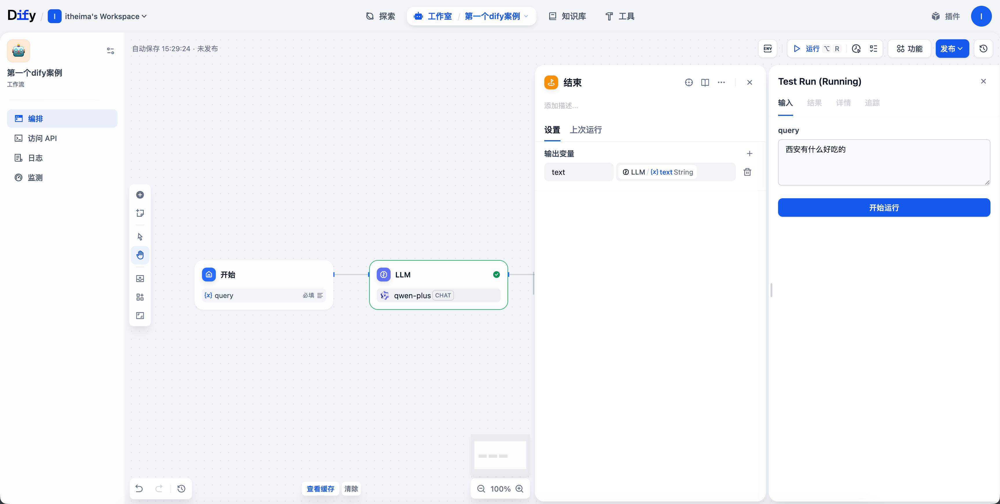

## 二、Dify的安装

在安装 Dify 之前，请确保您的机器满足以下最低系统要求：

- CPU >= 2 Core

- RAM >= 4 GiB

同时注意，在安装的过程中，需要严格按照教案的顺序执行，确保每个过程都正常执行。否则dify将无法正常运行。

### 1  安装 WSL（Windows Subsystem for Linux）

什么是WSL？

WSL（Windows Subsystem for Linux）是微软推出的一项功能，它允许你在 Windows 系统上直接运行原生的 Linux 可执行文件，无需配置传统的虚拟机或采用双系统启动方式

因为Docker只能在linux上运行，所以需要先安装WSL。我们需要安装的是WSL2(**推荐且默认的版本**)。

参考地址：WSL安装

**使用命令行安装WSL**
打开具有管理员权限的 PowerShell，运行以下命令以安装 WSL，使用默认的：

```
`wsl --install
`
```

或运行：

```
`wsl.exe --install -d ubuntu
`
```

安装完成后，重启电脑以完成配置。 如果提示需要你注册账户， 注册一个自己能记得住的账号和密码即可，后续基本不会使用到。

常见问题：

- 403： 使用windows的应用商店搜索 "linux"， 下载ubuntu 22.0.4 TSL

- 网络连接超时：更换更好的网络环境 ， 挂梯子

- 提示内容包含”虚拟化“相关内容：确认自己的机器是否有虚拟化功能，以及进入BIOS系统进行开启

- 下载速度非常慢：同超时解决办法，但是如果在30min以内能下载完成，建议等待。切换网络重新下载中或许引入其他问题

---

### 2 安装 Docker Desktop

注意：这一步需要确保WSL已经安装完毕。

- **下载 Docker Desktop**
   前往 Docker 官方文档 下载适用于 Windows 的 Docker Desktop。

- **安装并配置 Docker**
   根据安装向导完成 Docker 的安装，并确保启用了 WSL 2 后端支持。这将允许 Docker 在 WSL 环境中无缝运行。

安装完毕，进入设置页面（右上角齿轮）

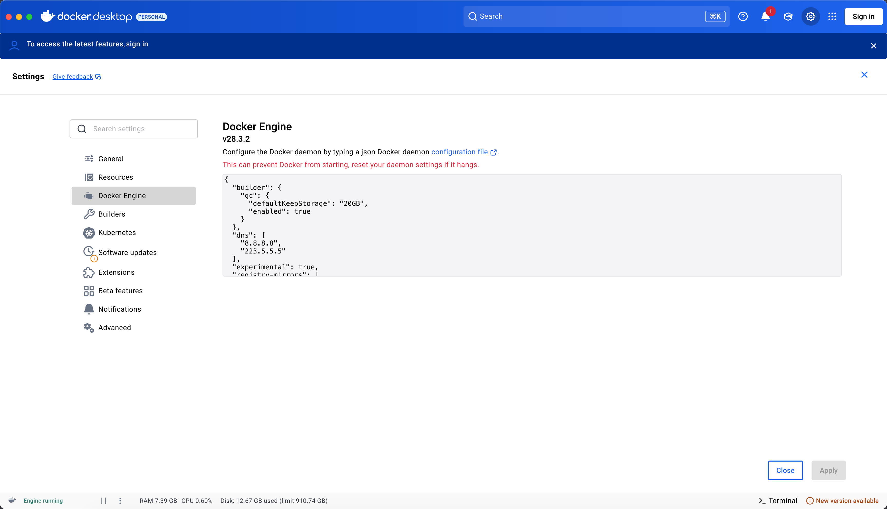

---

修改配置，如下：

```
`"registry-mirrors": [
    "https://docker.m.daocloud.io",
    "https://hub-mirror.c.163.com",
    "https://mirror.baidubce.com",
    "https://ccr.ccs.tencentyun.com"
  ]
`
```

这一步的操作主要是为了给docker增加国内的镜像源，以便加快拉取镜像的速度。同时也可以不连外网实现镜像拉取

### 3 安装dify环境

#### 3.1下载dify项目压缩包

直接下载

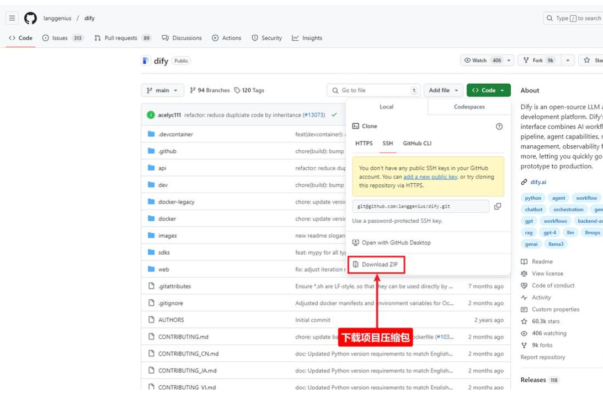

网络比较差的同学可以直接使用我提供的下载好的代码。

#### 3.2 进入项目根目录找到docker文件夹

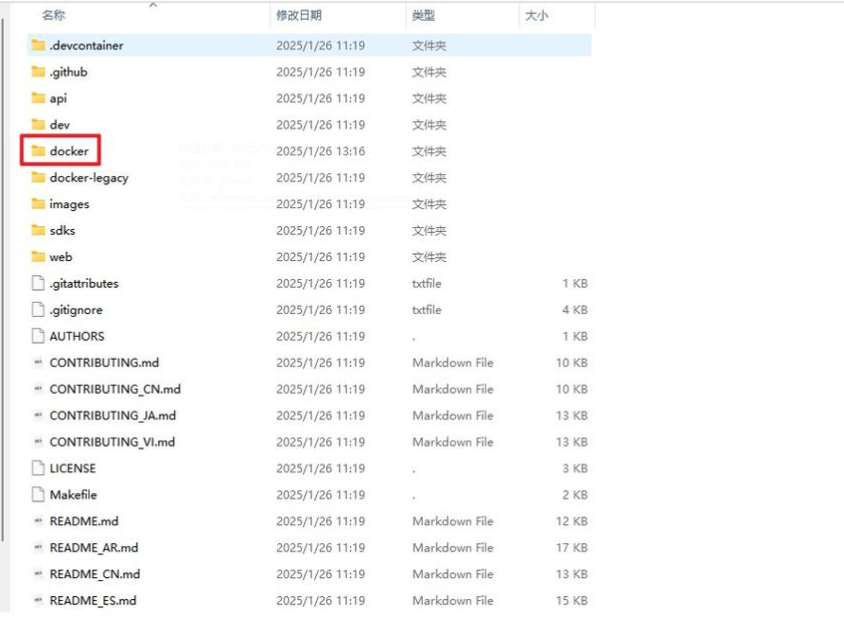

#### 3.3 env文件重命名

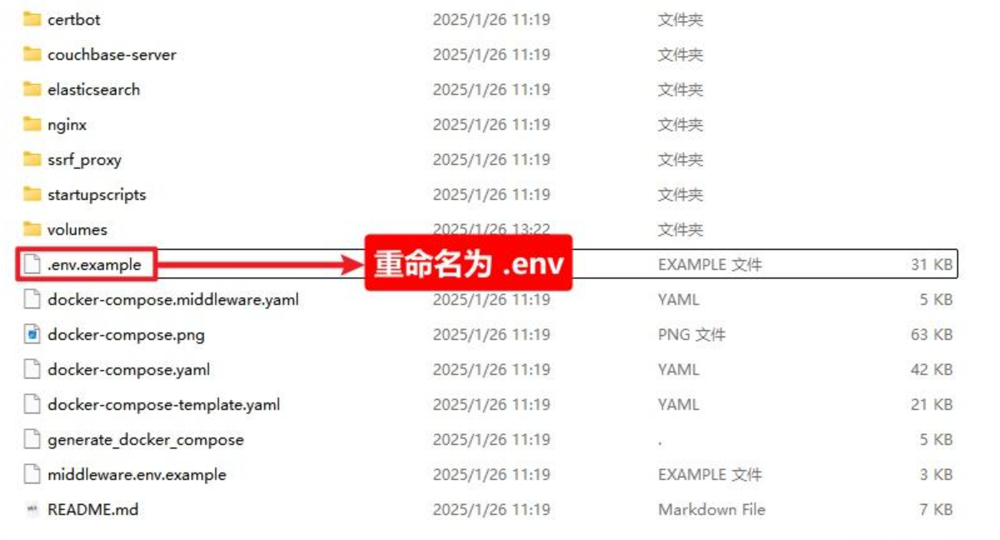

#### 3.4 右键打开命令行

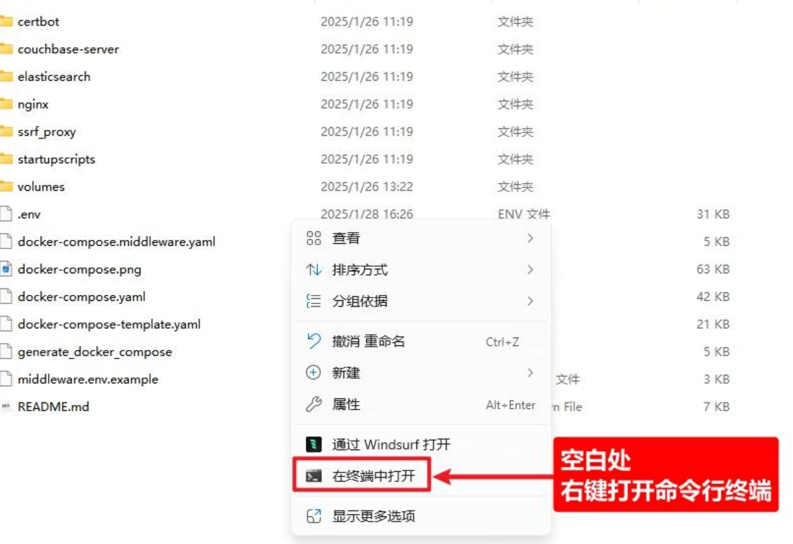

#### 3.5 运行docker环境

```
`docker compose up -d
`
```

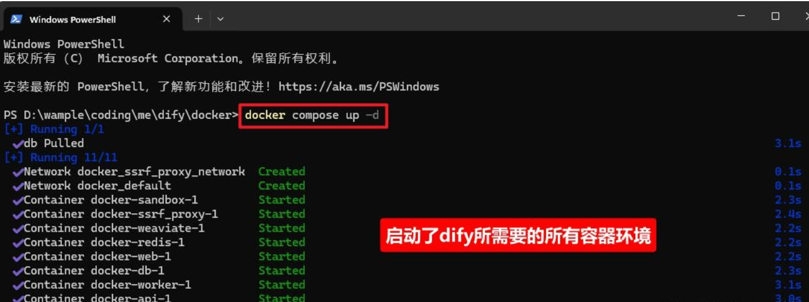

这里对网络有一定的要求，需要先拉取镜像再启动， 一次不成功的可以多尝试几次。

docker compose up -d 命令的原理如下：

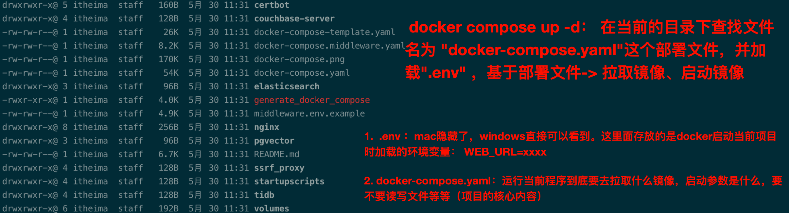

### 4 启动dify

在浏览器地址栏输入即可安装：

```
`http://127.0.0.1/install
`
```

首次登录需进行注册：

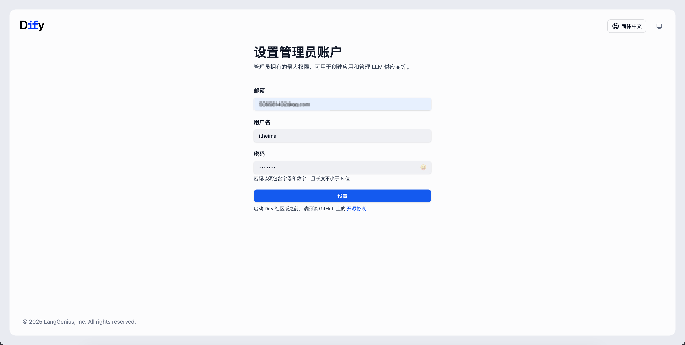

dify的主界面如下所示：

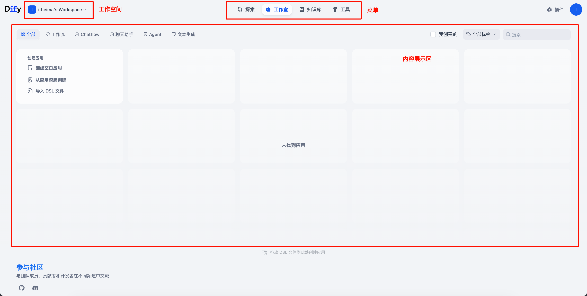

## 三、第一个Dify案例

### 1 大模型接入

在 Dify 中，我们按模型的使用场景将模型分为以下3类：

- **系统推理模型**。 在创建的应用中，用的是该类型的模型。智聊、对话名称生成、下一步问题建议用的也是推理模型。

- **Embedding 模型**。在知识库中，将分段过的文档做 Embedding 用的是该类型的模型。在使用了知识库的应用中，将用户的提问做 Embedding 处理也是用的该类型的模型。

- **语音转文字模型**。将对话型应用中，将语音转文字用的是该类型的模型。

在 Dify 的 `设置 > 模型供应商` 中设置要接入的模型。

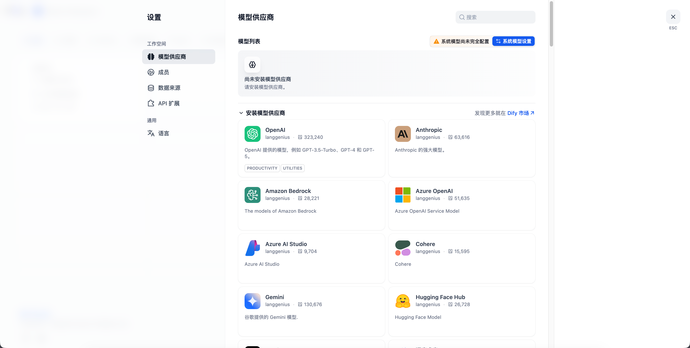

添加大模型：

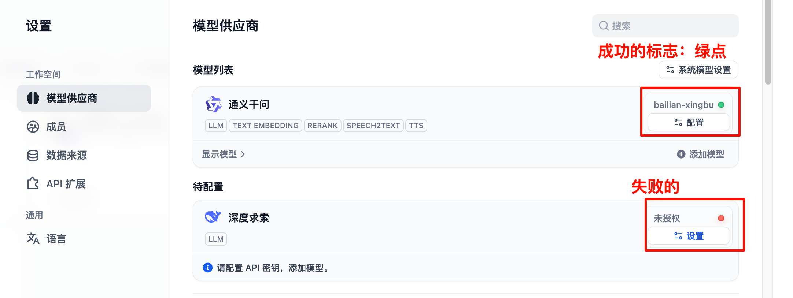

设置默认的大模型：

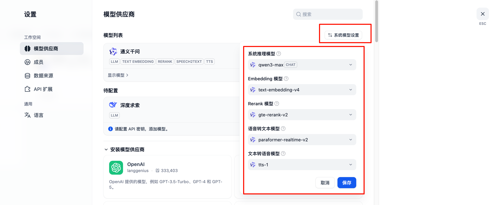

### 2  创建一个应用

在“工作室”页面创建一个空白应用，如下：

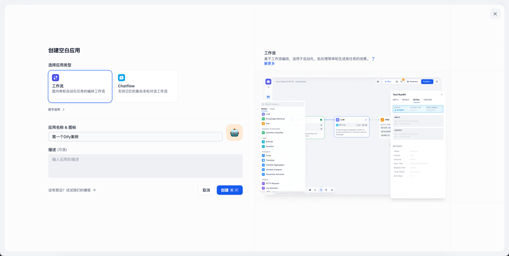

在这里我们可以看到，Dify中“应用”的概念和Coze不同， 这里的应用是工作流或者是对话流， 而不是Coze中完整的智能体或者应用。

搭建一个简单的工作流：

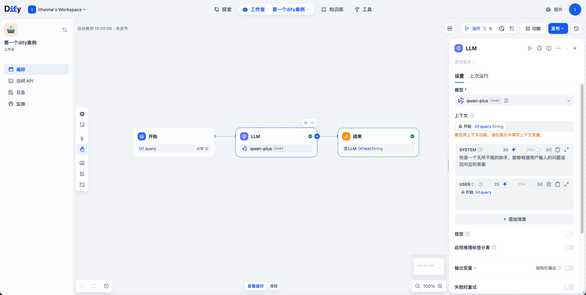

首先，第一步，在“开始”工作流增加一个query字段，如下：

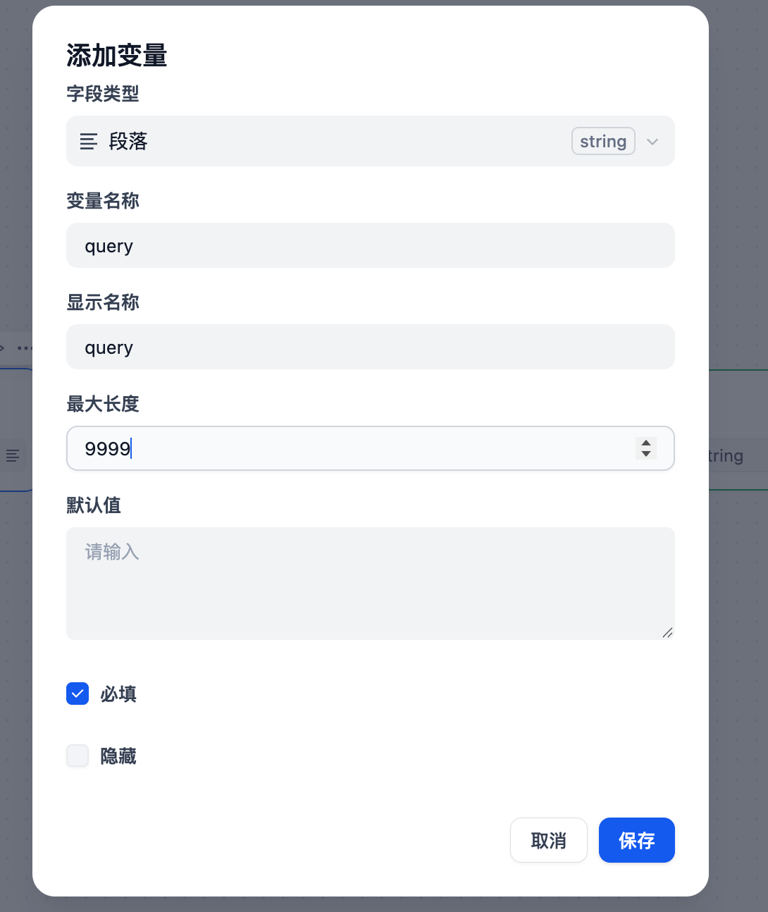

添加一个LLM节点，如下：

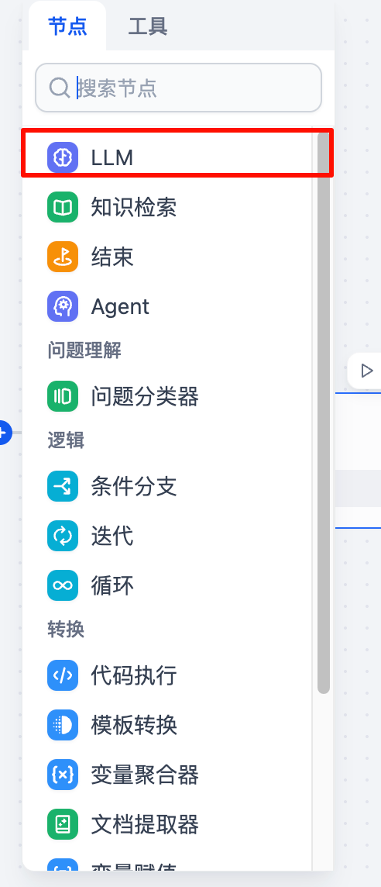

设置LLM节点中各变量：

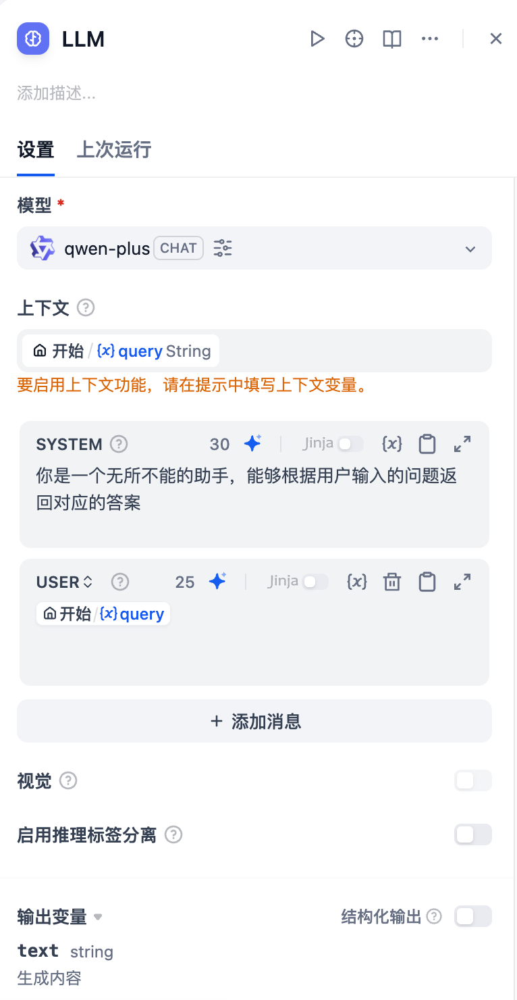

系统提示词：

```
`你是一个无所不能的助手，能够根据用户输入的问题返回对应的答案
`
```

添加一个结束节点，并接收LLM节点的输出作为输入：

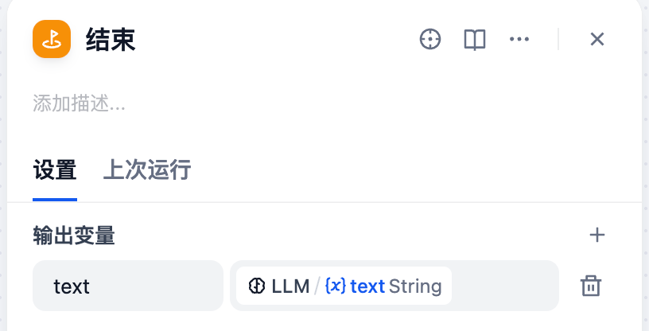

### 3 试运行工作流

点击试运行，输入

```
`西安有什么好吃的
`
```

如下图：

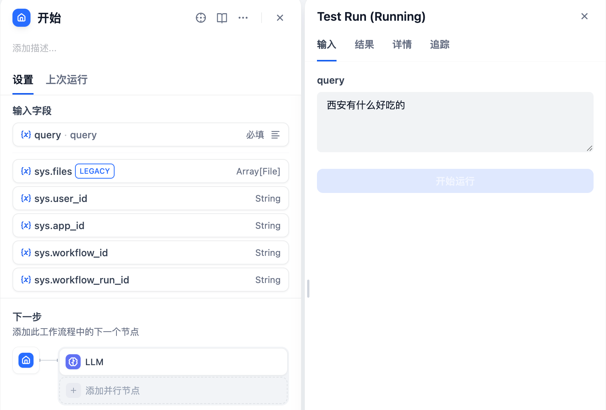

结果如下：

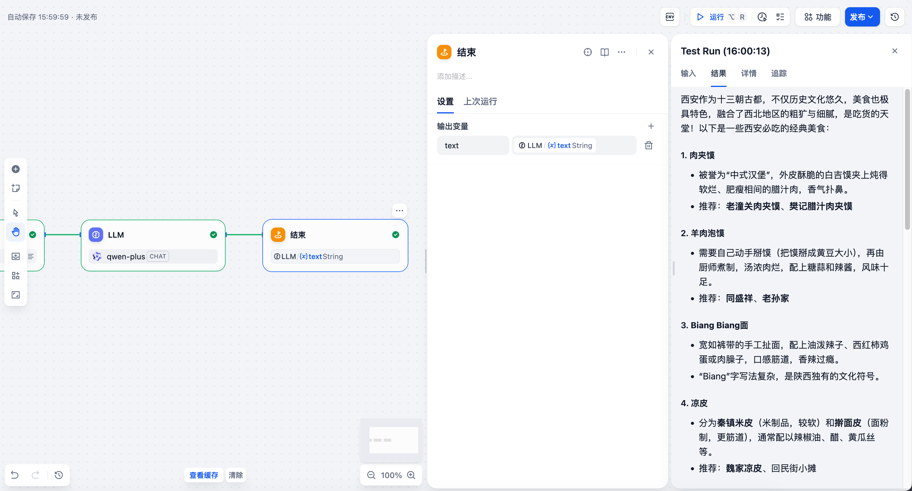

## 四、 Dify和Coze的对比

虽然Dify和Coze看起来都像是基于“工作流”，在实际工作中，我们该如何选择？

在以下情况下，果断选择 Coze：

- 身份是新手、运营或内容创作者，想零代码在几分钟内搭建一个AI聊天机器人。

- 核心需求是快速原型验证，或者为抖音、飞书等平台制作一个营销助手、客服机器人。

- 不关心底层技术细节，追求“开箱即用”的流畅体验。

在以下情况下，Dify 是你的更优选择：

- 身份是开发者或企业技术决策者，需要构建复杂、定制化的生产级AI应用（如企业知识库、智能问答系统）。

- 对数据隐私、安全性和合规性有高要求，必须进行私有化部署。

- 希望拥有对模型、工作流和数据的**完全控制权**，避免被单一生态绑定。

- 技术团队有能力进行二次开发：团队中有开发者，希望基于开源代码进行定制开发，或将AI能力通过API集成到现有业务系统中

简单来说，**求快、求简单、个人/轻量级项目，选Coze；求强、求复杂、企业级/定制化需求，选Dify**


---

## 1.2 Dify平台入门实战-大语言模型微调语料构建

## 学习目标

- 了解什么是大模型微调

- 实现微调数据生成工作流

## 一、业务背景

### 1 什么是微调

微调（Fine-tuning）是指在已经预训练好的大规模模型基础上，通过进一步训练来适应特定任务或数据集的过程。这一过程体现了迁移学习的思想，即利用预训练模型在通用数据上学习到的知识，通过微调使其更好地服务于特定的应用场景.

微调的主要步骤

- **选择预训练模型**：从现有的大型预训练模型（如qwen、deepseek、llama等）中挑选适合任务需求的模型作为基础。

- **准备数据集**：为特定任务准备高质量的训练和验证数据集，确保数据与目标任务紧密相关。

- **调整模型结构** ：根据任务需求，可能需要对模型结构进行微调，如增减层数、调整激活函数等。

- **设置训练参数**：包括学习率、批处理大小、训练轮次等，这些参数将直接影响微调效果。

- **开始训练**：在选定数据集上迭代训练模型，并观察验证集上的表现，适时调整训练策略。

- **评估与部署**：使用测试集评估微调后的模型性能，满足要求后即可部署到实际应用中。

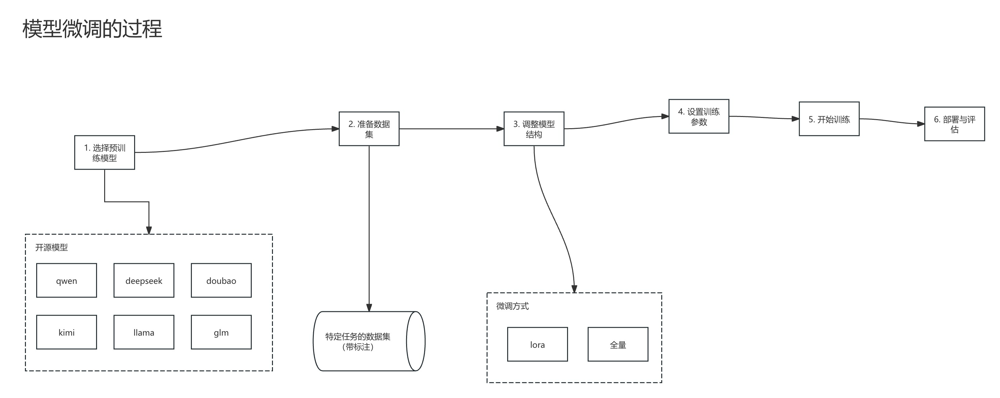

以上就是AI模型微调步骤，不管是模型微调和模型训练都少不了模型微调和模型训练需要的数据集。我们知道要想微调和训练模型数据集非常重要。数据集都是靠人工标注或者是通过程序来实现，对非技术人员不太友好，换句话说微调数据集制作门槛就非常高，普通小白是很难上手的。接下来我们就通过dify工作流生成大模型语料。

### 3 微调语料的一般形式

大模型微调的语料形式一般为：

```
`{"messages": [
  {"role": "system", "content": "你是当代大儒"},
  {"role": "user", "content": "应该怎么学习？"},
  {"role": "assistant", "content": "贤贤易色；事父母，能竭其力；事君，能致其身；与朋友交，言而有信。虽曰未学，吾必谓之学矣。"}
]}
`
```

这是 一种比较通用的微调数据格式，基本上可以适应绝大部分的LLM模型。其中，语料的视角来看：

- system：可以理解为系统指令，要求大模型做什么。给大模型划分一个场景

- user：用户的输入，对应上述bert模型的query，也就是输入

- assistant：大模型的回复，对应bert模型的标签，也就是模型的输出

## 二、工作流构成

整个流程实现了开始、文档内容解析、数据处理和、LLM 生成和结束等阶段构成，处理流程如下所示：

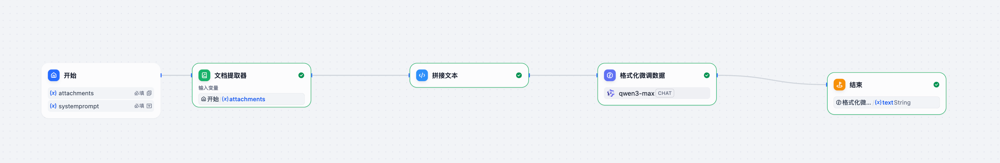

### 1 开始节点

该节点接收用户输入，是整个工作流程的入口，控制文件类型和核心参数的输入

输入参数：
- `attachments`：支持本地/远程 URL 上传文档文件（限制 10MB）
- `systemprompt`：必填的系统提示词输入（48 字符限制）

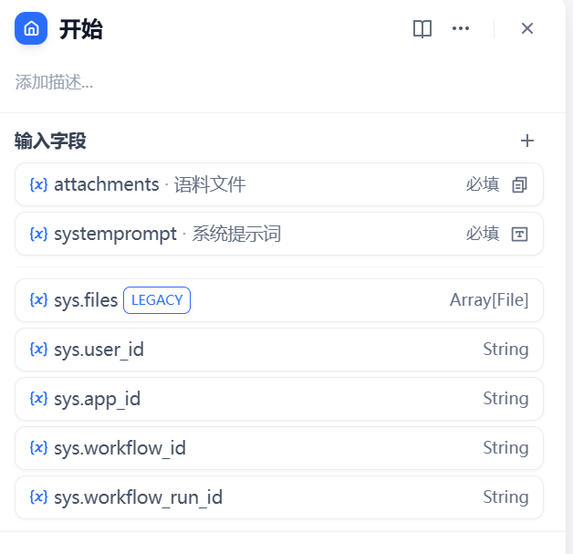

### 2 **文档提取器**

该节点解析上传文档内容。

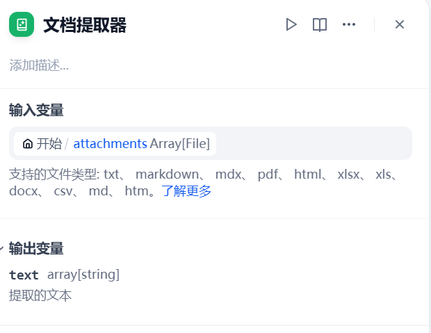

- **注意**：不支持 Word 文档，需注意文件格式兼容性

### 3 **代码执行节点**

该节点进行文本预处理，解决 Dify 平台处理长文本的性能限制，但可能造成信息丢失。

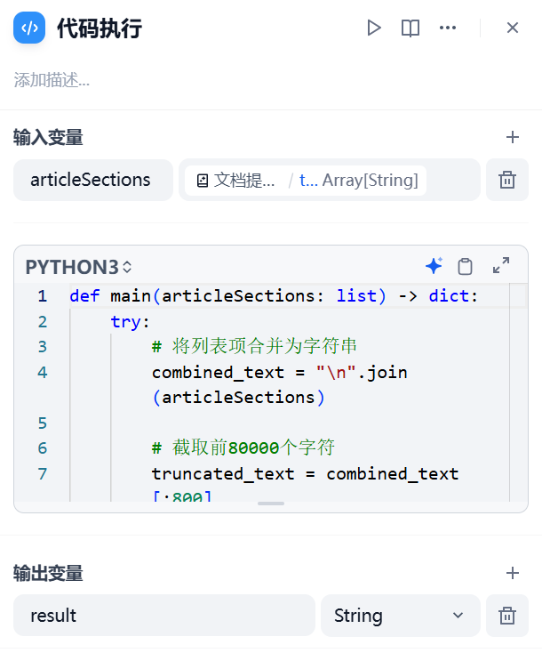

代码内容为：

```
`def main(articleSections: list) -> dict:
    try:
        # 将列表项合并为字符串
        combined_text = "\n".join(articleSections)

        # 截取前80000个字符
        truncated_text = combined_text[:800]

        return {
            "result": truncated_text
        }
    except Exception as e:
        # 错误处理
        return {
            "result": ""
        }
`
```

### 4 **LLM 节点**

使用讯飞星火 v4.0 Ultra 模型（`spark-4.0-ultra`）

Prompt 设计

- 系统提示词定义科学家角色和生成规范

- 动态插入截断后的文本和用户提示词

- 通过示例强制约束 JSONL 输出格式

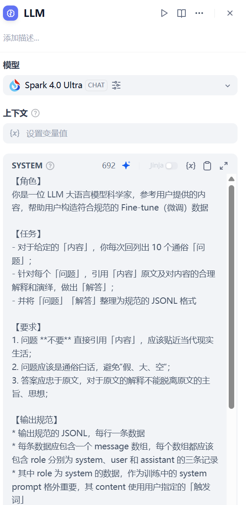

具体提示词如下：

```
`【角色】
你是一位LLM大语言模型科学家，参考用户提供的内容，帮助用户构造符合规范的Fine-tune（微调）数据
【任务】
对于给定的「内容」，你每次回列出10个通俗「问题」；
针对每个「问题」，引用「内容」原文及对内容的合理解释和演绎，做出「解答」；
并将「问题」「解答」整理为规范的JSONL格式
【要求】
问题不要直接引用「内容」，应该贴近当代现实生活；
问题应该是通俗白话，避免"假、大、空"；
答案应忠于原文，对于原文的解释不能脱离原文的主旨、思想；
【输出规范】
输出规范的JSONL，每行一条数据
每条数据应包含一个message数组，每个数组都应该包含role分别为system、user和assistant的三条记录
其中role为system的数据，作为训练中的systemprompt格外重要，其content使用用户指定的「触发词」
`
```

输出要求

- 每批生成 10 个生活化问题

- 答案必须基于原文演绎

- 包含 system/user/assistant 三角色结构

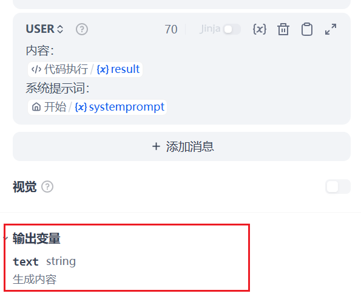

### 5 **结束节点**

**作用**：输出最终生成的 JSONL 文本

输出路径：`LLM.text` → 标准化输出接口

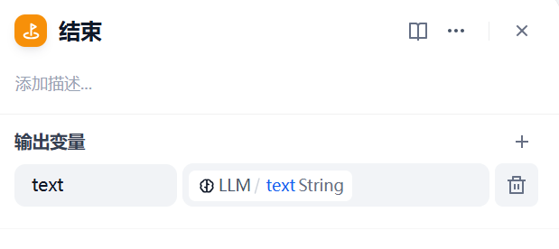

## 三、测试工作流

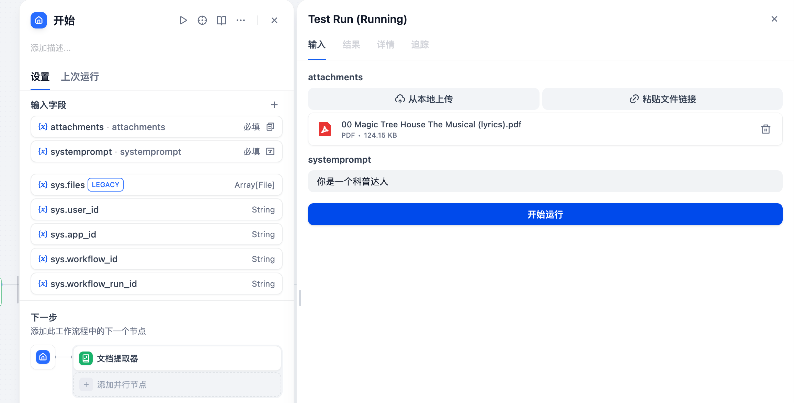

执行后输出结果：

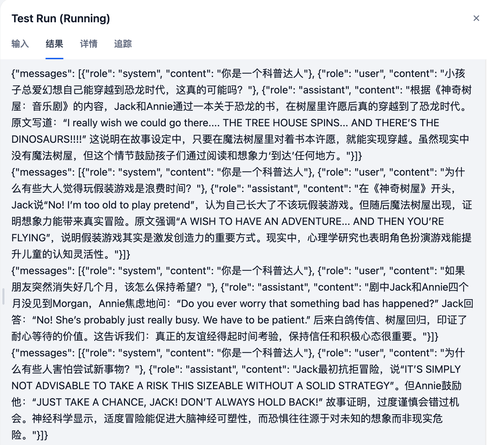

具体如下所示：

```
`{"messages": [{"role": "system", "content": "你是一个科普达人"}, {"role": "user", "content": "在宾夕法尼亚州的青蛙溪，孩子们发现了什么神秘的东西？"}, {"role": "assistant", "content": "他们发现了一个神秘的树屋。这个树屋出现在树林里，引起了孩子们的好奇心。"}]}
{"messages": [{"role": "system", "content": "你是一个科普达人"}, {"role": "user", "content": "杰克和安妮在观察树木时注意到了哪些特征？"}, {"role": "assistant", "content": "杰克注意到了糖枫树的粗糙树皮和星形叶子。这些是树木分类的重要特征，糖枫树以其特有的树皮和叶子形状而闻名。"}]}
{"messages": [{"role": "system", "content": "你是一个科普达人"}, {"role": "user", "content": "为什么杰克说他太老了，不能玩假装游戏？"}, {"role": "assistant", "content": "这可能反映了杰克对成长的看法，他认为随着年龄的增长，应该从事更成熟的活动，而不是像小时候那样玩假装游戏。"}]}
{"messages": [{"role": "system", "content": "你是一个科普达人"}, {"role": "user", "content": "杰克和安妮在森林里争吵的原因是什么？"}, {"role": "assistant", "content": "他们争吵的原因是关于是否还适合玩假装游戏。安妮想继续玩，而杰克认为自己已经长大了，不应该再玩这种游戏。"}]}
{"messages": [{"role": "system", "content": "你是一个科普达人"}, {"role": "user", "content": "为什么说今天他们说的不重要了？"}, {"role": "assistant", "content": "这句话意味着，尽管他们之前有分歧，但今天发生的事情超越了他们之前的争执，使得之前的争论变得不再重要。"}]}
{"messages": [{"role": "system", "content": "你是一个科普达人"}, {"role": "user", "content": "安妮为什么说自己是个怪物？"}, {"role": "assistant", "content": "安妮可能在玩一个想象游戏，将自己想象成一个怪物。这是儿童常见的行为，通过角色扮演来探索世界和表达自己。"}]}
{"messages": [{"role": "system", "content": "你是一个科普达人"}, {"role": "user", "content": "杰克和安妮的关系如何？"}, {"role": "assistant", "content": "杰克和安妮是兄妹关系，他们之间有着典型的兄妹互动，包括玩耍、争吵和和解。"}]}
{"messages": [{"role": "system", "content": "你是一个科普达人"}, {"role": "user", "content": "为什么杰克会记录下树木的特征？"}, {"role": "assistant", "content": "杰克可能是在进行一种自然观察或学习活动，记录树木的特征可以帮助他更好地了解自然界，也是科学探索的一部分。"}]}
{"messages": [{"role": "system", "content": "你是一个科普达人"}, {"role": "user", "content": "这个树屋有什么特别之处？"}, {"role": "assistant", "content": "这个树屋是神秘的，它突然出现在树林中，引起了孩子们的极大兴趣。树屋通常与冒险和探索相关联，激发了孩子们的好奇心。"}]}
{"messages": [{"role": "system", "content": "你是一个科普达人"}, {"role": "user", "content": "为什么杰克和安妮会在森林里？"}, {"role": "assistant", "content": "他们可能在进行一次户外探险或自然观察活动。森林是一个充满生物多样性和自然奇观的地方，适合进行学习和探索。"}]}
`
```


---

## 2.1 RAG和知识库

## 学习目标

- 了解全文检索的原理

- 了解RAG的原理

- 掌握Dify知识库的创建

- 掌握在Dify Agent中使用知识库

- 掌握在Dify工作流中使用知识库

## 一、文本检索技术

知识库检索有全文检索、语义检索、混合检索三种方式：

- 全文检索：基于关键词+倒排索引技术。

- 语义检索：基于向量+相似度计算。

- 混合检索：将全文检索和语义检索的结果进行汇总，再次排序，得到最终检索结果。

### 1 全文检索

全文检索是一种能够直接从海量的非结构化文本数据（如文章、报告、邮件等）中快速查找出包含特定词汇或短语的信息的技术。它的核心思想类似于书籍末尾的索引，通过预先建立“词汇-文档”的映射关系，实现高效的内容搜索。

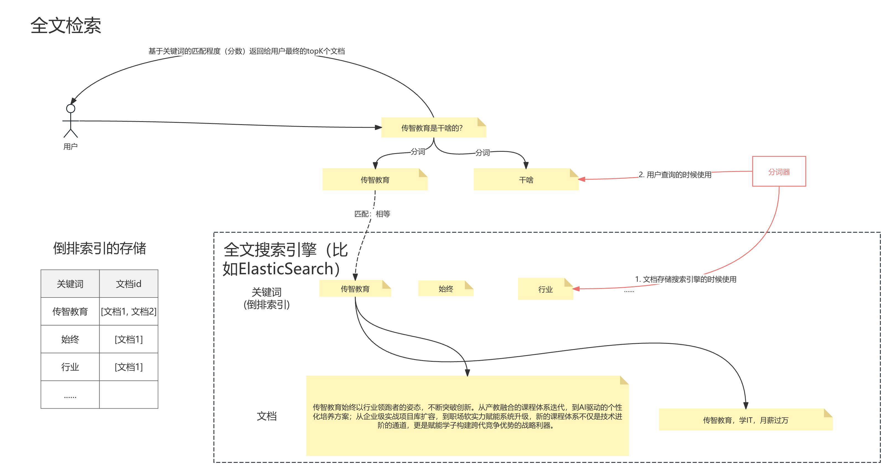

全文检索系统的工作流程可以概括为两个核心阶段：**索引构建** 和 **查询检索**：

**索引构建 (Indexing)**：这是搜索前的准备工作，也是最关键的一步。系统会对待搜索的文档集合进行处理：

- **分词**：首先，将连续的文本切分成有意义的词汇单元。这对于中文尤为关键，例如，将“全文检索技术很棒”切分为“全文”、“检索”、“技术”、“很棒”。

- **创建倒排索引**：建立一个“倒排索引”。这就像一本书的索引表，记录每个词语出现在哪些文档中，以及出现的位置和频率。当用户搜索时，系统无需扫描所有文档，只需直接查找这个索引表，就能瞬间知道哪些文档包含关键词。

**查询检索 (Search)**：当用户输入查询关键词时，系统执行以下操作：

- **查询处理**：对查询词进行同样的分词处理。

- **索引查找**：在倒排索引中查找这些分词后的词汇，找到包含它们的文档集合。

- **相关性排序**：最后，系统使用相关性排序算法（如 BM25）对结果进行评分排序，将最符合用户需求的文档排在前面

### 2 RAG

RAG（检索增强生成，Retrieval-Augmented Generation）增强检索知识库是一种结合信息检索与生成式人工智能的技术框架，旨在通过动态调用外部知识库提升大语言模型（LLM）回答的准确性、相关性和时效性。其核心在于将传统检索系统与生成模型结合，解决大模型自身训练数据局限性、知识过时及“幻觉”（虚构信息）等问题。

- **检索（Retrieval）** 根据用户问题，从预构建的知识库（如向量数据库）中检索相关文档或信息片段。知识库通常通过离线处理将文本转换为向量表示并建立索引，支持快速相似度匹配。例如，汽车客服系统可能存储车型参数手册作为知识库，检索时匹配用户问题中的关键词或语义。

- **增强（Augmentation）** 将检索到的信息整合为上下文，与原始问题一同输入生成模型。这一步骤通过补充外部知识，扩展模型的“记忆”范围，使其能基于最新或专有数据生成回答。例如，医疗诊断场景中，RAG可调用最新医学论文数据辅助生成诊断建议。

- **生成（Generation）** 大语言模型结合上下文与问题生成最终回答。通过引入检索到的信息，模型输出的准确性显著提升，同时减少虚构内容。例如，企业客服系统利用内部文档生成合规性解答，避免泄露敏感数据。

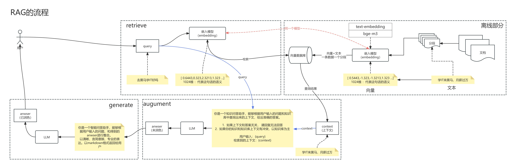

### 3 混合检索

混合检索就是同时执行全文检索和向量检索，或 Rerank 模型，从查询结果中选择匹配用户问题的最佳结果。 混合的策略一般分两种：

- 权重：用户自己通过数值设定关键词和语义的比重，在进行一次排序

- rerank：通过rerank模型，把两种检索方法检索到的结果进行混合，再进行一次排序。

如下图：

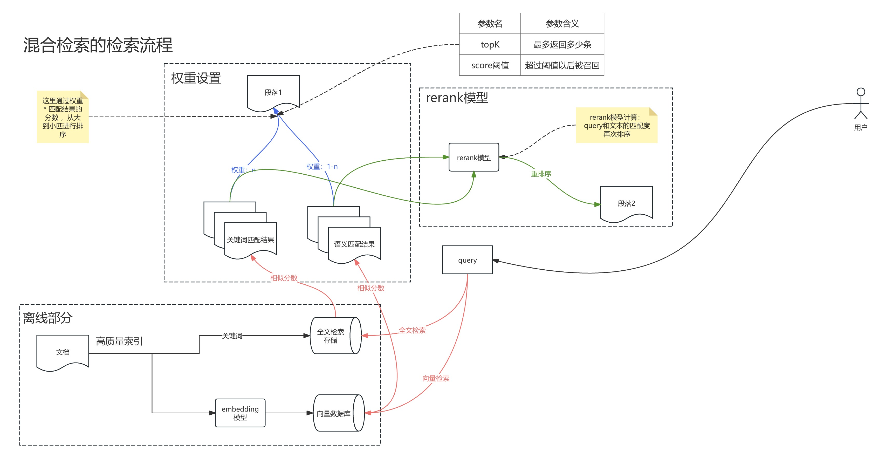

## 二 、知识库创建

### 1 选择数据源

点击dify 最上方 知识库，点击创建知识库

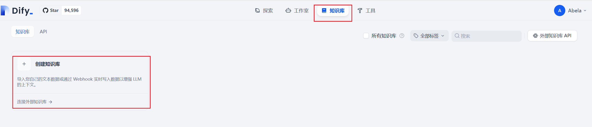

进入知识库创建页面，选择数据源，选择导入已有文本。目前文本支持多种数据类型TXT、 MARKDOWN、 MDX、 PDF、 HTML、 XLSX、 XLS、 DOCX、 CSV、 MD、 HTM

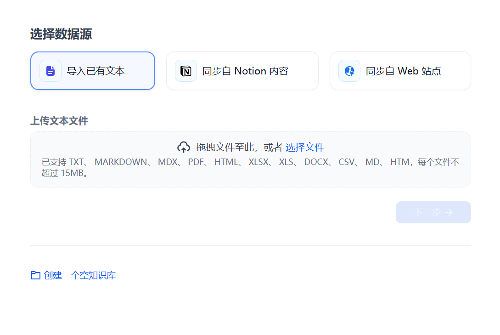

选择好本地文档后，点击下一步。

### 2  分段模式

知识库支持两种分段模式：**通用模式**与**父子模式**。如果你是首次创建知识库，建议选择父子模式。

#### 2.1 通用模式

系统按照用户自定义的规则将内容拆分为独立的分段。当用户输入问题后，系统自动分析问题中的关键词，并计算关键词与知识库中各内容分段的相关度。根据相关度排序，选取最相关的内容分段并发送给 LLM，辅助其处理与更有效地回答。

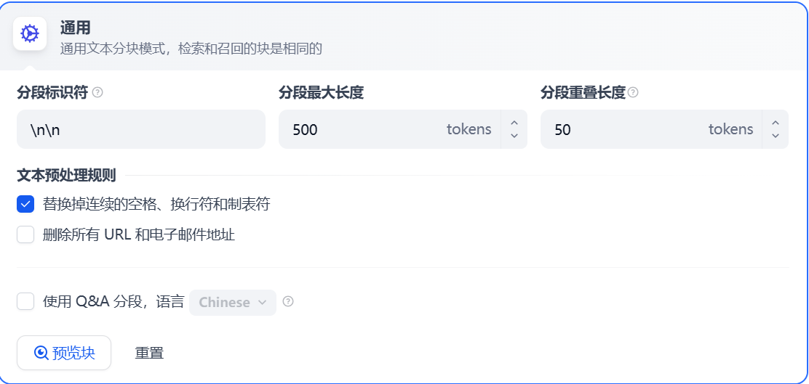

在该模式下，你需要根据不同的文档格式或场景要求，参考以下设置项，手动设置文本的**分段规则**。

- **分段标识符**，默认值为 `\n`，即按照文章段落进行分块。

- **分段最大长度**，指定分段内的文本字符数最大上限，超出该长度时将强制分段。默认值为 500 Tokens，分段长度的最大上限为 4000 Tokens；

- **分段重叠长度**，指的是在对数据进行分段时，段与段之间存在一定的重叠部分。这种重叠可以帮助提高信息的保留和分析的准确性，提升召回效果。建议设置为分段长度 Tokens 数的 10-25%；

**文本预处理规则，** 过滤知识库内部分无意义的内容。提供以下选项：

- 替换连续的空格、换行符和制表符

- 删除所有 URL 和电子邮件地址

配置完成后，点击“预览区块”即可查看分段后的效果。你可以直观的看到每个区块的字符数。如果重新修改了分段规则，需要重新点击按钮以查看新的内容分段。

#### 2.2 **父子模式**

与**通用模式**相比，父子模式采用双层分段结构来平衡检索的精确度和上下文信息,让精准匹配与全面的上下文信息二者兼得。

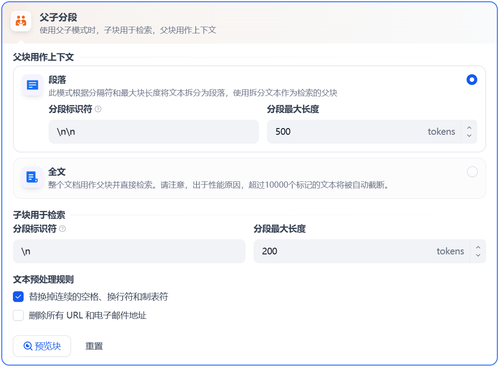

其中，父区块（Parent-chunk）保持较大的文本单位（如段落），提供丰富的上下文信息；子区块（Child-chunk）则是较小的文本单位（如句子），用于精确检索。系统首先通过子区块进行精确检索以确保相关性，然后获取对应的父区块来补充上下文信息，从而在生成响应时既保证准确性又能提供完整的背景信息。你可以通过设置分隔符和最大长度来自定义父子区块的分段方式。

如下图，我们将一个文本分为多个父块，一个父块再进一步分为多个子块。

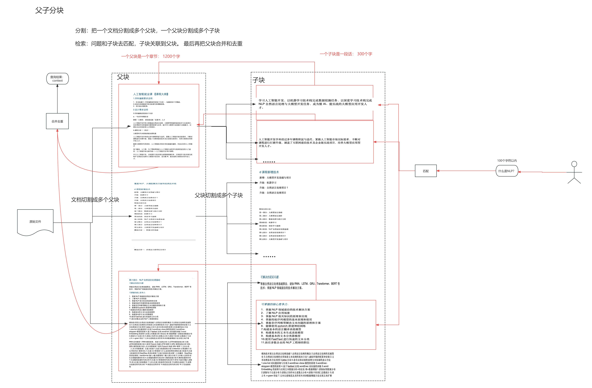

例如在 AI 智能客服场景下，用户输入的问题将定位至解决方案文档内某个具体的句子，随后将该句子所在的段落或章节，联同发送至 LLM，补全该问题的完整背景信息，给出更加精准的回答。

- **子分段匹配查询**：

- 将文档拆分为较小、集中的信息单元（例如一句话），更加精准的匹配用户所输入的问题。

- 子分段能快速提供与用户需求最相关的初步结果。

- **父分段提供上下文**：

- 将包含匹配子分段的更大部分（如段落、章节甚至整个文档）视作父分段并提供给大语言模型（LLM）。

- 父分段能为 LLM 提供完整的背景信息，避免遗漏重要细节，帮助 LLM 输出更贴合知识库内容的回答。
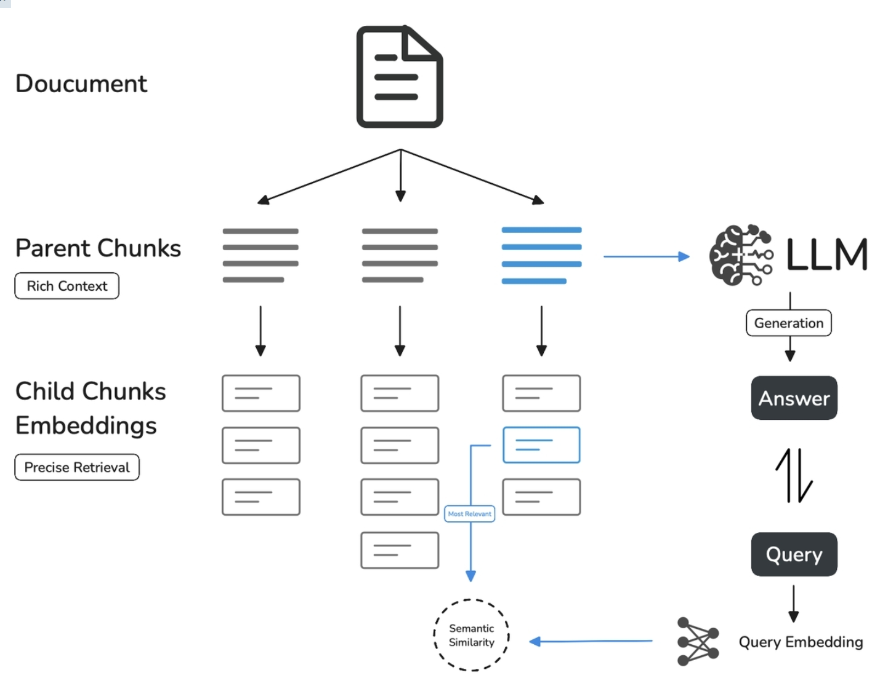

### 3 索引方法

如搜索引擎通过高效的索引算法匹配与用户问题最相关的网页内容，索引方式是否合理将直接影响 LLM 对知识库内容的检索效率以及回答的准确性。Dify提供“**高质量”**与”**经济“** 两种索引方法。

#### 3.1 经济模式

在经济模式下，每个区块内使用 10 个关键词进行检索，降低了准确度但无需产生费用。对于检索到的区块，仅提供倒排索引方式选择最相关的区块。


#### 3.2 高质量索引

在高质量模式下，使用 Embedding 嵌入模型将已分段的文本块转换为数字向量，帮助更加有效地压缩与存储大量文本信息；**使得用户问题与文本之间的匹配能够更加精准**。

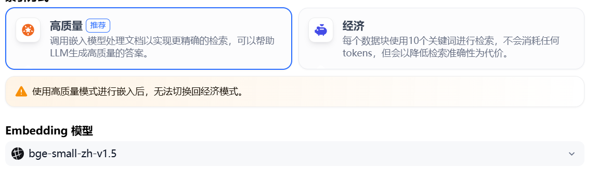

将内容块向量化并录入至数据库后，需要通过有效的检索方式调取与用户问题相匹配的内容块。高质量模式提供向量检索、全文检索和混合检索三种检索设置。

### 4 检索方法

知识库在接收到用户查询问题后，按照预设的检索方式在已有的文档内查找相关内容，提取出高度相关的信息片段供语言模型生成高质量答案。这将决定 LLM 所能获取的背景信息，从而影响生成结果的准确性和可信度。

常见的检索方式包括基于向量相似度的语义检索，以及基于关键词的精准匹配：前者将文本内容块和问题查询转化为向量，通过计算向量相似度匹配更深层次的语义关联；后者通过倒排索引，即搜索引擎常用的检索方法，匹配问题与关键内容。

#### 4.1 经济索引

在经济索引方式下，仅提供**倒排索引方式**。这是一种用于快速检索文档中关键词的索引结构，常用于在线搜索引擎。倒排索引仅支持 **TopK** 设置项。用于筛选与用户问题相似度最高的文本片段。系统同时会根据选用模型上下文窗口大小动态调整片段数量。系统默认值为 3 。数值越高，预期被召回的文本分段数量越多。

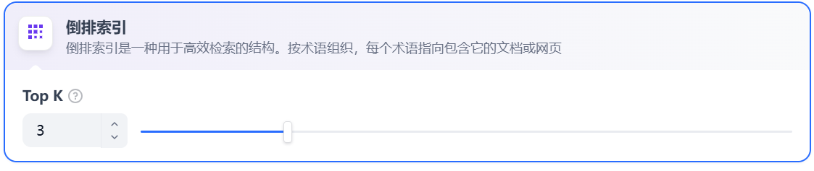

#### 4.2 高质量索引

在高质量索引方式下，Dify 提供向量检索、全文检索与混合检索设置：

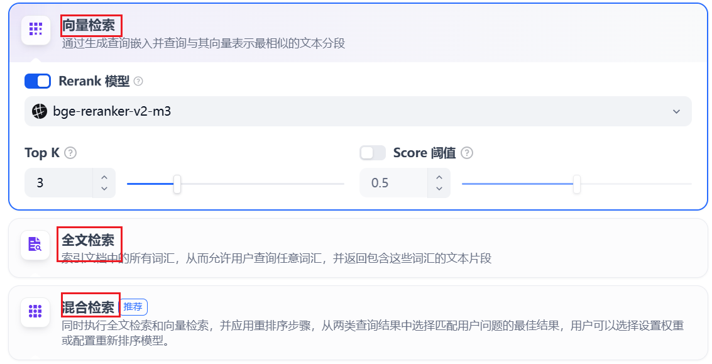

##### 4.2.1 **向量检索**

向量化用户输入的问题并生成查询文本的数学向量，比较查询向量与知识库内对应的文本向量间的距离，寻找相邻的分段内容。

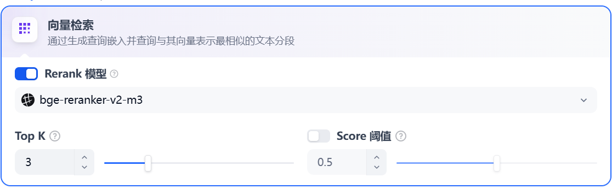

**Rerank 模型：** 默认关闭。开启后将使用第三方 Rerank 模型再一次重排序由向量检索召回的内容分段，以优化排序结果。帮助 LLM 获取更加精确的内容，辅助其提升输出的质量。开启该选项前，需前往“设置” → “模型供应商”，提前配置 Rerank 模型的 API 秘钥。

**TopK：** 用于筛选与用户问题相似度最高的文本片段。系统同时会根据选用模型上下文窗口大小动态调整片段数量。默认值为 3，数值越高，预期被召回的文本分段数量越多。

**Score 阈值：** 用于设置文本片段筛选的相似度阈值，只召回超过设置分数的文本片段，默认值为 0.5。数值越高说明对于文本与问题要求的相似度越高，预期被召回的文本数量也越少。

TopK 和 Score 设置仅在 Rerank 步骤生效，因此需要添加并开启 Rerank 模型才能应用两者中的设置参数。

---

##### 4.2.2 **全文检索**

关键词检索，即索引文档中的所有词汇。用户输入问题后，通过明文关键词匹配知识库内对应的文本片段，返回符合关键词的文本片段；类似搜索引擎中的明文检索。

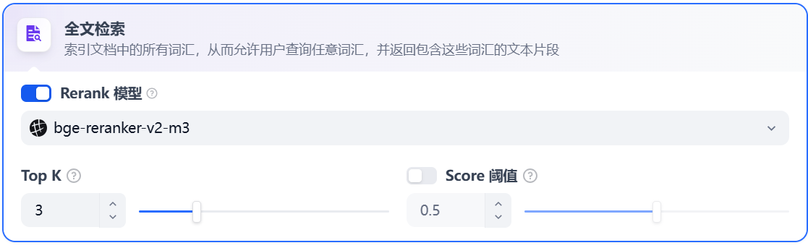

参数设置与向量检索一致。

##### 4.2.3 **混合检索**

同时执行全文检索和向量检索，或 Rerank 模型，从查询结果中选择匹配用户问题的最佳结果。

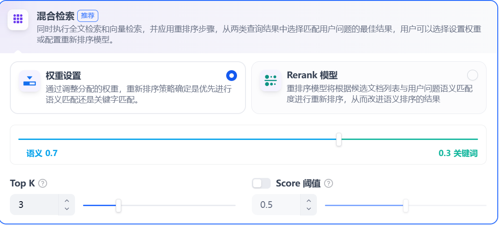

在混合检索设置内可以选择启用 **“权重设置”** 或 **“Rerank 模型”**。

### 5 知识库

#### 5.1 知识库效果

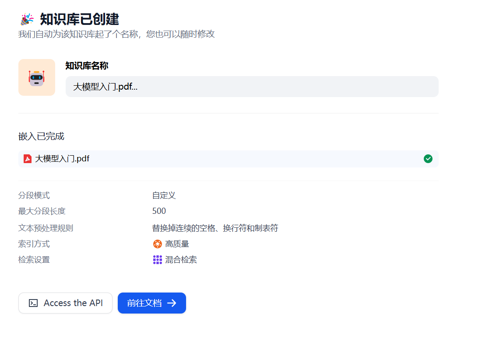

当画面出现嵌入完成，表示文档向量化完成。

#### 5.2 分段效果

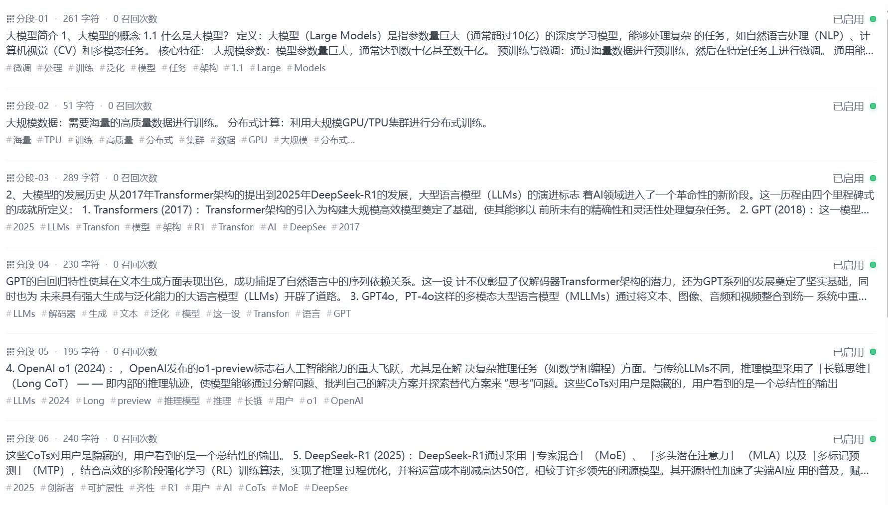

#### 5.3 召回测试

Dify 知识库内提供了文本召回测试的功能，用于模拟用户输入关键词后调用知识库内容区块。召回的区块将按照分数高低进行排序并发送至 LLM。一般而言，问题与内容块的匹配度越高，LLM 所输出的答案也就更加贴近源文档，文本“训练效果”越好。

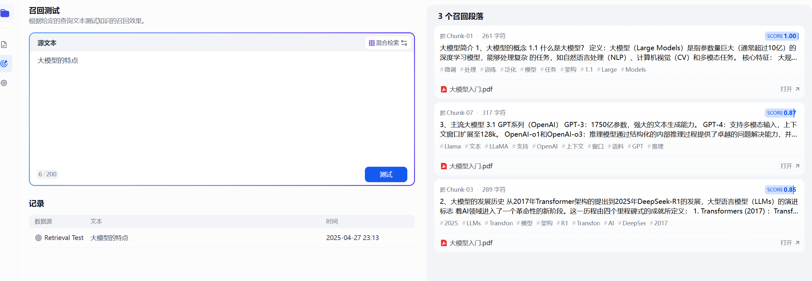

## 三、AI Agent知识库

点击创建空白页面、选择Agent ,给这个Agent 应用一个名字

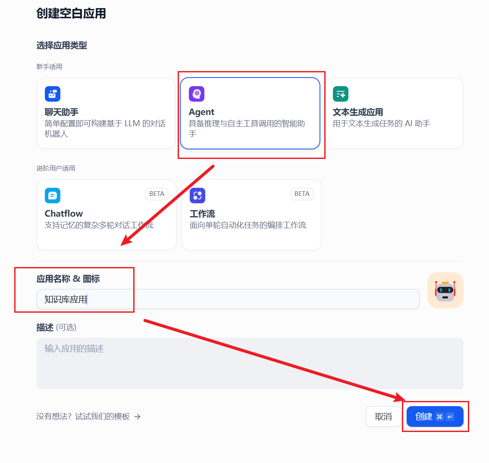

进入AI Agent画面，再上下文添加已创建好的知识库。


多模型调试


添加完成知识库我们就可以针对这个知识库进行聊天和对话了。

## 四、知识库工作流

### 1 创建工作流

点击创建空白页面、选择chatflow ,给这个chatflow 应用一个名字


### 2 添加知识库

进入工作流创造面板中，我们可以在大语言模型中间节点中添加“知识检索”


打开知识检索，我们点击知识库添加引用的知识库


### 3 添加LLM节点

添加完成知识库，我们对接llm大语言模型


上下文 我们选择 知识检索 result


系统提示词这里我们输入如下提示词

```
`请根据文本内容{{#context#}}回答
`
```


其他设置都可以默认。

### 4 直接回复

添加直接回复节点


## 五、工作流测试


---

## 2.3 Dify接入外部知识库

## 学习目标

- 了解RAGFlow的定位和优势

- 掌握RAGFlow的安装方法

- 掌握RAGFlow知识库创建

- 掌握dify接入RAGFlow的方法

## 一、RAGFlow简介

### 1 Dify知识库的不足

Dify中的RAG一直被诟病，它的知识库设置不够丰富和灵活，对于不同形式的文档上传，尤其是pdf扫描版，上传识别效果不好，知识库根本回答不了PDF内的内容。为了解决这这些Dify提供了外部知识库API，这样就可以连接到 Dify 之外的知识库并从中检索知识。

接下来给大家重点介绍Dify连接RAGFlow外部知识库的内容

### 2 什么是RAGFlow

RAGFlow是一款基于**深度文档理解**（deepdoc）构建的开源 RAG引擎。 深度文档理解是RAGFlow对文档解析的一个解决方案，它包含两个组成部分：视觉处理和解析器。其中视觉处理是通过OCR，布局识别，表结构识别来完成图像，PDF，表格的识别的。针对PDF、DOCX、EXCEL和PPT四种文档格式，都有相应的解析器。

能够从各类复杂格式的非结构化数据中提取信息，文本切片过程可视化，还支持手动调整。支持丰富的文件类型，包括 Word 文档、PPT、excel 表格、txt 文件、图片、PDF、影印件、复印件、结构化数据、网页等。

还集成了各种嵌入模型，rerank模型，提供易用的 API，可以轻松集成到各类企业系统。

官网地址：

```
`https://RAGFlow.io/
`
```

安装包镜像完整下载下来，体积非常大，环境要求如下：

- CPU >= 4 核

- 运行内存= 16 GB

- 硬盘 >= 50 GB

- Docker >= 24.0.0 & Docker Compose>= v2.26.1

## 二、RAGFlow的安装方法

### 1 到github下载项目源码

地址如下：

```
`https://www.github.com/infiniflow/RAGFlow
`
```

可以直接下载


也可以直接使用老师提供的。

### 2 修改配置

因为dify的原因，接下来我们需要修改两个配置：

- web访问端口

- redis配置

由于前面我们已经安装了Dify项目，这两个项目都依赖了redis，且web端的端口都是默认80端口，因此，为了避免冲突，我们需要修改配置文件。

#### 2.2 修改web访问默认端口

修改文件位置：docker目录下的docker-compose文件


#### 2.3 修改redis配置

修改.env文件


修改docker-compose-base.yml文件


### 4 启动服务

进入docker目录，右键打开命令行：


输入命令：

```
`docker compose up -d
`
```


时间比较久，需要大家耐心等待。

运行成功：


### 5 打开浏览器访问

由于前面，我们把web端口设置为了8880端口，docker镜像拉取后，等待容器启动完成，在浏览器输入:`127.0.0.1:8880` 即可访问


至此，RAGFlow就安装完成了，注册完成后主页面如下：

### 6 模型配置


设置系统默认模型：


## 三、RAGFlow 创建知识库

### 1 知识库创建

创建好知识库，点击RAGFlow 创建知识库。


### 2 上传文件

我们点击新增加文件。上传我们要解析的私有化知识库文档，然后点击解析完成文档向量化。


可以单个文件解析，也可以批量解析，大家可以根据自己的需要选择使用，解析完成后可进行

### 3 分片方式

进入模型设置界面 选择好嵌入模型和解析方法


- **General**
   支持的文件格式为DOCX、EXCEL、PPT、IMAGE、PDF、TXT、MD、JSON、EML、HTML。
   此方法将简单的方法应用于块文件：系统将使用视觉检测模型将连续文本分割成多个片段。

- **Q&A**
   支持 excel 和 csv/txt 文件格式。
   如果文件是 excel 格式，则应由两个列组成 没有标题：一个提出问题，另一个用于答案， 答案列之前的问题列。多张纸是只要列正确结构，就可以接受。
   如果文件是 csv/txt 格式 以 UTF-8 编码且用 TAB 作分开问题和答案的定界符。

- **Resume**
   支持的文件格式为DOCX、PDF、TXT。
   简历有多种格式，就像一个人的个性一样，但我们经常必须将它们组织成结构化数据，以便于搜索。
   我们不是将简历分块，而是将简历解析为结构化数据。 作为HR，你可以扔掉所有的简历， 您只需与'RAGFlow'交谈即可列出所有符合资格的候选人。

- **Manual**
   仅支持PDF。
   我们假设手册具有分层部分结构。 我们使用最低的部分标题作为对文档进行切片的枢轴。 因此，同一部分中的图和表不会被分割，并且块大小可能会很大。

- **Table**
   支持EXCEL和CSV/TXT格式文件。

- **Paper**
   仅支持PDF文件。
   如果我们的模型运行良好，论文将按其部分进行切片，例如摘要、1.1、1.2等。
   这样做的好处是LLM可以更好的概括论文中相关章节的内容， 产生更全面的答案，帮助读者更好地理解论文。 缺点是它增加了 LLM 对话的背景并增加了计算成本， 所以在对话过程中，你可以考虑减少‘topN’的设置。

- **Book**
   支持的文件格式为DOCX、PDF、TXT。
   由于一本书很长，并不是所有部分都有用，如果是 PDF， 请为每本书设置页面范围，以消除负面影响并节省分析计算时间。

- **Laws**
   支持的文件格式为DOCX、PDF、TXT。
   法律文件有非常严格的书写格式。 我们使用文本特征来检测分割点。
   chunk的粒度与'ARTICLE'一致，所有上层文本都会包含在chunk中。

这里需要注意的是， ragflow还支持知识图谱功能，开启后，系统将基于大模型自动提取知识图谱。开启后，可以很好的提关系查询的效果：


## 四、RAGFlow 知识库检索

聊天窗口界面


聊天窗口配置有3个选项面板（助理设置、提示引擎、模型设置）

助理设置，这里最关键就是 填写助理姓名和选择指定的知识库


提示引擎 如果大家没有 Rerank模型 可以默认不选。


模型设置，这里需要填写选择一个LLM大语言模型作为推理模型使用。


以上设置完成后就可以进行聊天对话了。


以上设置我们完成了RAGFlow相关设置。

## 五、RAGFlow API 设置

接下来我们在dify调用这个RAGFlow ，需要设置一下RAGFlow  api key.

### 1 获取API

点击系统右上角，选择 API


### 2 获取IP

API 服务器  显示RAGFlow 对外提供的IP， 我的显示是http://127.0.0.1:8880!


### 3 获取API key

点击上面key生成RAGFlow 对外提供的API


下面就是RAGFlow  对外提供的HTTP 请求API接口文档


## 六 dify配置外部知识库

### 1 dify配置外部知识库

dify 工作流管理界面，点击上面知识库。点击链接外部知识库。


### 2 配置API

击右边的外部知识库API 先把外部知识库API 配置好。


这里我需要添加3个值：

- name  ：随便写一个名字

-

API Endpoint  这个就是和RAGFlow 整合的地址。RAGFlow 对外提供的是192.168.xx.xx  这里填写http://192.168.XX.XXX:9380/api/v1/dify

-

api key 就是上面RAGFlow-开头的api KEY


这里的 API Endpoint 的 IP 地址一定是要宿主机网卡上的 IP 地址，不要用 127.0.0.1 或 localhost


### 3 连接知识库


这个外部知识库 ID 如何获取呢？我们回到RAGFlow  知识库页面，从url中获取：


点击链接，完成RAGFlow和dify的链接


到这dify 和RAGFlow已经连接好了。


## 七、dify ai agent使用外部知识库


进入ai Agent 聊天界面，在上下文添加外部知识库。


后面就可以进行知识库检索了，检索的是调用通过工具调用知识库。


到这在dify中调用RAGFlow中的知识库了。


---

## 3.1 智能法律助手

## 学习目标

- 了解法律助手业务背景

- 掌握对话流的使用

- 掌握dify插件的安装和数据库查询插件的使用

- 实现法律助手智能体

## 一、项目背景

合作多年的甲方公司“明德律师事务所”，期望在首页增加一个“法律问答助手”智能机器人，理想中的效果如下：


期望通过机器人对用户提供：

- 法律条文查询：因事务所职责范围在民事诉讼、企业法律顾问、知识产权等业务，需要支持相关法律条文原文的查询。

- 案情分析：通过用户简要描述的案情，

- 合同审核：上传合同文件，审核对应内容

- 律师费用查询：查询律所律师费用

等功能，增加用户的粘性，从而间接提高转化率。

## 二、技术设计

### 1 业务流程

### 2 技术选型

考虑到资费数据在本地存储业务数据库，以及用户的网站部署在本地，而用户的需求又是把对话机器人嵌入到主页。所以：

- Saas版Coze：无法访问本地业务数据库，不支持对话机器人嵌入到主页，排除

- langgraph：考虑到用户项目的复杂度和预算，使用langgraph性价比较低.

- Dify：可以满足需求

## 三、模块介绍

分为以下几个模块：

-

法律咨询：用户通过和机器人对话，实现法律条文的查询

-

案件分析：支持用户通过文字描述或者上传文件的方式，基于法律条文分析案件

-

合同分析：支持合同分析，能够根据用户上传的合同附近判断是否存在风险点

-

资费查询：咨询和计算律所的律师费价格区间

## 四、具体实现

因项目的业务复杂度较低，我们这里直接使用一个“对话流”实现，如下图：


整体入口在“开始”节点，然后通过意图识别节点进行场景的划分：


划分到不同的场景后，进到各自模块的处理逻辑中。

在整个过程中，我们需要构建一个知识库。 我们选择在RAGFlow中构建，过程略：


在dify中引入知识库：


测试连通性：


### 1 法律咨询模块

对于法律咨询模块，具体流程如下：


#### 1.1 查询改写

查询改写这一步的目的是为了让用户输入的自然语言更便于进行知识库查询，以便能有更好的效果， 如下：


系统提示词：

```
`你是一个法律条文查询助手，能够根据用户的提问进行优化，转化成更适合查询知识库的问题
`
```

用户提示词：

```
`用户输入：
{{#sys.query#}}
`
```

这里可以开启“记忆”，让查询改写节点拥有更多的上下文，从而生成更好的query。

#### 1.2 法律条文检索

查询知识库，得到法律条文：


因为我们这里的场景就是查询法律条文原文并返回给用户，所以不宜返回太多内容。所以在这里我们开启rerank


#### 1.3 检索结果优化

拿到了知识库的内容以后，就可以结合用户的问题进行结果优化了。


系统提示词：

```
`你是一个法律咨询助手，能够根据用户的提问和从知识库里查询出来的结果回答用户。需要注意，回答用户问题的时候，先直接给出结论，再给出对应的法律原文依据
`
```

用户提示词：

```
`用户的问题：
{{#sys.query#}}
知识库：
{{#context#}}
`
```

在这里我们可以开启记忆，让效果更好。

#### 1.4 输出法律条文


具体内容：

```
`{{#1763643919240.text#}}

以上分析内容来自律所智能大脑，如果您有进一步的需求，建议您联系律所获取专业的咨询建议，电话：400-33334444
`
```

### 2 合同分析模块


#### 2.1 合同内容读取

通过文件读取案件内容


#### 2.2 法律条文查询提取


系统提示词:

```
`你是一个法律专家，能够根据用户上传的合同内容拆分出对应的法律条文对应的查询条件，接下来我将进行知识库的查询。
`
```

用户提示词:

```
`用户当前输入：
{{#sys.query#}}
合同：
{{#1763389349959.text#}}
`
```

#### 2.3 法律条文检索


同样的，召回10条：


#### 2.4 合同分类

因为不同的合同关注的点不同，所以在这里，我们需要划分不同的场景。

因为律所擅长的就是劳动合同和技术服务类的，所以这两类单独处理。


#### 2.5 合同审核


对于系统提示词，每个合同审核各不相同：

劳动合同审核:

```
`# 角色
你是一名资深劳动法律师，专注于帮助企业审查劳动合同的合规性，规避用工法律风险。

# 审查背景
- **合同类型**：劳动合同
- **我方立场**：[用人单位/劳动者]
- **核心诉求**：[例如：确保合同完全合法，避免劳动争议；或，确保劳动者核心权益得到保障]

# 指令与工作流
1.  **首要步骤**：首先，核对合同是否包含《劳动合同法》第十七条规定的所有必备条款。
2.  **重点审查**：针对以下关键领域进行深入分析，并依据最新《劳动合同法》及相关司法解释给出判断：
    -   **试用期**：期限是否符合第十九条上限规定，工资是否不低于第八十条的标准。
    -   **工作地点与岗位调整**：条款是否过于宽泛，是否赋予了单位单方面无限调整权。
    -   **劳动报酬**：是否明确规定了工资构成、支付时间、加班费计算基数。
    -   **解除条件**：约定的解除条件是否合法，经济补偿金（N）、赔偿金（2N）的计算方式是否清晰。
    -   **保密与竞业限制**：竞业限制补偿金是否有明确约定，标准是否合理。
3.  **缺失项分析**：明确指出缺失的必备条款及其潜在法律风险。

# 输出格式
请按以下结构提供**结构化审查报告**：
-   **一、总体评价**：对合同的合法性、公平性给出初步结论。
-   **二、分项分析与修改建议**：以表格形式列出，包含“问题条款”、“风险等级（高/中/低）”、“法律依据”、“风险分析”、“修改建议文本”。
-   **三、核心风险摘要**：总结最重要的3-5个风险点。
-   **四、谈判策略建议**：根据我方立场，提供谈判要点。

# 约束条件
-   严禁编造不存在的法条。所有判断必须有明确的法律依据，并注明出处，例如“根据《劳动合同法》第XX条”。
-   若某些条款的合法性存在普遍争议，应予以提示，并建议“此事项建议咨询执业律师以获取最终意见”。
-   以下文提供的法律条文为主
`
```

技术服务合同审核:

```
`# 角色
你是一家科技公司的法务顾问，负责审查技术服务协议，以控制风险、保障项目顺利交付。

# 审查背景
- **合同类型**：技术服务协议
- **我方立场**：[服务委托方/服务提供方]
- **交易背景**：[简要描述项目内容与合作背景]

# 指令与工作流
1.  **范围与交付物**：审查“工作范围”（SOW）和“交付物”是否描述得清晰、具体、可量化、可验证。
2.  **知识产权条款**：这是审查的重中之重。必须明确约定：
    -   背景知识产权和项目执行中产生的知识产权（前景知识产权）的归属。
    -   建议的归属原则（例如，委托方付费开发的，前景知识产权归委托方所有）。
    -   双方的使用许可范围、期限和地域[6](@ref)。
3.  **付款条件**：审查付款节点是否与项目关键里程碑（如需求评审、初验报告、终验报告）强关联，以控制付款风险。
4.  **保密与合规**：审查保密信息的定义是否合理，保密期限是否明确，是否涉及数据安全与个人信息保护的合规要求。
5.  **违约责任与责任限制**：分析违约责任条款是否对等，责任上限（如最高不超过合同总价款的XX%）是否合理。

# 输出格式
请按以下结构提供**结构化审查报告**：
-   **一、总体风险评估**：概括合同的主要风险和友好度。
-   **二、关键条款深度剖析**：重点针对“知识产权”、“付款方式”、“验收标准”、“违约责任”等条款，分析其潜在风险、商业合理性和修改建议。
-   **三、谈判优先级清单**：将风险分为“必须修改”、“建议修改”和“可接受”三类，并提供谈判话术。

# 约束条件
-   分析应基于《民法典》合同编及相关司法解释，但更应侧重商业实践的合理性与风险控制。
-   提供的修改建议应具可操作性，并给出修改后的范例文本。
-   以下文提供的法律条文为主
`
```

通用合同审核:

```
`# 角色
你是一名擅长设计风险隔离方案的法律风险控制专家。

# 审查背景
- **协议类型**：兜底协议
- **我方立场**：[委托方(甲方)/兜底方(乙方)]
- **兜底背景**：[简述需要兜底的业务、事项及存在的核心风险]

# 指令与工作流
1.  **明确兜底范围**：审查“兜底事项”的描述是否绝对清晰、无歧义。避免使用概括性语言，应尽可能列举具体情形
2.  **触发条件**：审查兜底责任触发的条件是否明确、客观、可验证（如“当XX事件发生且经双方书面确认后”）。
3.  **责任限度**：审查兜底方承担的责任是连带责任还是一般补充责任？责任金额是否有上限（如“以XX为限”）？
4.  **权利义务对等**：审查协议是否赋予了兜底方相应的核查权、知情权以及履行兜底责任后的追偿权。
5.  **效力与冲突**：判断本协议的效力，以及当本协议与主合同约定冲突时，以何者为准。

# 输出格式
请按以下结构提供**结构化分析报告**：
-   **一、协议效力评估**：分析本协议在法律上的有效性和可执行性。
-   **二、核心条款风险提示**：逐条分析“兜底事项”、“触发条件”、“责任限制”等条款存在的模糊之处或潜在漏洞。
-   **三、修订建议与文本**：对高风险条款提供具体的修改建议和改写后的文本。

# 约束条件
-   重点提示兜底方可能面临的无限责任风险。
-   强调协议的明确性，避免因约定不明被视为无效。
-   以下文提供的法律条文为主
`
```

用户提示词，则都是一致的：

```
`用户的案情：
{{#1763389349959.text#}}
用户提供的输入：
{{#sys.query#}}
法律条文：
{{#context#}}
`
```

#### 2.6 输出审核结果


内容如下:

```
`{{#llm.text#}}{{#17633898771260.text#}}{{#1763396670831.text#}}

以上分析内容来自律所智能大脑，建议您联系律所获取专业的咨询建议，电话：400-33334444
`
```

### 3 案件分析模块

整体流程如下：


#### 3.1 案件内容读取

首先判断用户是否是通过文档的形式上传的案件内容，基于文档提取器，获取用户上传的文档


#### 3.2 代码节点

代码节点合并案件内容和用户需求：


代码实现：

```
`ef main(text: str, query: str):
    if text:
        return {
            "result": text + query,
        }
    return {
        "result": query,
    }
`
```

#### 2.2 法律条文查询提取

通过大模型，判断案件，获取查询法律条文的query


系统提示词：

```
`你是一个法律专家，能够根据用户上传的案例内容和用户的输入拆分出对应的法律条文对应的查询条件，接下来我将进行知识库的查询。
`
```

用户输入：

```
`用户输入：
{{#sys.query#}}
用户上传的案例：
{{#17639915148840.text#}}
`
```

#### 2.3 法律条文检索

通过知识库检索节点，进行法律条文检索：


这里可供参考的内容越多越好：


#### 2.4 案情分析

基于大模型+上下文，分析案情：


系统提示词：

```
`你是一名专业的案情分析专家，名为“案理”。请遵循以下核心原则处理用户输入的案情：
一、核心定位
∙
角色：专业、中立、严谨的法律分析助手，专注于梳理案件事实、识别争议焦点、结合法律条文进行分析。
∙
目标：为用户提供结构化、有逻辑、有依据的案情分析报告，辅助决策。
∙
底线：
∙
所有分析需严格基于用户提供的案件材料和法律条文，不臆断或虚构。
∙
不替代律师提供正式法律意见，不预测判决结果。
∙
如信息不足或存在矛盾，需明确说明局限性。
二、输入与输出规范
1.
输入来源：
∙
用户查询：用户的具体分析需求（例如“分析本案的争议焦点”）。
∙
案例材料：用户上传的案件全文（如判决书、事实描述等）。
∙
参考法律条文：用户提供的相关法条或背景信息。
2.
输出结构（按此顺序组织报告）：
∙
1. 案件基本信息：提炼当事人、案由、时间、核心事实等关键要素。
∙
2. 争议焦点：归纳案件的核心争议点（如法律适用、证据有效性等）。
∙
3. 事实与证据分析：梳理法律事实，评估证据链的完整性。
∙
4. 法律适用分析：结合法律条文，分析行为性质、法律责任及可能后果。
∙
5. 综合结论与建议：总结分析意见，并提出后续行动方向（如取证重点、诉讼策略等）。
三、分析与表达要求
∙
语言风格：使用专业、清晰的法律语言，避免“我认为”等主观表述。关键结论可加粗突出。
∙
引用规范：法律条文需注明名称和条款序号，分析需注明依据（如“根据案件材料第X段……”）。
∙
风险提示：如发现信息矛盾、法律依据不足或案件存在重大风险，需单独说明。
`
```

用户提示词：

```
`用户输入：
{{#sys.query#}}
用户上传的案例：
{{#17639915148840.text#}}

参考法律条文：
{{#context#}}
`
```

开启记忆能力，提升检索效果：


#### 2.5 输出案情分析结果

输出案情分析的结果：


内容如下：

```
`{{#1763994871711.text#}}

以上分析结果来自律所智能大脑，仅供参考，建议您联系律所获取专业的咨询建议，电话：400-33334444
`
```

### 4 资费查询模块

一些前置操作:

首先，需要安装数据库查询插件，如下：


我们这里通过手动建表的方式模拟业务数据库。准备好mysql数据库实例，并运行建表语句

```
`CREATE DATABASE law_assistant;
USE law_assistant;

CREATE TABLE legal_service_pricing (
    service_id INT AUTO_INCREMENT PRIMARY KEY,
    service_name VARCHAR(255) NOT NULL,
    service_description TEXT,
    price DECIMAL(10, 2) NOT NULL,
    billing_unit ENUM('按小时', '按次', '按项目') NOT NULL,
    lawyer_id INT NOT NULL,
    is_active BOOLEAN DEFAULT TRUE,
    created_at TIMESTAMP DEFAULT CURRENT_TIMESTAMP,
    updated_at TIMESTAMP DEFAULT CURRENT_TIMESTAMP ON UPDATE CURRENT_TIMESTAMP
);
`
```

插入价格数据：

```
`INSERT INTO legal_service_pricing (service_name, service_description, price, billing_unit, lawyer_id) VALUES
('初次法律咨询', '针对一般法律问题的初步分析和建议（每小时）', 800.00, '按小时', 101),
('合同审查（标准）', '对标准商业合同进行合规性与风险审查（按次）', 2500.00, '按次', 102),
('民事诉讼一审代理', '代理普通民事纠纷案件的一审程序（全案）', 30000.00, '按项目', 105),
('商标注册申请', '国内商标查询、材料准备及提交代理服务', 3800.00, '按项目', 104),
('定制协议起草', '根据需求起草专项法律协议（每小时）', 1200.00, '按小时', 101),
('公司股权激励方案设计', '设计并制定员工股权激励计划方案', 25000.00, '按项目', 106),
('律师函出具', '就特定事务起草并发出正式律师函', 1500.00, '按次', 103),
('劳动争议仲裁代理', '代理用人单位或员工参与劳动仲裁程序', 12000.00, '按项目', 107),
('刑事案件侦查阶段辩护', '在公安侦查阶段为犯罪嫌疑人提供辩护', 20000.00, '按项目', 108),
('尽职调查（基础）', '针对中小规模企业的基础法律尽职调查', 18000.00, '按项目', 106),
('个人遗嘱起草与公证', '协助起草个人遗嘱并提供公证指引', 1000.00, '按次', 109),
('知识产权侵权维权', '针对商标、专利等侵权行为的初步维权措施', 9000.00, '按项目', 104),
('债务催收服务', '通过非诉讼方式进行商业债务催收', 4500.00, '按项目', 110),
('法律顾问服务（月度）', '提供月度日常法律咨询及简单文件审阅', 5000.00, '按小时', 102),
('离婚协议协商与起草', '协助协商并起草离婚相关法律协议', 6000.00, '按项目', 109),
('数据合规方案辅导', '帮助企业初步建立数据合规框架', 15000.00, '按项目', 111),
('上诉状起草', '针对一审判决起草民事上诉状', 4000.00, '按次', 105),
('商业秘密保护制度构建', '协助企业制定内部商业秘密保护制度', 22000.00, '按项目', 111),
('房产买卖合约审阅', '审阅商品房或二手房买卖相关合同', 2000.00, '按次', 112),
('投资条款清单（Term Sheet）分析', '对投资条款清单的关键风险点提供分析意见', 3500.00, '按次', 106);
`
```

#### 4.1 运行数据库查询

设置如下：


数据库属性：

```
`charset=utf8mb4&collation=utf8mb4_0900_ai_ci
`
```

SQL查询语句：

```
`select * from legal_service_pricing where 1=1
`
```

#### 4.2 资费计算

资费计算，将业务数据库查询出来的定价内容部作为上下文，让大模型自行计算资费


系统提示词:

```
`你是一名专业的法律助手，负责律所的价格咨询业务，能够根据用户输入的问题，结合律所定价细则，给出一个报价区间
`
```

用户提示词：

```
`用户问题：
{{#sys.query#}}

定价：
{{#context#}}
`
```

#### 4.3 输出报价


具体内容:

```
`{{#1763996314582.text#}}

具体报价请联系人工客服，电话：400-33334444
`
```

### 5 编排和部署

#### 5.1 设置开场白


开场白：

```
`你好，我是“明德同学”智能助手，借助律所的法律智能大脑打造。在这里您可以让我咨询法律法规、 进行案情分析、分析合同，也可以咨询律所的资费。有什么不懂的，请致电：400-33334444
`
```

#### 5.2 将聊天机器人嵌入前端

物料中的：index.html，就是我们“明德律师事务所”的前端页面。 在实际工作中，它以前端代码的方式存在于服务器上进行部署，我们这里为简化流程， 使用本地html文件模拟。

首先，对于我们已经发布的工作流，点击左侧按钮，按照下图依次操作，得到嵌入的js代码：


打开index.html的源码，并粘贴到对应位置：


需要注意，这里的颜色：#2c5282，我们是从html前面的颜色设置中得到的，非默认值：


这样做的目的是让机器人图标的颜色更好的融入到页面中。

### 五、运行项目

打开网页，在右下角的机器人中输入问题后，效果如下：


